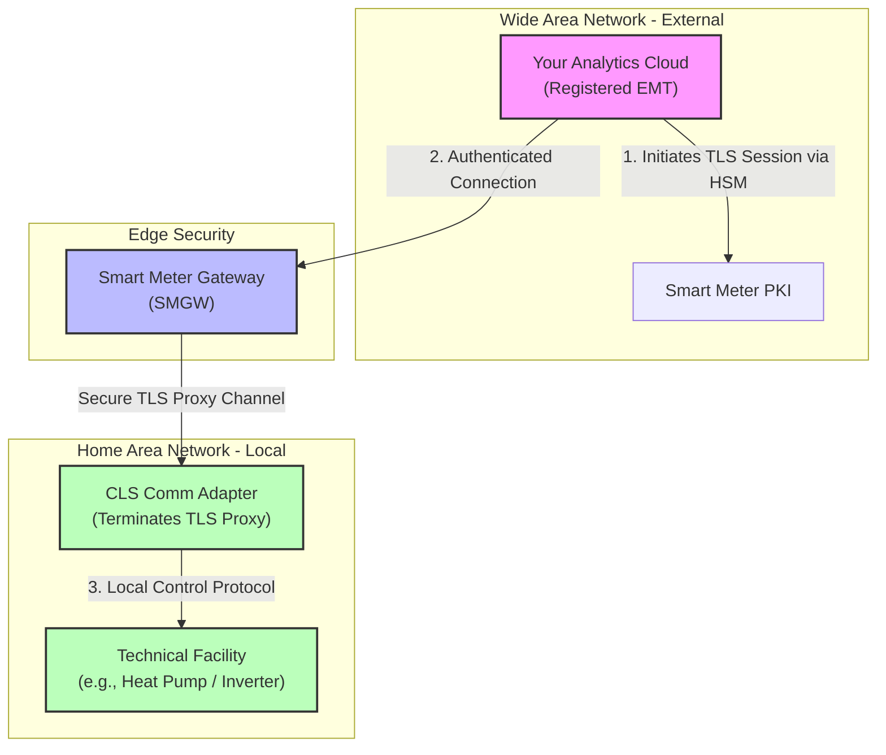
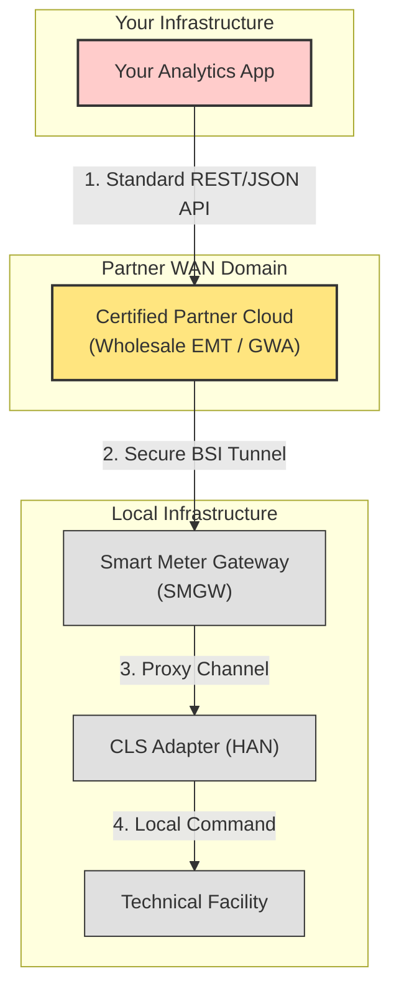
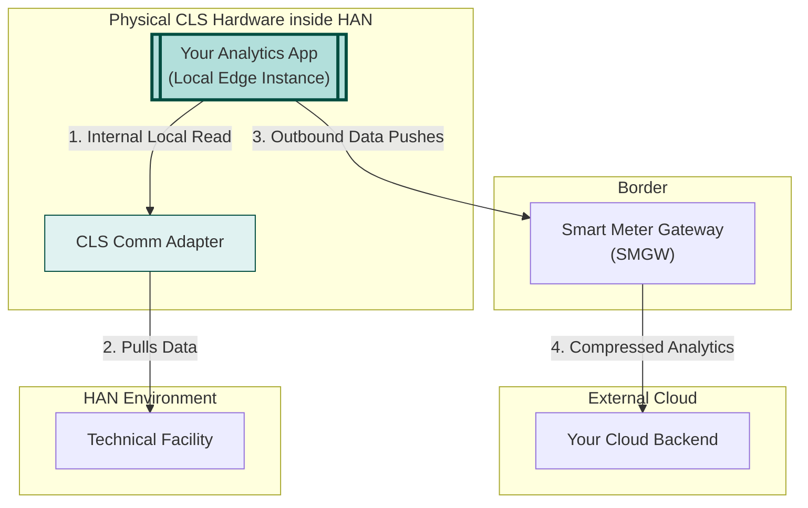

### Case 1: Active EMT (Direct Connection)
*You shoulder the entire regulatory burden, hosting the BSI-compliant security infrastructure yourself.*

### Case 2: Partner / Wholesale EMT (Indirect Connection)
*You bypass the regulatory nightmare by piggybacking on an established partner’s infrastructure via a standard Web API.*

### Case 3: Edge / CLS Software Approach
*You don't fight your way in. Your analytics code lives right inside the HAN on the physical CLS device, using the SMGW purely to dial out.*

