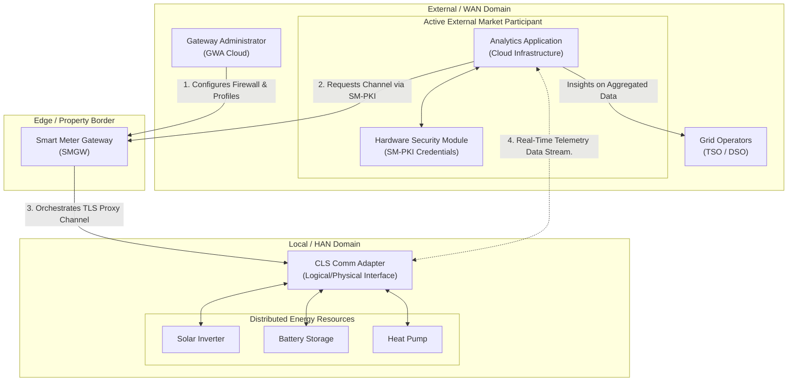

## CLS

```mermaid
graph TD
    %% External / WAN Domain
    subgraph WAN [External / WAN Domain]
        subgraph EMT [Active External Market Participant]
            App["Analytics Application<br/>(Cloud Infrastructure)"]
            HSM["Hardware Security Module<br/>(SM-PKI Credentials)"]
            App <--> HSM
        end
        
        GWA["Gateway Administrator<br/>(GWA Cloud)"]
        Operators["Grid Operators<br/>(TSO / DSO)"]
        
        App -->|Insights on Aggregated Data| Operators
    end

    %% Edge Border
    subgraph Edge [Edge / Property Border]
        SMGW["Smart Meter Gateway<br/>(SMGW)"]
    end

    %% Local / HAN Domain
    subgraph HAN [Local / HAN Domain]
        CLS["CLS Comm Adapter<br/>(Logical/Physical Interface)"]
        
        subgraph DER [Distributed Energy Resources]
            Inverter["Solar Inverter"]
            Battery["Battery Storage"]
            HP["Heat Pump"]
        end
        
        CLS <--> Inverter
        CLS <--> Battery
        CLS <--> HP
    end

    %% Operational Orchestration and Data Flow
    GWA -->|1. Configures Firewall & Profiles| SMGW
    App -->|2. Requests Channel via SM-PKI| SMGW
    SMGW -->|3. Orchestrates TLS Proxy Channel| CLS
    App <.->|4. Real-Time Telemetry Data Stream.| CLS
```
