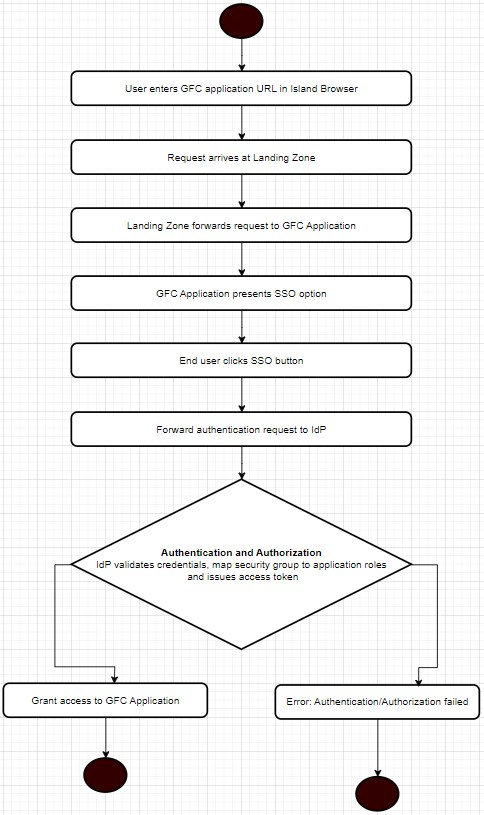

# Accessing web application via Island browser
- **`"Island browser + Private DNS + Public root certificate + External user account + Single sign on + Application roles mapped to security groups"`**
- The following design outlines the authentication flow and access management for external users accessing the GFC application via `Island browser` while ensuring security, compliance, and seamless integration with `Single Sign-On` (SSO) and `role-based access control` (RBAC).
- [Entities](#entities)
- [Authentication and access flow](#authentication-and-access-flow)
## Entities
- **External user account**
  - The end user has an external L+G account.
- **Island browser**
  - The user accesses the application via Island browser, which operates through trusted Island gateways deployed within the Landing Zone.
- **VPN tunnel**
  - A secure VPN tunnel is established between the customer's network and L+G to ensure encrypted communication.
- **GFC application**
  - The GFC application is exposed via a DNS name that is resolvable within the VPN tunnel.
- **Single Sign-On (SSO)**
  - The GFC application enforces SSO authentication for seamless access.
- **Security group mapping**
  - Security groups from the Enterprise ID are mapped to GFC application roles for access control.

## Authentication and access flow
- **User initiates access**
  - The end user enters the GFC application URL in the Island browser.
- **Routing request through landing zone**
  - The request reaches the Landing Zone (DMZ), which acts as a secure entry point.
  - The DMZ forwards the request to the GFC application within the private network.
- **Certificates check at Island browser**
  * User types `https://app.gfc.landisgyr.com` in their browser
  * The browser will:
    * **Resolve** the `DNS name` to the `internal IP address` of the load balancer (or application server).
    * Establish an `HTTPS connection` to the load balancer (or application server).
    * The load balancer (or application server) will `present the certificate` signed by the public root CA.
    * Because the certificate is signed by a public CA, the browser will trust it.
    * The application will then function as expected.
- **GFC application presents SSO login**
  - The GFC application detects the user's external account and displays an SSO login button.
- **User authenticates via SSO**
  - The user clicks the SSO button, initiating authentication with the identity provider (Enter ID).
  - The IdP validates the credentials.
  - Once authenticated, the IdP issues an access token.
- **Authorization and role mapping**
  - The GFC application retrieves user attributes from the IdP token.
  - The user’s security group membership is mapped to application roles.
- **User gains access to GFC application**
  - Upon successful authentication and authorization, the user is granted access to appropriate permissions based on role mappings.

