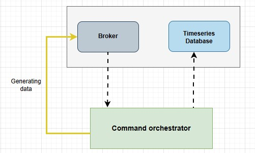

# Data ingestion service

- [Service design](#service-design)
- [Brain storming](#brain-storming)
## Service design
- **Subscribes to**: ActiveMQ queue with hourly meter data (all OBIS codes in one message).
  - For data directly pushed from IoT devices use [MQTT](mqtt/README.md) 
- **InfluxDB schema**:  
  - Measurement: `power_quality`  
  - Tags: `meter_id`  
  - Fields: `voltage_a, voltage_b, voltage_c, current_a, current_b, current_c, power_factor, frequency`  
  - Timestamp: provided by sensor (every 15 mins)  
- **Data handling**:  
  - One point per message (all fields together).  
  - No retry on insert failure; log and drop messages.  
  - Batch size configurable; default 1 (hourly data).  
  - No time-based batch flush needed due to data cadence.  
- **Performance**:  
  - Designed for burst loads (e.g., 500k meters pushing near-simultaneously).  
  - Autoscaling based on CPU usage and queue length.  
- **Architecture**:  
  - Stateless service for easy horizontal scaling.  
  - Metrics and health checks planned for future.
## Brain storming 
### ActiveMQ Subscriber
- Connects to ActiveMQ broker.
- Subscribes to configured queue/topic.
- Receives messages containing meter data (JSON with all OBIS fields).
- Pushes received messages to internal processing pipeline or buffer.
- Question:
  - Should it acknowledge messages immediately on receive or after successful insert?
### Message Processor
- Parses JSON message.
- Validates required fields (meter_id, timestamp, all voltage/current fields).
- Prepares data point in InfluxDB line protocol format.
- Question:
  - Should it handle missing or corrupt fields by dropping message or partial insert?
### Batching and insert logic
- Collects points based on configured batch size.
- Inserts batch into InfluxDB using batch write API.
- On failure: logs error, drops batch (no retry).
- Question:
  - What should be the default batch size? (We agreed 1 for hourly data, but ready for burst.)
### Autoscaling and monitoring
- Service instances can scale horizontally.
- Monitor CPU and ActiveMQ queue length.
- Trigger scale up/down automatically or manually.
- Question:
  - Which metrics would be critical to expose? CPU, memory, queue depth, insert latency?
### Configuration
- ActiveMQ connection details.
- InfluxDB endpoint and credentials.
- Batch size.
- Logging level.
- Autoscaling thresholds (future).
