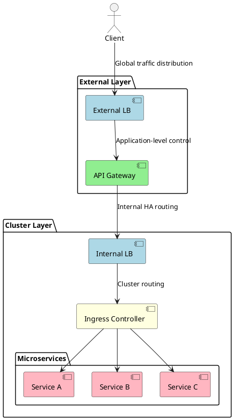
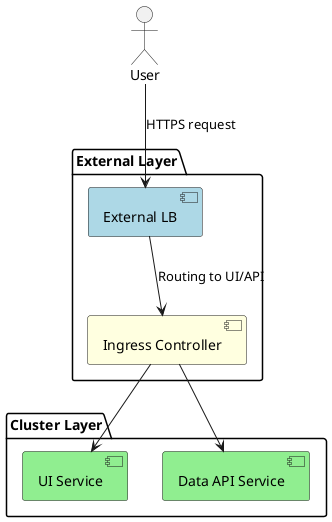
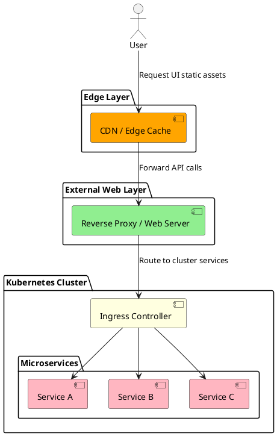

# Designing Microservices
- [Introduction](#introduction)
- [The Problem: Confusions in Microservices Exposure](#the-problem)
- [Layer Responsibilities: LB vs Ingress vs API Gateway](#layer-responsibilities)
- [Real-World Examples: When API Gateway Helps](#real-world-examples)
- [Current Setup: Ingress + Load Balancers](#current-setup)
- [Feature Mapping: Who Handles What](#feature-mapping)
- [Simpler Setup: UI + API Inside Cluster](#simpler-setup)
- [UI Outside Cluster: CDN + Reverse Proxy](#ui-outside-cluster)
- [UML Diagrams: Before vs After (Color-Coded)](#uml-diagrams)
- [Best Practices Summary](#best-practices)
- [Conclusion](#conclusion)
## Introduction
- Cloud-native microservices often confuse developers: should I use **Ingress, load balancers, API Gateway, or a reverse proxy**?
- This blog untangles the confusion, explains **where to place each component**, and provides **industry-standard architecture practices**, including for **UI deployment inside or outside Kubernetes**.
## The Problem: Confusions in Microservices Exposure
* Overlapping responsibilities between Ingress, API Gateway, and load balancers.
* Misconception that **Ingress can do everything**, including auth and rate limiting.
* UI often deployed inside cluster unnecessarily, complicating caching and scaling.
* **Goal:** Provide **clarity and optimal placement** for each layer.
## Layer Responsibilities: LB vs Ingress vs API Gateway
* **Rule of Thumb:** 
  * LB = availability, 
  * Gateway = control, 
  * Ingress = internal routing.

| Layer                   | Role                      | Key Features                                           |
| ----------------------- | ------------------------- | ------------------------------------------------------ |
| **Load Balancer**       | Traffic distribution & HA | Layer 4/7 routing, health checks, failover             |
| **API Gateway**         | Application-level control | Auth, rate limiting, transformations, caching, logging |
| **Ingress Controller**  | Internal routing          | Path-based routing, TLS termination                    |
| **Reverse Proxy / CDN** | UI delivery               | TLS, caching, compression, API routing                 |

## Real-World Examples: When API Gateway Helps
* **Multiple external microservices** exposed through a single endpoint.
* **Rate limiting** per client/API key.
* **Auth at the edge** (OAuth, JWT).
* **Request transformations** (REST → gRPC, JSON → XML).
* **Centralized logging & analytics**.
* **Analogy:** 
  * LB = traffic cop
  * Ingress = traffic sign inside cluster
  * API Gateway = security checkpoint + concierge.
## Current Setup: Ingress + Load Balancers
```
[External LB]
        |
[Internal LB]
        |
[Ingress Controller]
        |
[Microservices]
```

* Pros: HA, routing, TLS
* Cons: Limited auth, rate limiting, transformations, logging
## Feature Mapping: Who Handles What

| Feature                    | API Gateway  | Load Balancer | Ingress    |
| -------------------------- | ------------ | ------------- | ---------- |
| Auth & Authorization       | ✅            | ❌             | ⚠️ limited |
| Rate limiting              | ✅ per client | ⚠️ global     | ⚠️ basic   |
| Transformation             | ✅            | ❌             | ❌          |
| Caching                    | ✅            | ❌             | ⚠️ limited |
| Logging / Analytics        | ✅            | ⚠️ metrics    | ⚠️ basic   |
| TLS termination            | ✅            | ✅             | ✅          |
| Circuit breaking / retries | ✅            | ❌             | ❌          |

## Simpler Setup: UI + API Inside Cluster
* **When API Gateway is not needed**:
  * Ingress handles **routing and TLS**.
  * Keep it simple; no over-engineering.
```
[Client Browser]
        |
[External LB] (optional)
        |
[Ingress Controller]
        |
[UI Service] / [Data API Service]
```
## UI Outside Cluster: CDN + Reverse Proxy
```
[Client Browser]
        |
[CDN / Edge Cache] 
        |
[Reverse Proxy / Web Server] (optional)
        |
[Kubernetes Cluster via Ingress]
        |
[Microservices]
```

* **Benefits:**
  * UI decoupled → independent deployment and scaling
  * CDN → caching and low-latency global delivery
  * Reverse Proxy → TLS, API routing, optional compression/security
  * Kubernetes Ingress → internal routing only
## UML Diagrams: Before vs After (Color-Coded)
### Full Production with API Gateway

### Simplified UI + API via Ingress


---

### UI Outside Cluster via CDN + Reverse Proxy


* **Color Legend:**
  * **LightBlue** → Load Balancers
  * **LightGreen** → API Gateway / Reverse Proxy / UI Services
  * **LightYellow** → Ingress
  * **LightPink** → Microservices
  * **Orange** → CDN
## Best Practices Summary
1. Use **API Gateway for public APIs** requiring auth, rate limiting, transformations.
2. Use **Ingress for internal routing** inside Kubernetes.
3. Always place **load balancers** for HA in front of key layers.
4. For UI outside cluster → **CDN + optional reverse proxy**.
5. Avoid over-engineering; introduce API Gateway **only when necessary**.
## Conclusion
* Layered approach clarifies responsibilities and reduces confusion.
* API Gateway, LB, Ingress, and reverse proxies each serve **distinct purposes**.
* Proper placement ensures **scalability, security, maintainability, and observability**.
* Following these best practices aligns with **industry standards** for modern cloud-native deployments.
