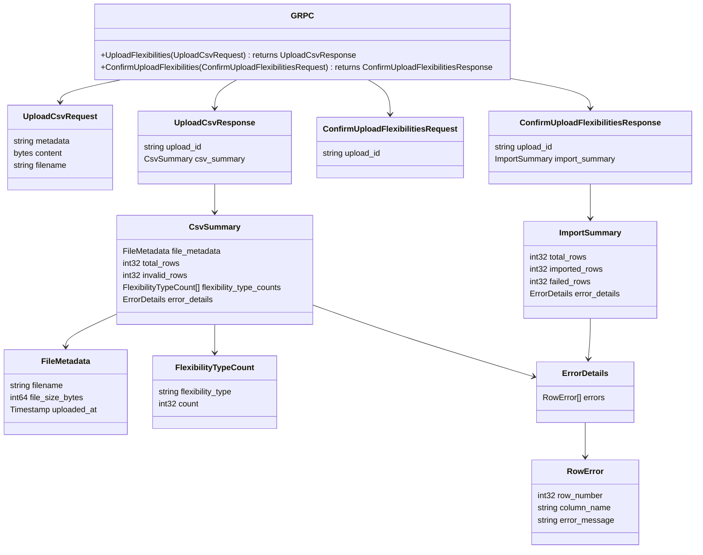
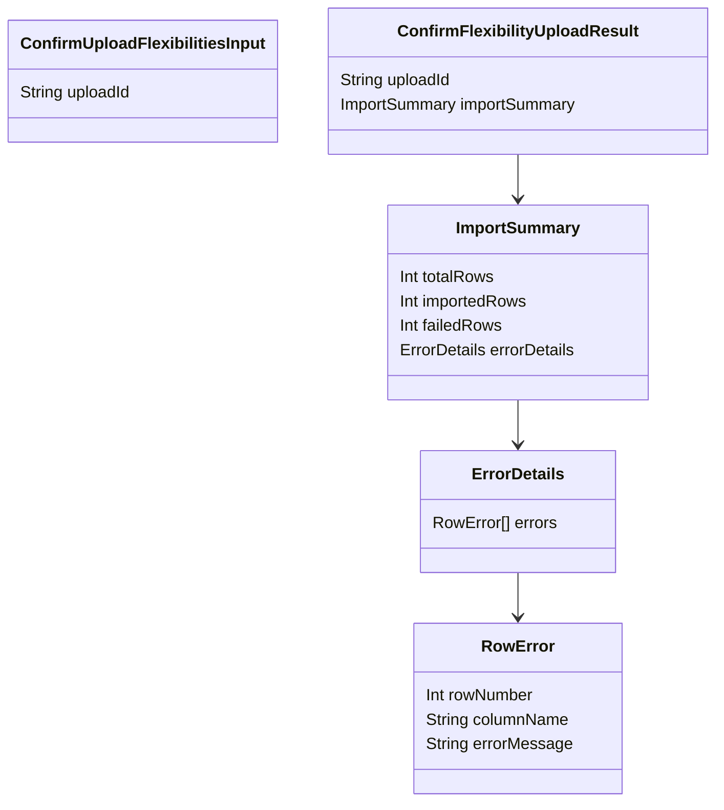

# Application
- [Platform engineering](platform-engineering/README.md)
- [bff](api-gateway/README.md)
- [gfc-apis](gfc-apis/README.md)
- [gfc-core](gfc-service/README.md)
- [command-orchestrator](command-orchestrator/README.md)
- [protocol-adapter](protocol-adapter/README.md)
- [Tooling](tooling/README.md)
- Use cases
  - [Switching flexibilities](usecases/switching/README.md)
  - [Organization API](usecases/organization/README.md)
  - [File upload](usecases/fileupload/README.md)
  - [Running the app](usecases/running-app/README.md)
  - [Query flexibilities](usecases/query/README.md)

