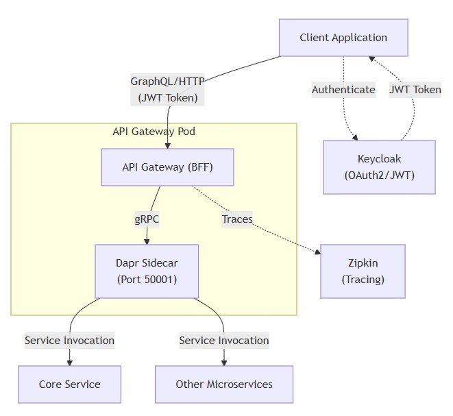
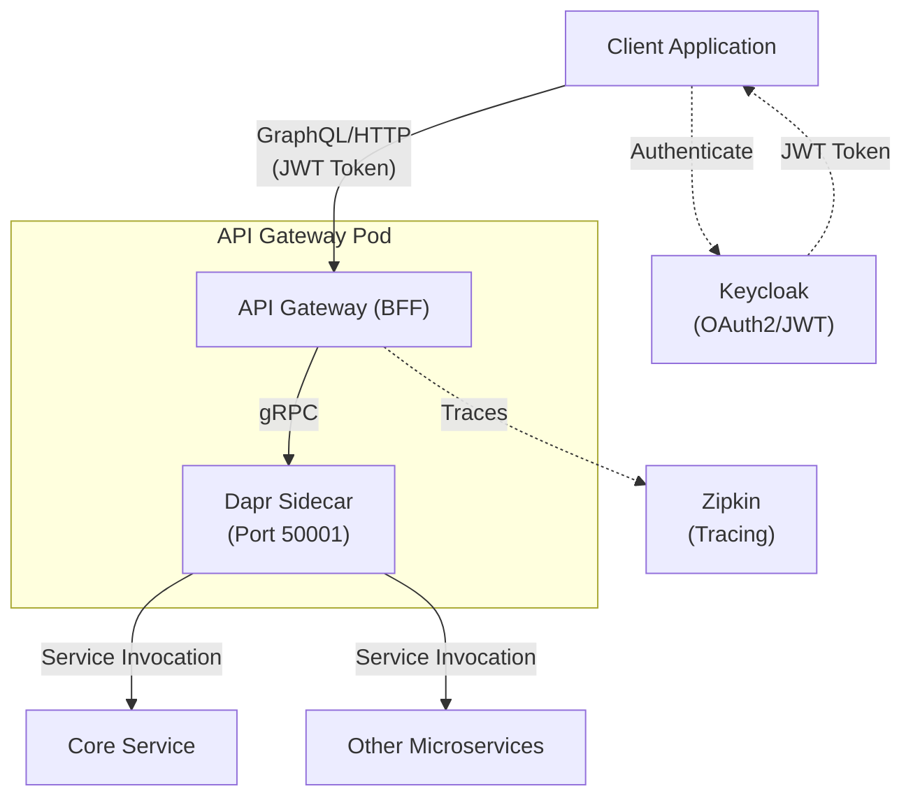
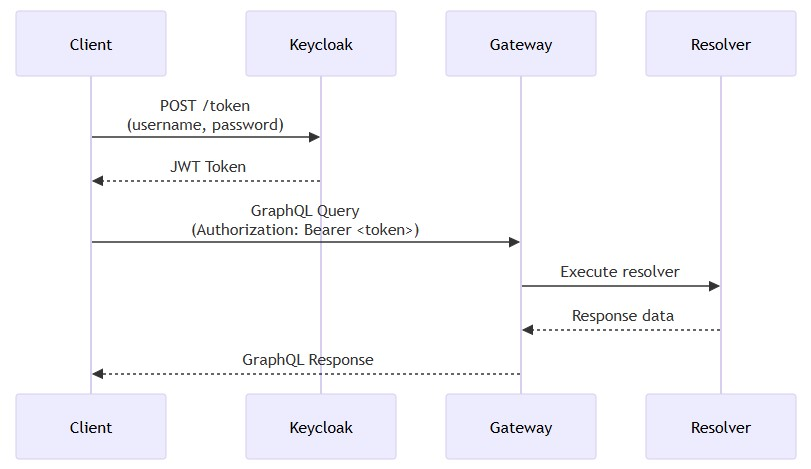
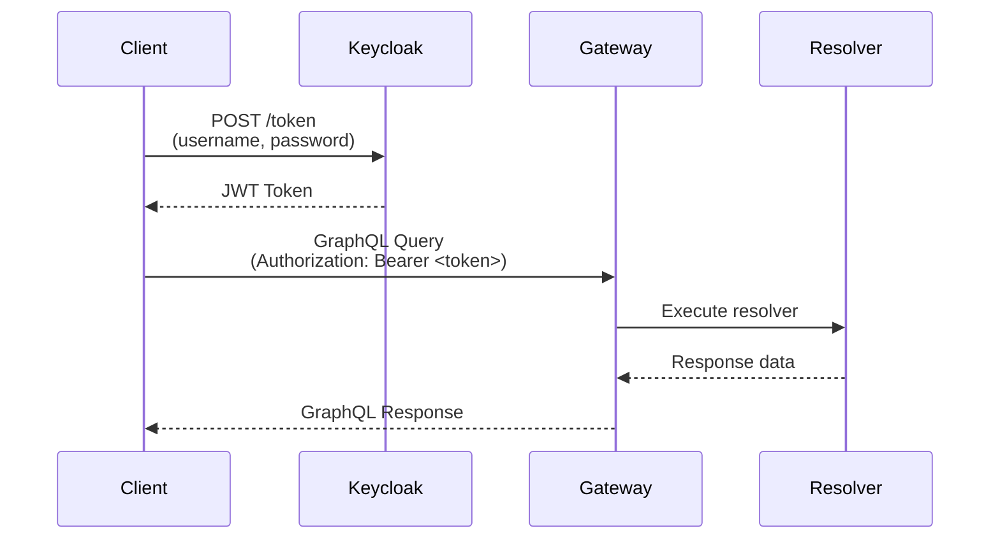
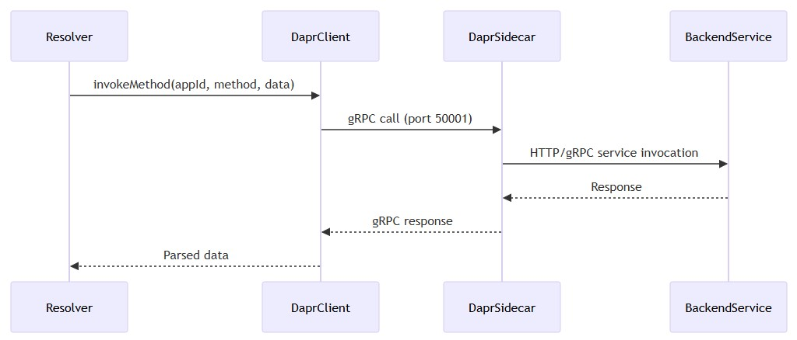
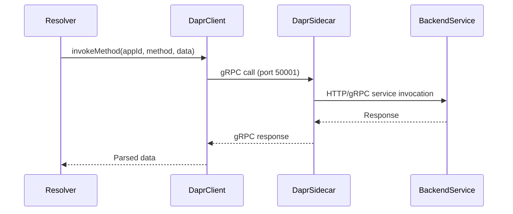
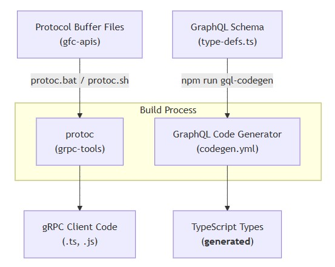
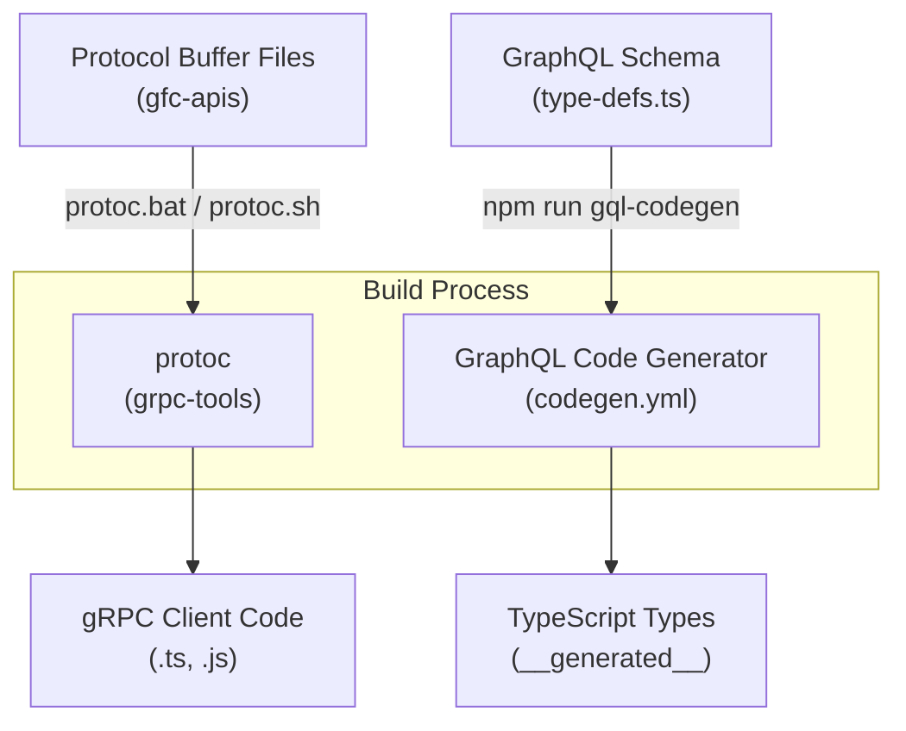

# Architecture
* [Principles](#principles)
* [System architecture](#system-architecture)
  * [Components](#components)
* [Communication protocols](#communication-protocols)
  * [Client to gateway (inbound)](#client-to-gateway-inbound)
  * [Gateway to services (outbound)](#gateway-to-services-outbound)
  * [Hybrid REST endpoints](#hybrid-rest-endpoints)
* [Dapr integration](#dapr-integration)
  * [Sidecar configuration](#sidecar-configuration)
  * [Dapr client usage](#dapr-client-usage)
* [Security layers](#security-layers)
  * [Transport security](#transport-security)
  * [Rate limiting](#rate-limiting)
  * [GraphQL query protection](#graphql-query-protection)
  * [Authentication](#authentication)
  * [Input validation](#input-validation)
* [Component structure](#component-structure)
  * [Directory organization](#directory-organization)
  * [Code generation pipeline](#code-generation-pipeline)
  * [Runtime components](#runtime-components)
* [Deployment architecture](#deployment-architecture)
## Principles
* The API Gateway implements a **Backend for Frontend (BFF)** pattern, serving as a unified entry point that translates GraphQL requests into gRPC/HTTP calls to backend microservices via Dapr sidecars.
* Protocol translation between GraphQL (client-facing) and gRPC/HTTP (service-facing)
* Sidecar pattern using Dapr for service discovery and communication
* Security-first design with multiple defense layers
* Type-safe code generation for both GraphQL and Protocol Buffers
* Hybrid API support (GraphQL + REST endpoints)
## System architecture


<details>
  <summary>mermaid</summary>


</details>

### Components
* **Client layer** - External applications sending GraphQL queries with JWT authentication
* **API Gateway** - Apollo Server on Fastify handling GraphQL requests
* **Dapr sidecar** - Local proxy for service-to-service communication (gRPC port 50001)
* **Backend services** - Microservices invoked via Dapr service invocation
* **Observability** - Zipkin for distributed tracing
* **Authentication** - Keycloak for OAuth2/JWT token issuance
## Communication protocols
### Client to gateway (inbound)
* **Protocol:** HTTP/HTTPS
* **Format:** GraphQL queries/mutations
* **Authentication:** JWT Bearer tokens from Keycloak



<details>
  <summary>mermaid</summary>


</details>

* Token acquisition: `curl -X POST "https://dev.idp.landisgyr.com/keyc01/realms/gfc/protocol/openid-connect/token"`
* Apollo Server configured with Fastify as HTTP server
* GraphQL Playground available in development mode only

### Gateway to services (outbound)
* **Primary protocol:** gRPC via Dapr
* **Fallback protocol:** HTTP via Dapr



<details>
  <summary>mermaid</summary>


</details>

* Dapr app protocol: `--app-protocol http` (gateway accepts HTTP from its sidecar)
* Dapr gRPC port: `--dapr-grpc-port 50001` (gateway communicates with Dapr via gRPC)
* Protocol Buffer compilation: `protoc.bat` / `protoc.sh` scripts generate TypeScript gRPC clients
* Example from resolver code
```typescript
// File: src/resolver-definitions/core/organization/organizations.ts
const appId = config.CORE_SERVICE_APP_ID;
// Resolver invokes backend service via Dapr client
```

### Hybrid REST endpoints
* **Protocol:** HTTP POST
* **Use case:** File uploads (CSV import)
* Route file: `src/routes/flexibilities-import.route.ts`
* Multipart form handling: `@fastify/multipart` dependency
* Test data: `test/Flexibilities-L540.csv`
## Dapr integration
### Sidecar configuration
* **App identity:**
  * App ID: `api-gateway` (or `bff` in some documentation)
  * Protocol: HTTP (gateway listens for HTTP from Dapr)
  * Dapr gRPC port: `50001` (gateway sends gRPC to Dapr)
* **Dapr run command:**
```bash
dapr run --app-id api-gateway --app-protocol http --dapr-grpc-port 50001 --scheduler-host-address="" npm run start
```
* **Configuration details:**
* `--app-id api-gateway` - Unique identifier for service discovery
* `--app-protocol http` - Dapr communicates with gateway via HTTP
* `--dapr-grpc-port 50001` - Gateway communicates with Dapr via gRPC
* `--scheduler-host-address=""` - Disables Dapr scheduler component

### Dapr client usage
* Dependency: `@dapr/dapr` version `^3.6.1`
* Client file: `src/common/dapr-client.ts`
* Service invocation pattern used in resolvers
* **Enabled Dapr APIs:**
  * **Health API** - HTTP and gRPC endpoints at `/healthz`
  * **Metadata API** - HTTP and gRPC for runtime information
* **Health check integration:**
  * Kubernetes liveness probes use `/healthz`
  * Dapr health checks use same endpoint
  * Endpoint serves both application and Dapr health status
## Security layers
### Transport security
* **Fastify plugins:**
  * `@fastify/helmet` - Security headers (CSP, HSTS, X-Frame-Options, etc.)
  * `@fastify/cors` - Cross-Origin Resource Sharing configuration
  * `@fastify/compress` - Response compression (reduces attack surface via smaller payloads)
### Rate limiting
* **Plugin:** `@fastify/rate-limit`
* **Purpose:**
  * Prevents DoS attacks
  * Throttles excessive requests per client
### GraphQL query protection
* **GraphQL Armor plugins:**
  * `@escape.tech/graphql-armor-cost-limit` - Limits query complexity cost
  * `@escape.tech/graphql-armor-max-depth` - Prevents deeply nested queries
  * `@escape.tech/graphql-armor-max-tokens` - Limits total tokens in query
  * `@escape.tech/graphql-armor-max-aliases` - Prevents alias-based attacks
  * `@escape.tech/graphql-armor-max-directives` - Limits directive usage
  * `@escape.tech/graphql-armor-block-field-suggestions` - Disables field suggestions in errors
* **Attack vectors mitigated:**
  * Query depth attacks (deeply nested queries causing resource exhaustion)
  * Query cost attacks (expensive field selections)
  * Alias flooding (duplicate fields with different aliases)
  * Directive abuse (excessive use of `@include`, `@skip`, etc.)
  * Information disclosure (field name suggestions in error messages)
### Authentication
* **Mechanism:** OAuth2 / JWT via Keycloak
* **Flow:**
  * Client authenticates with Keycloak
  * Keycloak issues JWT token
  * Client includes token in `Authorization: Bearer <token>` header
  * Gateway validates token before processing GraphQL request
* **Keycloak endpoint (dev):**
```
https://dev.idp.landisgyr.com/keyc01/realms/gfc/protocol/openid-connect/token
```

* **Test credentials documented:**
  * Username: `test03`
  * Client ID: `test-client-01`
### Input validation
* **Multipart form security:**
  * Plugin: `@fastify/multipart`
  * Dependency: `@fastify/busboy` for safe multipart parsing
  * Secure JSON parsing: `secure-json-parse` (prevents prototype pollution)
## Component structure
### Directory organization
```
src/
├── common/                    # Shared utilities
│   ├── config.ts             # Centralized configuration
│   ├── dapr-client.ts        # Dapr SDK client
│   ├── to-date.ts            # Date utilities
│   ├── to-date-time.ts       # DateTime utilities
│   └── scalars/              # Custom GraphQL scalars
│       ├── Date.ts
│       ├── DateTime.ts
│       ├── JSONMap.ts
│       ├── Latitude.ts
│       └── Longitude.ts
├── integrations/             # External integrations
│   ├── apollo-escape.ts      # GraphQL Armor setup
│   └── apollo-fastify.ts     # Apollo-Fastify bridge
├── resolver-definitions/     # GraphQL resolvers
│   └── core/
│       └── authorization/    # Domain-specific resolvers
├── routes/                   # REST endpoints
│   └── flexibilities-import.route.ts
├── index.ts                  # Application entry point
├── type-defs.ts              # GraphQL schema definitions
└── resolvers.ts              # Resolver implementations
```

### Code generation pipeline


<details>
  <summary>mermaid</summary>


</details>

* **Build sequence:**
  * **Prebuild:** Protocol Buffer compilation (`protoc.bat` or `protoc.sh`)
  * **GraphQL codegen:** TypeScript type generation (`graphql-codegen`)
  * **TypeScript compilation:** `tsc` compiles to `dist/`
  * **File copy:** Source files copied to `dist/` for runtime access
* **Tools:**
  * `grpc-tools` - Protocol Buffer compiler
  * `grpc_tools_node_protoc_ts` - TypeScript plugin for protoc
  * `@graphql-codegen/cli` - GraphQL schema to TypeScript types
  * `@graphql-codegen/typescript-resolvers` - Resolver type generation
### Runtime components
* **Server stack:**
  * **Fastify** - High-performance HTTP server
  * **Apollo Server** - GraphQL execution engine
  * **Dapr SDK** - Service invocation client
  * **GraphQL Armor** - Security middleware
  * **Fastify plugins** - CORS, Helmet, compression, rate limiting, multipart
* **Custom scalars:**
  * `Date` - ISO 8601 date strings
  * `DateTime` - ISO 8601 datetime strings
  * `JSONMap` - Arbitrary JSON objects
  * `Latitude` - Geographic latitude values
  * `Longitude` - Geographic longitude values
* **Purpose:** Indicates geospatial capabilities (likely for energy grid or resource location features)
## Deployment architecture
* **Container:** Dockerfile present for containerization
* **Kubernetes integration:**
  * Health endpoint: `/healthz` for liveness/readiness probes
  * Dapr annotations for sidecar injection (not visible in repo but implied by Dapr usage)
* **Environment modes:**
  * **Local development:** `NODE_ENV=local` with optional Dapr (`DAPR_ENABLED=false` flag)
  * **Production:** `npm run start:prod` (assumes `NODE_ENV=production`)
* **Observability:**
  * Distributed tracing via Zipkin
  * Trace endpoint: `http://localhost:9411/zipkin/` (local development)
