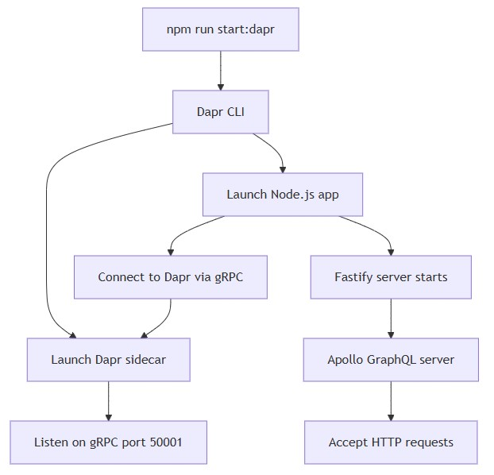
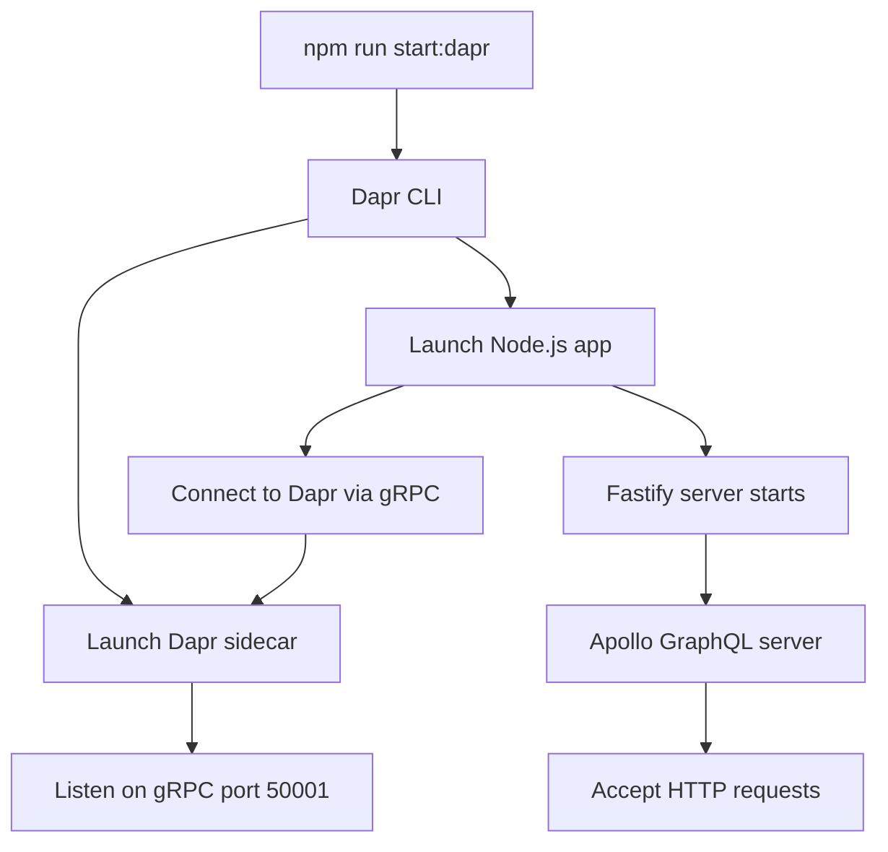
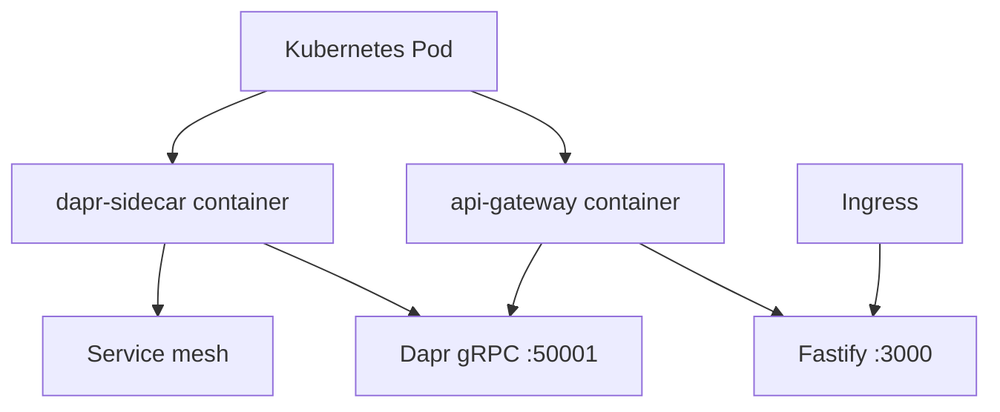

# Deployment
* [Overview](#overview)
* [Containerization](#containerization)
* [Dapr sidecar configuration](#dapr-sidecar-configuration)
* [Local development with Dapr](#local-development-with-dapr)
* [Health checks](#health-checks)
* [Environment configuration](#environment-configuration)
* [Production deployment](#production-deployment)
## Overview
* The API Gateway is designed for deployment as a containerized microservice with Dapr sidecar integration.
* The repository includes a Dockerfile and documented Dapr runtime commands for local and production environments.
## Containerization
* A Dockerfile exists at the repository root for building the container image.
* Project structure analysis confirms `Dockerfile` presence
* Build scripts in `package.json` prepare distribution artifacts:
  * `build:win32`: TypeScript compilation + file copy (Windows)
  * `build:default`: TypeScript compilation + file copy (Unix)
* **Container build process:**
```bash
docker build -t api-gateway:latest .
```
## Dapr sidecar configuration
* The application is configured to run alongside a Dapr sidecar for microservice communication.
* **Core Dapr settings:**
  * **App ID:** `api-gateway`
  * **Protocol:** HTTP (app-to-sidecar communication)
  * **Dapr gRPC port:** `50001`
  * **Scheduler:** Disabled (`--scheduler-host-address=""`)
* **Dapr client integration:**
  * Centralized client: `src/common/dapr-client.ts`
  * Service invocation via gRPC to backend services
  * Metadata propagation for authentication tokens
* **Enabled Dapr APIs:**
  * Health (`/healthz`): HTTP and gRPC
  * Metadata: HTTP and gRPC
## Local development with Dapr
* **Start with Dapr sidecar (full build):**
```bash
npm run start:dapr
```
* Executes:
```bash
dapr run --app-id api-gateway --app-protocol http --dapr-grpc-port 50001 --scheduler-host-address="" npm run start
```
* **Start with Dapr sidecar (skip code generation):**
  * Skips GraphQL codegen and protobuf compilation for faster iteration.
```bash
npm run start:dapr:cache
```
* **Start without Dapr:**
  * Sets `DAPR_ENABLED=false` for standalone development.
```bash
npm run start
```
* **Flow diagram:**


<details>
  <summary>mermaid</summary>


</details>

## Health checks
* **Endpoint:** `/healthz`
* **Consumers:**
  * Dapr sidecar health probes
  * Kubernetes liveness/readiness probes
* **Protocol support:**
  * HTTP: Available
  * gRPC: Not implemented for Dapr sidecar (HTTP only per Dapr API allowlist)
* README explicitly states: "The 'healthz' endpoint is used both by dapr for its health check by Kubernetes liveness probes"
* Dapr documentation reference: `https://docs.dapr.io/reference/api/health_api/`
## Environment configuration
* **Runtime environment variables:**
  * `NODE_ENV`: Controls Apollo Playground availability (`local` enables it)
  * `DAPR_ENABLED`: Toggles Dapr client initialization (`true`/`false`)
* **Configuration management:**
  * Centralized: `src/common/config.ts`
  * Service discovery: `CORE_SERVICE_APP_ID` for backend service routing
* **Environment file:**
  * `.env` file support via `dotenv` package
  * No example `.env.example` file found in repository
## Production deployment
* **Start command:**
```bash
npm run start:prod
```
* Executes:
```bash
node dist/index.js
```
* **Prerequisites:**
  * Pre-built artifacts in `dist/` directory
  * Environment variables configured
  * Dapr sidecar deployed separately (Kubernetes annotations or standalone)
* **Kubernetes deployment pattern (inferred):**


<details>
  <summary>mermaid</summary>


</details>

* **Expected Dapr annotations (not present in repository):**
  * `dapr.io/enabled: "true"`
  * `dapr.io/app-id: "api-gateway"`
  * `dapr.io/app-protocol: "http"`
  * `dapr.io/app-port: "<fastify-port>"`
