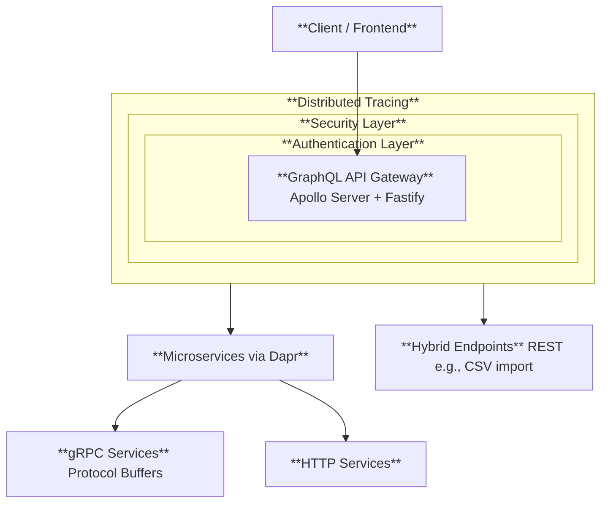

# Introduction
- [Overview](#overview)
- [Layers](#layers)
## Overview
- This is a **GraphQL API Gateway** (Backend for Frontend) built with `Apollo Server` and `Fastify`
- Serves as an entry point for microservices communication using **Dapr** (Distributed Application Runtime)
- Supports both **gRPC and HTTP protocols** for service-to-service communication via Dapr sidecars
## Layers
- Authentication layer: **OAuth2/JWT authentication** via Keycloak for secure access
- Distributed tracing layer: with **Zipkin** for observability
- Security layer: **GraphQL Armor plugins** (cost limits, depth limits, token limits, etc.)

## 
- Uses **Protocol Buffers** for gRPC service definitions with automated code generation
- Provides **GraphQL schema code generation** for TypeScript type safety
- Designed for **cloud-native deployment** with Kubernetes health probes and Dapr sidecar integration
- Supports **hybrid architecture** with both GraphQL queries and REST endpoints (e.g., CSV import)

