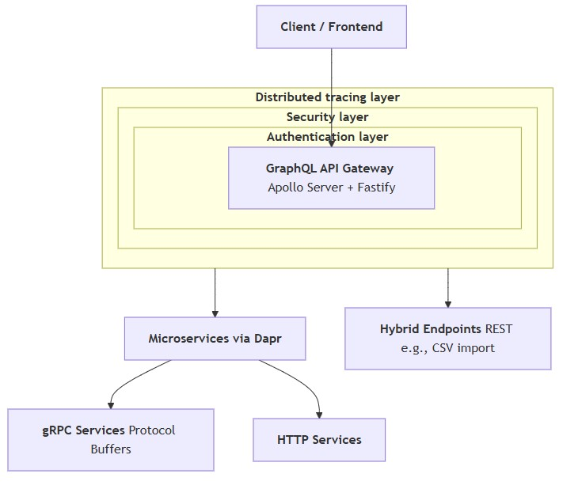
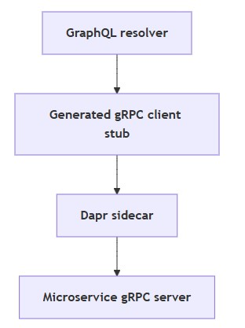
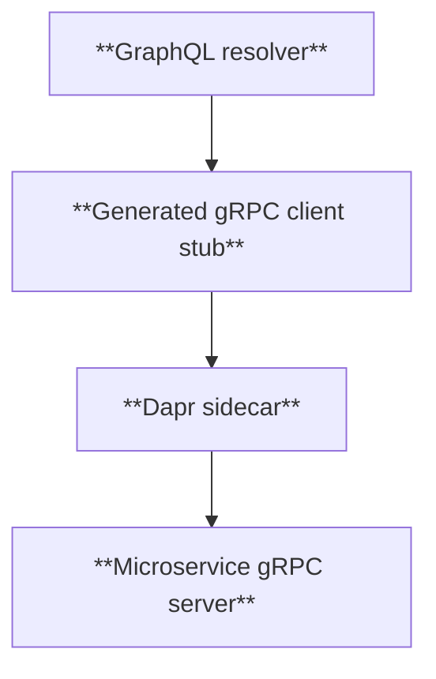
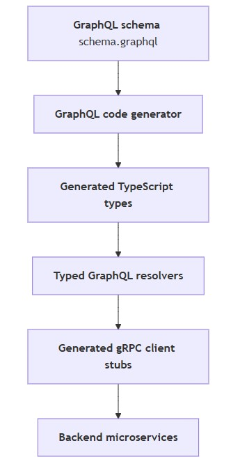
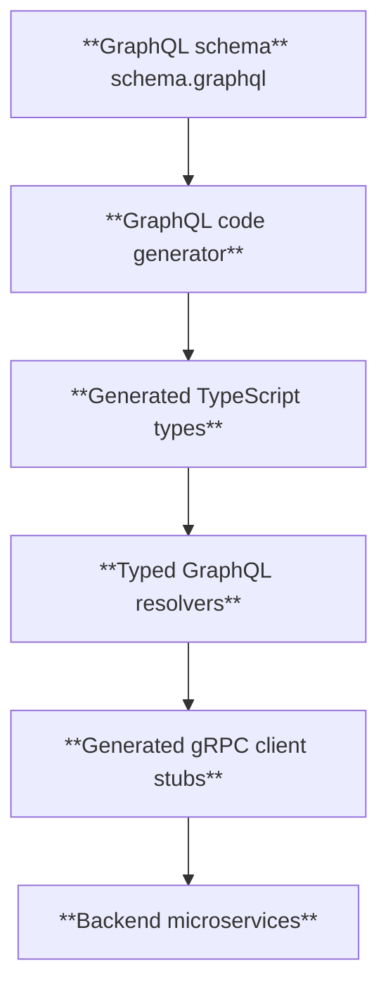

# Introduction
- [Overview](#overview)
- [Layers](#layers)
- [Features](#features)
## Overview
- **GraphQL API Gateway** (Backend for Frontend) built with `Apollo Server` and `Fastify`
- It serves as an entry point for microservices communication using **Dapr** (Distributed Application Runtime)
- It Supports both **gRPC and HTTP protocols** for service-to-service communication via `Dapr sidecars`
## Layers
- Authentication layer: **OAuth2/JWT authentication** via Keycloak for secure access
- Security layer: **GraphQL Armor plugins** (cost limits, depth limits, token limits, etc.)
- Distributed tracing layer: with **Zipkin** for observability

  
mermaid

## Features
- **Automated client code generation** for protocol buffers
  - Uses Protocol Buffers for gRPC service definitions with automated code generation
  - Automated code generation ensures the gateway has **type-safe client stubs** to call services without manual boilerplate.

  
mermaid

 - **Schema code generation** for TypeScript type safety
   - The gateway exposes a **GraphQL API to clients**.
   - Code generation converts the GraphQL schema into **TypeScript types** used in the gateway code.
   - Ensures that resolvers return the **correct data types**, matching the schema.
   - **Prevents runtime errors** in responses to clients.

  
mermaid

- **Designed for cloud-native deployment** with Kubernetes health probes and Dapr sidecar integration
  - **Health probes:** Kubernetes can check if the gateway is alive and ready.
  - **Dapr sidecar:** Gateway can call microservices via Dapr (gRPC or HTTP) without worrying about service discovery, retries, or protocol details.
  - Gateway stays **resilient and observable** in a cloud-native environment.
- Supports **hybrid architecture** with both GraphQL queries and REST endpoints (e.g., CSV import)
  - Gateway can **serve GraphQL queries to clients** for standard data access.
  - It can also **expose REST endpoints** for specific tasks (like bulk CSV import).
  * Internally, it can route these requests to services using the same Dapr layer.
