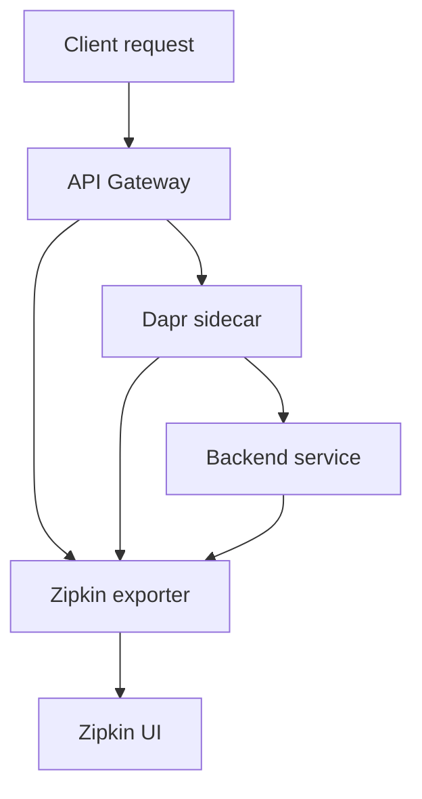

# Observability
* [Overview](#overview)
* [Distributed tracing](#distributed-tracing)
* [Zipkin integration](#zipkin-integration)
* [Trace propagation](#trace-propagation)
* [Gaps and unknowns](#gaps-and-unknowns)
## Overview
- The API Gateway includes distributed tracing capabilities for monitoring request flows across microservices.
- `Zipkin` is the configured tracing backend.
## Distributed tracing
* **Purpose:**
  * Track requests across service boundaries
  * Identify performance bottlenecks
  * Debug distributed system failures
* **Architecture pattern:**



## Zipkin integration
* **Local development endpoint:**
```
http://localhost:9411/zipkin/
```
* README states: "Zipkin tracing when hosted locally: http://localhost:9411/zipkin/"
* Dapr sidecar handles trace context propagation automatically
* **Expected behavior:**
  * Dapr injects trace headers into outbound requests
  * Zipkin collects spans from all Dapr-enabled services
  * Traces visualized in Zipkin UI
## Trace propagation
* **Mechanism:**
  * Dapr sidecar automatically propagates W3C Trace Context headers
  * No explicit instrumentation required in application code
* **Headers propagated:**
  * `traceparent`
  * `tracestate`
* **Span creation points:**
  * Incoming GraphQL requests
  * Dapr service invocations (gRPC calls to backend services)
  * HTTP requests via Fastify

## Gaps and unknowns
* **Missing configuration:**
  * Zipkin collector endpoint configuration (environment variable or Dapr component)
  * Sampling rate settings
  * Trace retention policies
  * Production Zipkin deployment details
