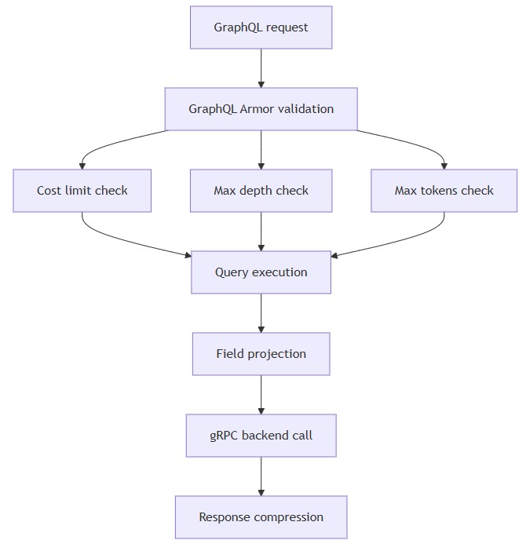
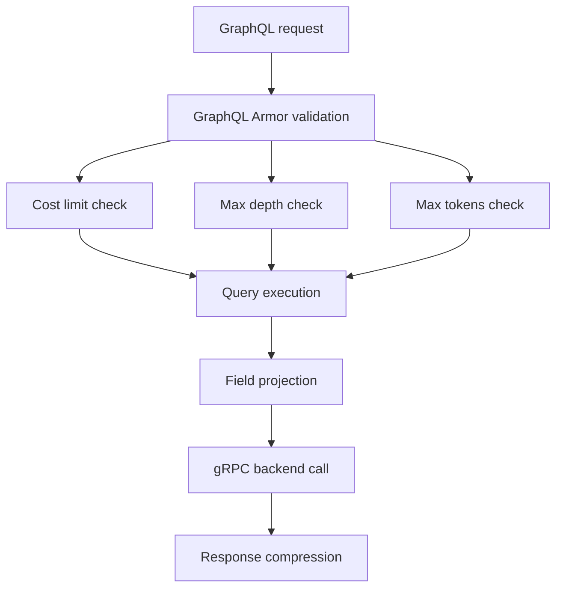

# Performance considerations
* [Overview](#overview)
* [HTTP Compression](#compression)
* [Rate limiting](#rate-limiting)
* [Caching mechanisms](#caching-mechanisms)
* [Request optimization](#request-optimization)
* [Gaps and unknowns](#gaps-and-unknowns)
## Overview
* The API Gateway implements multiple performance optimization strategies including HTTP compression, rate limiting, and caching to handle production workloads efficiently.
## HTTP Compression
* **Fastify plugin:**
  * `@fastify/compress` version `^8.3.0`
* **Capabilities:**
  * Automatic response compression
  * Supports gzip, deflate, and brotli encodings
  * Reduces bandwidth usage for large GraphQL responses
* **Configuration location:**
  * `src/integrations/apollo-fastify.ts` (inferred from plugin usage pattern)
* Package.json dependency: `"@fastify/compress": "^8.3.0"`
## Rate limiting
* **Fastify plugin:**
  * `@fastify/rate-limit` version `^10.3.0`
* **Purpose:**
  * Prevent API abuse
  * Protect backend services from overload
  * Enforce fair usage policies
* **Expected configuration:**
  * Per-IP request limits
  * Time window-based throttling
  * Custom error responses for rate-limited requests
* Package.json dependency: `"@fastify/rate-limit": "^10.3.0"`
## Caching mechanisms
* **LRU cache:**
  * `lru-cache` version `^11.1.0` (via Apollo Server dependencies)
* **Usage:**
  * Apollo Server internal caching for schema parsing
  * Query result caching (if enabled)
  * Keyvalue cache interface for custom caching strategies
* **Cache invalidation:**
  * Not documented in repository
  * Likely time-based eviction via LRU policy
* Apollo Server dependency tree includes `@apollo/utils.keyvaluecache` with `lru-cache` backend
## Request optimization
* **Body size limits:**
```typescript
// File: src/index.ts
const fastify = Fastify({
  bodyLimit: 1048576 * 50, //50MiB
  requestTimeout: 10000, //10 seconds
});
```

* **Timeouts:**
  * Request timeout: 10 seconds
  * Prevents long-running queries from blocking resources
* **Multipart handling:**
  * `@fastify/multipart` version `^9.3.0`
  * Optimized file upload processing for CSV imports
* **GraphQL query optimization:**


<details>
  <summary>mermaid</summary>


</details>

* **GraphQL Armor protections:**
  * `@escape.tech/graphql-armor-cost-limit` version `^2.4.3`
  * `@escape.tech/graphql-armor-max-depth` version `^2.4.2`
  * `@escape.tech/graphql-armor-max-tokens` version `^2.5.1`
  * `@escape.tech/graphql-armor-max-aliases` version `^2.6.2`
  * `@escape.tech/graphql-armor-max-directives` version `^2.3.1`
* **Purpose:**
  * Prevent expensive queries from degrading performance
  * Block deeply nested queries
  * Limit query complexity
* **Field projection optimization:**
```typescript
// File: src/resolver-definitions/core/device/devices.ts
const fieldSelections = info && graphqlFields(info).items;

const deviceRequest = new QueryDeviceRequest()
  .setFieldProjections(
    fieldSelections &&
      new FieldMask().setPathsList(Object.keys(fieldSelections)),
  );
```

* **Benefit:**
  * Only requested fields fetched from backend services
  * Reduces payload size and processing time
## Gaps and unknowns
* **Missing configuration details:**
  * Compression level settings
  * Rate limit thresholds (requests per minute/hour)
  * Cache size limits and eviction policies
  * GraphQL Armor cost calculation rules
* **Undocumented:**
  * Response caching strategy (CDN, Redis, in-memory)
  * Database connection pooling
  * gRPC keepalive settings
  * HTTP/2 server push usage
* **Cannot document without assumptions:**
* Load balancing strategy
* Horizontal scaling behavior
* Memory usage under load
* Benchmark results or performance 
