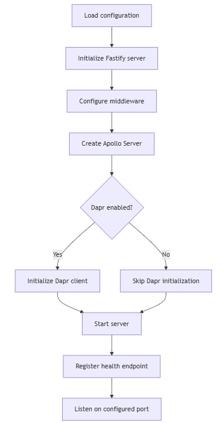
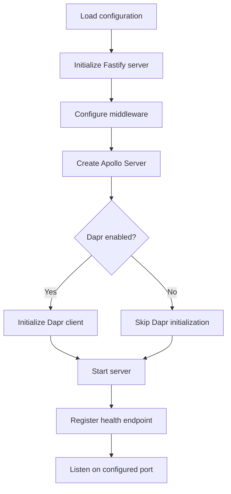
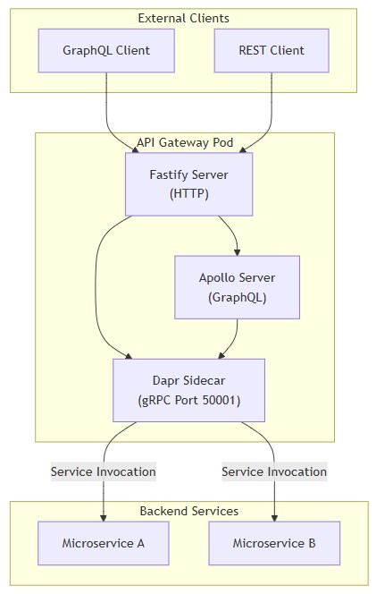
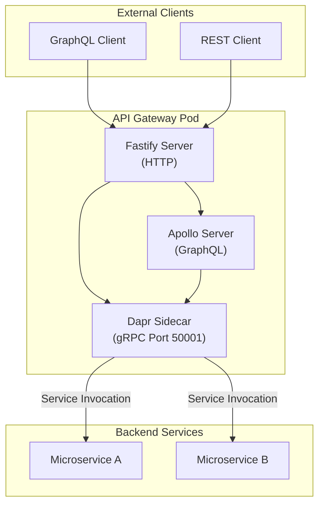
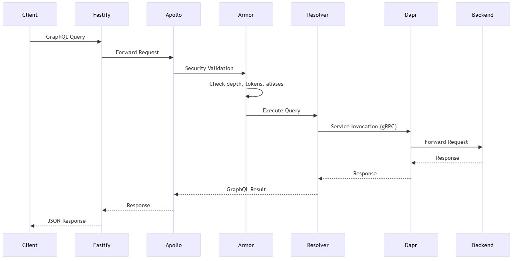
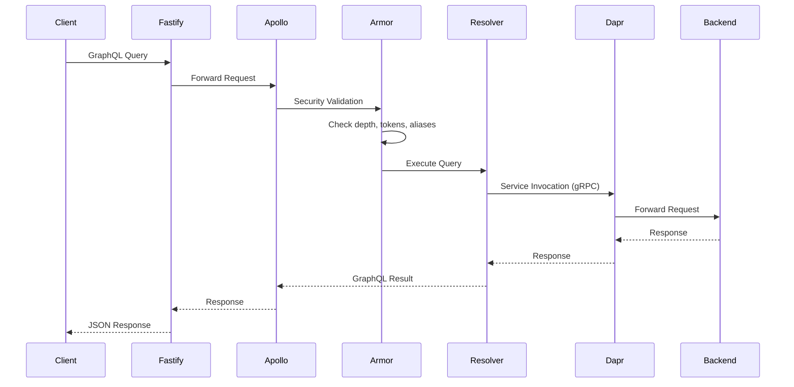

# Runtime behavior
* [Application startup](#application-startup)
* [Server initialization](#server-initialization)
* [Dapr sidecar integration](#dapr-sidecar-integration)
* [Health check mechanism](#health-check-mechanism)
* [Request processing flow](#request-processing-flow)
* [Shutdown behavior](#shutdown-behavior)
## Application startup
* The application entry point is `src/index.ts`.
* **Startup sequence:**


<details>
  <summary>mermaid</summary>


</details>

```typescript
// File: c:\Git\gfc-app\api-gateway\src\index.ts
const isDev = config.ENV !== "production";
const isHttp2 = config.ENV !== "local";

const fastify = Fastify({
  // redacted
});
```

* Environment-based configuration determines HTTP/2 enablement and development features.
## Server initialization
* The application uses **Fastify** as the underlying **HTTP server** with `Apollo Server` for `GraphQL`.
* **Server configuration:**
  * HTTP/2 enabled when `NODE_ENV` is not `local`
  * Apollo Server playground available only in development mode
  * Schema created using `makeExecutableSchema` with merged type definitions
```typescript
const schema = makeExecutableSchema({
  typeDefs: mergeTypeDefs(typesArray),
  resolvers
});

const server = new ApolloServer({
  schema,
  plugins: [
    isDev ? ApolloServerPluginLandingPageDisabled : /* production plugin */
  ]
});
```

## Dapr sidecar integration
* When Dapr is enabled, the application runs alongside a Dapr sidecar process.
* **Communication architecture:**


<details>
  <summary>mermaid</summary>


</details>

* **Dapr client initialization:**
```json
"@dapr/dapr": "^3.6.1"
```
* **Dapr client location:** `src/common/dapr-client.ts`
* **Communication protocols:**
  * Application to Dapr: gRPC on port 50001
  * Dapr to Application: HTTP
  * Dapr to Backend Services: gRPC or HTTP (service-dependent)
* **Dapr APIs enabled:**
  * `healthz` - HTTP and gRPC
  * `metadata` - HTTP and gRPC
## Health check mechanism
* The `/healthz` endpoint serves multiple purposes.
* **Health check consumers:**
  * Kubernetes liveness probes
  * Kubernetes readiness probes
  * Dapr sidecar health monitoring
* **Protocol support:**
  * HTTP endpoint available
  * gRPC endpoint available (application side only)
* The "healthz" endpoint is used both by dapr for its health check by Kubernetes liveness probes, as well as our application for its health check by dapr.
## Request processing flow
* The application processes requests through multiple layers.
* **GraphQL request flow:**


<details>
  <summary>mermaid</summary>


</details>

* **Security layer processing:**
  * GraphQL Armor plugins execute before resolver invocation:
    * Cost limit calculation
    * Maximum depth validation
    * Maximum tokens validation
    * Maximum aliases validation
    * Maximum directives validation
    * Field suggestion blocking
```json
"@escape.tech/graphql-armor-block-field-suggestions": "^3.0.1",
"@escape.tech/graphql-armor-cost-limit": "^2.4.3",
"@escape.tech/graphql-armor-max-aliases": "^2.6.2",
"@escape.tech/graphql-armor-max-depth": "^2.4.2",
"@escape.tech/graphql-armor-max-directives": "^2.3.1",
"@escape.tech/graphql-armor-max-tokens": "^2.5.1"
```
## Shutdown behavior
* Graceful shutdown implementation, signal handling, and cleanup procedures are not visible in provided snippets.
* The repository does not contain evidence of shutdown behavior.
