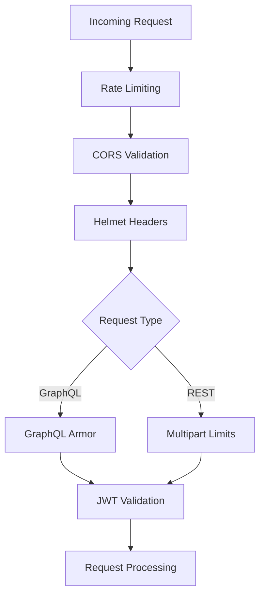

# Security
* [Security architecture](#security-architecture)
* [GraphQL armor plugins](#graphql-armor-plugins)
* [HTTP security headers](#http-security-headers)
* [Cross-origin resource sharing](#cross-origin-resource-sharing)
* [Rate limiting](#rate-limiting)
* [Authentication](#authentication)
* [File upload restrictions](#file-upload-restrictions)

## Security architecture
* The application implements multiple security layers


* **Security layers applied in order:**
  * Rate limiting (request throttling)
  * CORS policy enforcement
  * Security headers injection
  * Protocol-specific validation (GraphQL Armor or multipart limits)
  * JWT authentication

## GraphQL armor plugins
* GraphQL Armor provides query complexity and abuse prevention
* **Enabled plugins:**
  * Block field suggestions
  * Cost limit
  * Maximum aliases
  * Maximum depth
  * Maximum directives
  * Maximum tokens

```json
"@escape.tech/graphql-armor-block-field-suggestions": "^3.0.1",
"@escape.tech/graphql-armor-cost-limit": "^2.4.3",
"@escape.tech/graphql-armor-max-aliases": "^2.6.2",
"@escape.tech/graphql-armor-max-depth": "^2.4.2",
"@escape.tech/graphql-armor-max-directives": "^2.3.1",
"@escape.tech/graphql-armor-max-tokens": "^2.5.1"
```

* **Custom plugin implementations:**
  * The application includes custom implementations for field suggestions blocking and token limiting
* **Block field suggestions plugin:**
  * Prevents GraphQL introspection from suggesting field names in error messages
```typescript
// File: c:\Git\gfc-app\api-gateway\src\integrations\apollo-escape.ts
export const blockFieldSuggestionPlugin = ({
  mask,
}: BlockFieldSuggestionsOptions) => {
  // redacted
};
```

* **Maximum tokens plugin:**
  * Limits the number of tokens in a GraphQL query to prevent resource exhaustion
```typescript
// File: c:\Git\gfc-app\api-gateway\src\integrations\apollo-escape.ts
export const maxTokenPlugin = (
  options:
    | (ParseOptions & {
        n: number;
        exposeLimits?: boolean;
        errorMessage?: string;
      } & GraphQLArmorCallbackConfiguration)
    | undefined,
) => {
  // redacted
};
```

* **Token validation implementation:**
  * Parsing occurs during the `parsingDidStart` phase of Apollo Server request lifecycle
```typescript
async parsingDidStart(
  requestContext: GraphQLRequestContext<BaseContext>,
) {
  const source = requestContext.source;
  if (source !== undefined) {
    const parser = new MaxTokensParserWLexer(source, options);
    parser.parseDocument();
  }
}
```
* **Error handling:**
  * Validation failures return standardized GraphQL errors with `GRAPHQL_VALIDATION_FAILED` code
```typescript
async unexpectedErrorProcessingRequest(err: any) {
  throw new GraphQLError(err.error, {
    extensions: {
      code: "GRAPHQL_VALIDATION_FAILED",
    },
  });
}
```

## HTTP security headers
* Helmet middleware adds security headers to HTTP responses
```typescript
// File: c:\Git\gfc-app\api-gateway\src\index.ts
import helmet from "@fastify/helmet";

if (!isDev) await fastify.register(helmet);
```
* **Behavior:**
  * Enabled only in production mode (`NODE_ENV !== "local"`)
  * Disabled in development for easier debugging
* **Dependency:**
```json
"@fastify/helmet": "^13.0.2"
```
* **Note:** Specific headers configured, CSP policies, and custom Helmet options are not visible in provided snippets
## Cross-origin resource sharing
* CORS policy controls which origins can access the API
```typescript
// File: c:\Git\gfc-app\api-gateway\src\index.ts
await fastify.register(cors, {
  origin: isDev ? true : originRegExp,
  credentials: true,
});
```
* **Configuration:**
  * Development mode: All origins allowed (`origin: true`)
  * Production mode: Origins validated against `originRegExp` pattern
  * Credentials: Enabled for all modes
* **Dependency:**

```json
"@fastify/cors": "^11.2.0"
```
* **Note:** The `originRegExp` pattern definition is not visible in provided snippets
## Rate limiting
* Rate limiting prevents abuse and resource exhaustion
```typescript
// File: c:\Git\gfc-app\api-gateway\src\index.ts
import rateLimit from "@fastify/rate-limit";

await fastify.register(rateLimit);
```
* **Dependency:**
```json
"@fastify/rate-limit": "^10.3.0"
```
* **Note:** Rate limit thresholds, time windows, and exemption rules are not visible in provided snippets

## Authentication
* The application uses JWT-based authentication via OAuth2/OpenID Connect
* **Identity provider:**
  * Keycloak instance at `https://dev.idp.landisgyr.com/keyc01`
  * Realm: `gfc`
  * Client ID: `test-client-01`
* **Token acquisition example from README:**
```bash
curl -X POST "https://dev.idp.landisgyr.com/keyc01/realms/gfc/protocol/openid-connect/token" \
  -d "grant_type=password" \
  -d "username=test03" \
  -d "password=rubicon3.14one" \
  -d "client_id=test-client-01"
```

* **Token usage:**
  * Tokens are passed in the `Authorization` header as `Bearer <token>`
* **Context extraction:**
  * The authorization header is extracted and made available to resolvers via GraphQL context
```typescript
// File: c:\Git\gfc-app\api-gateway\src\index.ts
await fastify.register<FastifyApolloPluginOptions<Context>>(
  fastifyApollo(server),
  {
    context: async (request) => ({
      token: request.headers.authorization,
    }),
  },
);
```
* **Note:** Token validation logic, permission checks, and role-based access control implementation are not visible in provided snippets

## File upload restrictions
* File uploads are restricted to prevent abuse
```typescript
// File: c:\Git\gfc-app\api-gateway\src\index.ts
fastify.register(import("@fastify/multipart"), {
  limits: {
    fileSize: 1048576 * 10, //10 MiB
    files: 1
  }, 
})
```
* **Restrictions:**
  * Maximum file size: 10 MiB (10,485,760 bytes)
  * Maximum files per request: 1
* **Dependency:**
```json
"@fastify/multipart": "^9.3.0"
```
* **Applicable endpoints:**
  * `/api/flexibilities/import`
* **Note:** File type validation, content scanning, and virus checking are not visible in provided snippets
