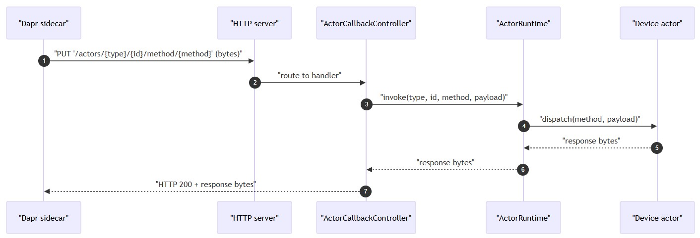
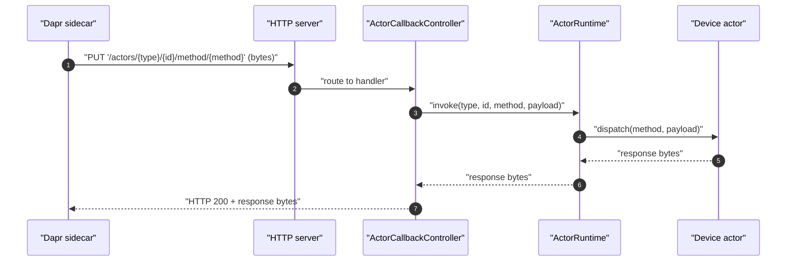

## API reference
- [Overview](#overview)
- [HTTP endpoints](#http-endpoints)
- [Requests](#requests)
## Overview
- Base interface and port are configured under device-hub.http-server
  - `default interface`: `0.0.0.0`
  - `default port`: `3501`
- Endpoints below are implemented in `ActorCallbackController` and `HealthCheckController`
## HTTP endpoints
- dapr actor callbacks

| HTTP method | Endpoint                                       | Purpose                           |
| ----------- | ---------------------------------------------- | --------------------------------- |
| GET         | `/dapr/config`                                 | Fetch actor runtime configuration |
| DELETE      | `/actors/{type}/{id}`                          | Deactivate an actor instance      |
| PUT         | `/actors/{type}/{id}/method/{method}`          | Invoke an actor method            |
| PUT         | `/actors/{type}/{id}/method/remind/{reminder}` | Deliver actor reminders           |
| PUT         | `/actors/{type}/{id}/method/timer/{timer}`     | Deliver actor timers              |

- health

| HTTP method | Endpoint                                       | Purpose            |
| ----------- | ---------------------------------------------- | ------------------ |
| GET         | `/healthz`                                     | Health  check      |

## Requests

| HTTP method | Endpoint   | Request body  | Success response  | Error behavior   |
| ----------- | ---------- | ------------  | ----------------  | ---------------- |
| GET         | `/dapr/config`                                 | None                                                 | `200` with serialized ActorRuntime configuration bytes | `500` with text `Error serializing config` on serialization failure |
| DELETE      | `/actors/{type}/{id}`                          | None                                                 | `200` with empty body after deactivation completes     | Errors propagate as server error                                    |
| PUT         | `/actors/{type}/{id}/method/{method}`          | Raw bytes forwarded to `ActorRuntime.invoke`         | `200` with raw bytes returned by actor method          | Returns `200` with bytes for string `error`                         |
| PUT         | `/actors/{type}/{id}/method/remind/{reminder}` | Raw bytes forwarded to `ActorRuntime.invokeReminder` | `200` with empty body                                  | Error propagates, resulting in server error                         |
| PUT         | `/actors/{type}/{id}/method/timer/{timer}`     | Raw bytes forwarded to `ActorRuntime.invokeTimer`    | `200` with empty body                                  | Error propagates, resulting in server error                         |
| GET         | `/healthz`                                     | None                                                 | `200` (health response)                                | Implementation details not visible in provided code                 |

  
mermaid

