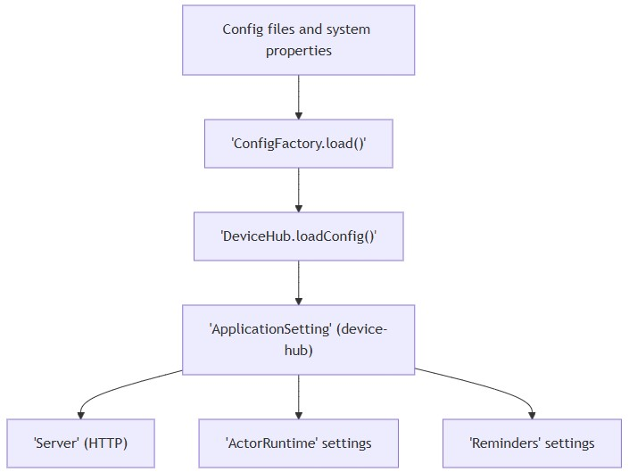
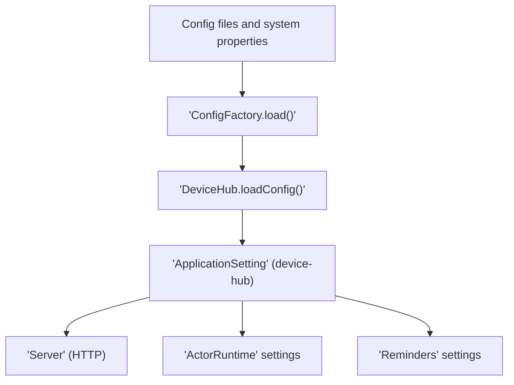

## Configuration
- [Overview](#overview)
- [Application settings structure and defaults](#application-settings-structure-and-defaults)
- [Environment variables](#environment-variables)
- [Configuration files and overrides](#configuration-files-and-overrides)
## Overview
- Configuration is loaded via Typesafe Config and must contain a top-level section named device-hub
- Defaults are provided in code for all sub-sections when specific keys are missing
- The service logs the resolved device-hub configuration on startup

  
mermaid

## Application settings structure and defaults
| Scope                | Configuration key                                     | Value               |
| -------------------- | ----------------------------------------------------- | ------------------- |
| HTTP callback server | dapr-http-callback-server.interface                   | `0.0.0.0`           |
| HTTP callback server | dapr-http-callback-server.port                        | `3501`              |
| HTTP callback server | dapr-http-callback-server.worker-thread-count         | `4`                 |
| HTTP callback server | dapr-http-callback-server.selector-thread-count       | `1`                 |
| gRPC integration     | grpc-requests-deadline                                | `5 seconds`         |
| Reminders            | reminders.partitions                                  | `1`                 |
| Reminders            | reminders.check-connectivity.initialDelay             | `60 minutes`        |
| Reminders            | reminders.check-connectivity.period                   | `12 hours`          |
| Reminders            | reminders.check-connectivity.partitions               | `1`                 |
| Reminders            | reminders.check-connectivity.executionTimeWindow      | `60 minutes`        |
| Reminders            | reminders.check-data-completeness.initialDelay        | `60 minutes`        |
| Reminders            | reminders.check-data-completeness.period              | `12 hours`          |
| Reminders            | reminders.check-data-completeness.partitions          | `1`                 |
| Reminders            | reminders.check-data-completeness.executionTimeWindow | `60 minutes`        |
| Actor runtime        | actor-runtime.actor-idle-timeout                      | `60 minutes`        |
| Actor runtime        | actor-runtime.actor-scan-interval                     | `30 seconds`        |
| Actor runtime        | actor-runtime.drain-ongoing-call-timeout              | `60 seconds`        |

## Environment variables
- dapr host ip: `DAPR_HOST_IP`
- dapr grpc port: `DAPR_GRPC_PORT`
## Configuration files and overrides
| Area                      | Description                                       | Location / Notes                                                                                                                                                                |
| ------------------------- | ------------------------------------------------- | ------------------------------------------------------------------------------------------------------------------------------------------------------------------------------- |
| Application configuration | Core application settings loaded at startup       | `src/main/dist/etc/application.conf`; requires top-level key `device-hub`; application fails to start if missing                                                                |
| Logging configuration     | Logging framework and appenders configuration     | `src/main/dist/etc/logback.xml`                                                                                                                                                 |
| Dapr components           | State store and other Dapr runtime components     | `components/postgresql.yaml` for PostgreSQL state store; `components` directory passed to Dapr using `--resources-path ./components`                                            |
| System property overrides | JVM-level overrides for configuration and logging | `-Dconfig.file=src/main/dist/etc/application.conf`; `-Dlogback.configurationFile=src/main/dist/etc/logback.xml`; example additional property used at runtime: `-Dlog.appender=` |
