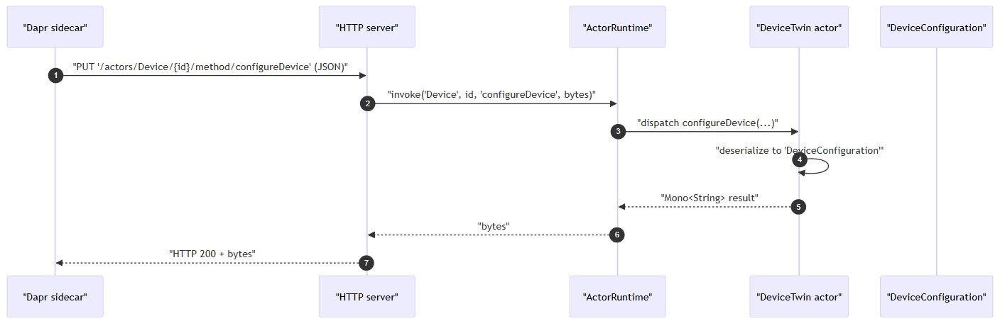
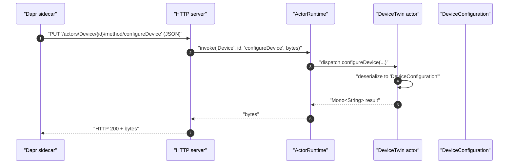

## Data models
- [Overview](#overview)
- [Device configuration](#device-configuration)
- [Actor interfaces using the model](#actor-interfaces-using-the-model)
- [Serialization](#serialization)

## Overview
- Core domain data used by actors is represented by the `DeviceConfiguration` class
- `DeviceConfiguration` is referenced by the Device actor interface as the payload for `configureDevice`

## Device configuration

| Aspect                   | Details     |
| ------------------------ | ------------ |
| Location                 | `src/main/java/com/landisgyr/gfc/devicehub/api/DeviceConfiguration.java`  |
| Purpose                  | Actor state / payload carrying information derived from an IEC4HES `MeterConfig` event      |
| Annotations & traits     | - Uses `com.fasterxml.jackson.annotation.JsonProperty`   - Implements `java.io.Serializable`  |
| Known fields & accessors | - `commTechnology: String` — getter: `getCommTechnology()`   - `meterUtilitySerialNumber: String`   - `deviceState: String` — allowed values (from class comment):     • `NOT_DEFINED`     • `INVENTORY`     • `DISCOVERED`     • `IN_OPERATION`     • `UPDATE_IN_PROGRESS`     • `POOR_COMMUNICATION`     • `ERROR`     • `REMOVED` |

- notes
  - `deviceState` is a String with documented allowed values
     - no enum is defined in the provided code
  - Only the fields shown above are evidenced in the repository snippets
    - other members, if present, are not documented here

## Actor interfaces using the model

| Actor                  | Location                                                          | Type / Annotation             | Key methods                                                |
| ---------------------- | ----------------------------------------------------------------- | ----------------------------- | ---------------------------------------------------------- |
| Device actor interface | `src/main/java/com/landisgyr/gfc/devicehub/api/Device.java`       | `@ActorType(name = "Device")` | `Mono<String> configureDevice(DeviceConfiguration device)` |
| Device twin actor      | `src/main/java/com/landisgyr/gfc/devicehub/actor/DeviceTwin.java` | Implements `Device`           | Overrides `configureDevice(DeviceConfiguration device)`    |

  
mermaid

## Serialization

| Area                   | Detail                    | Remarks                                                                                      |
| ---------------------- | ------------------------- | --------------------------------------------------------------------------------------------------------- |
| JSON mapping           | Jackson library           | `jackson-datatype-jsr310` included for Java 8 date/time support                                           |
| Runtime configuration  | ObjectMapper setup        | DeviceHub configures the Dapr default Jackson `ObjectMapper` before registering actors                    |
| Implication for models | Actor model serialization | `DeviceConfiguration` and similar models are serialized/deserialized as JSON when passed to actor methods |
