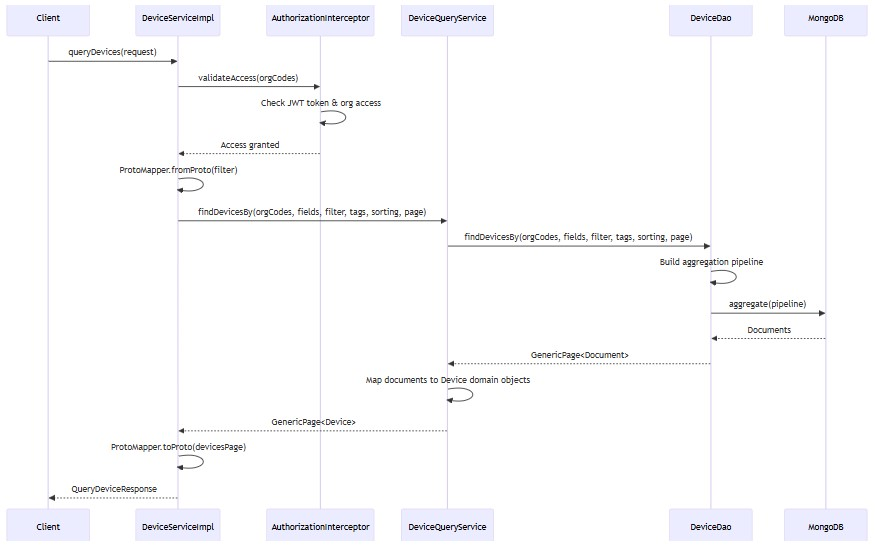
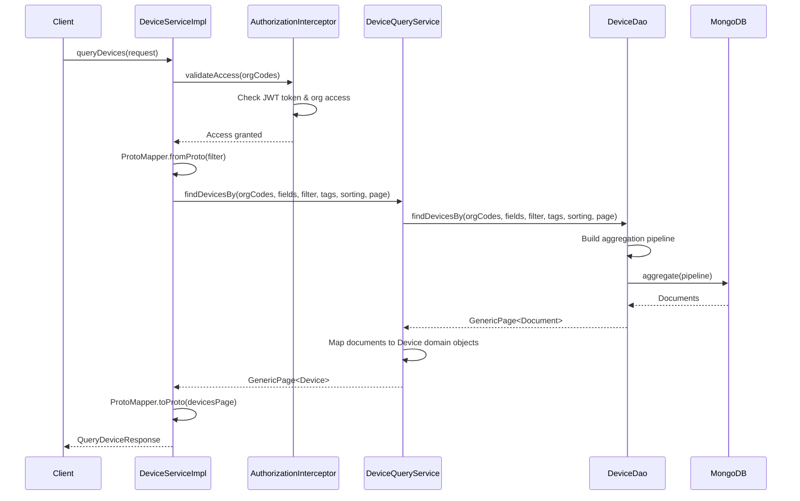
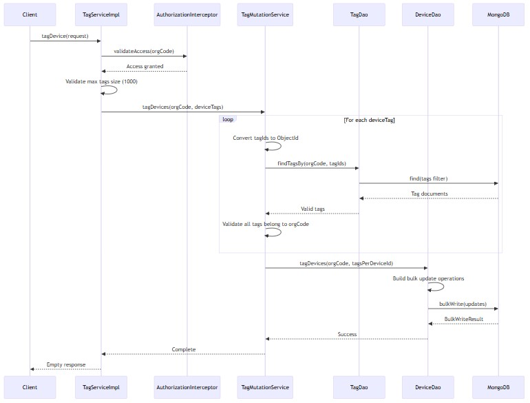
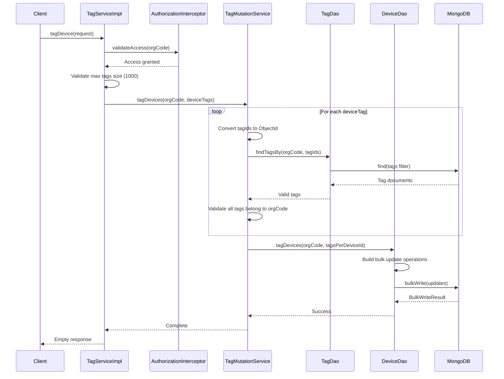
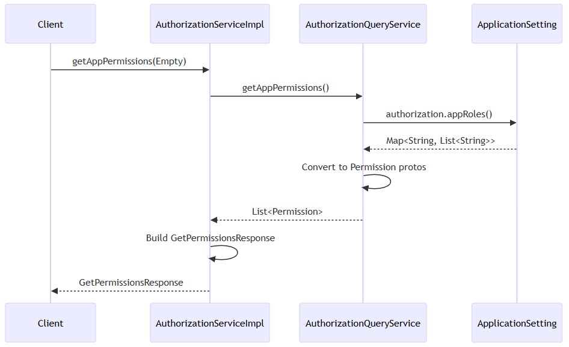
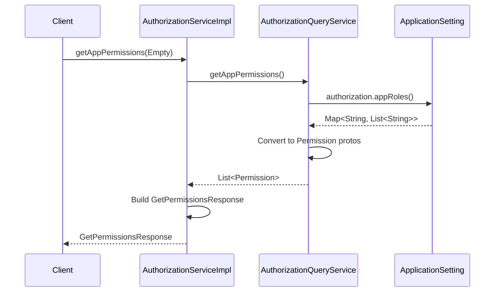

# gRPC APIs
- [Overview](#overview)
- [Device service](#device-service)
  - [RPC methods](#rpc-methods)
  - [Query devices flow](#query-devices-flow)
- [Event service](#event-service)
  - [RPC methods](#rpc-methods-1)
- [Organization service](#organization-service)
  - [RPC methods](#rpc-methods-2)
- [Tag service](#tag-service)
  - [RPC methods](#rpc-methods-3)
  - [Tag devices flow](#tag-devices-flow)
- [Authorization service](#authorization-service)
  - [RPC methods](#rpc-methods-4)
  - [Get app permissions flow](#get-app-permissions-flow)
- [Health service](#health-service)
  - [RPC methods](#rpc-methods-5)
- [Dapr health service](#dapr-health-service)
  - [RPC methods](#rpc-methods-6)
- [Revision service](#revision-service)
  - [RPC methods](#rpc-methods-7)
## Overview
- Service exposes 7 main gRPC service interfaces for device, event, organization, tag, authorization, health, and revision management
- All services use Protocol Buffers for type-safe contracts and unary RPCs (no streaming)
- Field masks (`FieldMask`) supported for field projection to reduce payload size
- Organization-scoped access control enforced via `validateAccess()` in all mutation operations
- Pagination supported via `PageRequest` with default page size 50 for queries
- Search filters translated from protobuf to domain `SearchFilter` via `ProtoMapper`

## Device service
- Manages smart meter device lifecycle: registration, state transitions, querying, and bulk operations
- Supports device registration from device-hub via Dapr, state updates, and communication statistics
- Query operations support complex filters, tag filtering, field projection, and pagination
- Bulk operations include CSV upload for flexibilities and device count aggregation
- Device twin ID used as unique identifier alongside MongoDB `_id`

### RPC methods

| Method | Request | Response | Notes |
|--------|---------|----------|-------|
| `getDevice` | `GetDeviceRequest` (orgCode, id, fieldProjections) | `GetDeviceResponse` (device) | Retrieve single device by ID with field projection |
| `queryDevices` | `QueryDeviceRequest` (orgCodes, filter, order, pagination, fieldProjections) | `QueryDeviceResponse` (devices page) | Query devices with filters, sorting, pagination, tag filtering |
| `registerDevice` | `RegisterDeviceRequest` (orgCode, deviceRegistrationData) | `RegisterDeviceResponse` (registeredDevice) | Register new device from device-hub, generates deviceTwinId |
| `updateDeviceState` | `UpdateDeviceStateRequest` (orgCode, deviceTwin, deviceState, changed) | `UpdateDeviceStateResponse` (createdEventId) | Update device state, creates event if state changed |
| `updateCommunicationStats` | `UpdateCommunicationStatsRequest` (device) | `UpdateCommunicationStatsResponse` | Update device communication statistics, broadcasts to frontend |
| `getDeviceCount` | `GetDeviceCountRequest` (orgCodes, filter, groupBy) | `GetDeviceCountResponse` (groups) | Aggregate device counts grouped by specified criteria |
| `getDeviceModels` | `GetDeviceModelsRequest` (orgCodes) | `GetDeviceModelsResponse` (deviceModels) | Get list of unique device models for organizations |
| `uploadFlexibilities` | `UploadCsvRequest` (content) | `UploadCsvResponse` (uploadId, csvReview) | Upload CSV file for flexibilities, returns preview |
| `confirmUploadFlexibilities` | `ConfirmUploadFlexibilitiesRequest` | `ConfirmUploadFlexibilitiesResponse` | Confirm flexibilities upload (not implemented) |

### Query devices flow

  
mermaid

## Event service
- Manages operational events for devices: storage, querying, and aggregation
- Events linked to devices via `deviceTwinId` and organization via `orgCode`
- Supports event filtering by type, timestamp, device, and custom search filters
- Aggregation operations provide event counts grouped by various criteria
- Event mutations create upsert operations based on deviceTwinId, type, and timestamp uniqueness

### RPC methods

| Method | Request | Response | Notes |
|--------|---------|----------|-------|
| `addEvent` | `AddEventRequest` (event) | `AddEventResponse` (added) | Add or update event, returns true if new event created |
| `queryEvent` | `QueryEventRequest` (orgCode, filter, sort, pagination, fieldProjections) | `QueryEventResponse` (events page) | Query events with filters, sorting, pagination (default page size 50) |
| `getEventCount` | `EventCountRequest` (orgCodes, filter, groupBy) | `EventCountResponse` (groups) | Aggregate event counts grouped by type, device, etc. |
| `getDeviceStateChangedCounts` | `GetDeviceStateChangedCountsRequest` (orgCodes, filter) | `EventCountResponse` (groups) | Count device state change events grouped by state |

## Organization service
- Manages multi-tenant organizations with settings and configuration
- Organization data cached in `OrganizationService` with 10-minute TTL
- Settings include device identifier type, metering point defaults, and organization-specific configuration
- Access control based on JWT claims: empty access list means super admin (development mode)

### RPC methods

| Method | Request | Response | Notes |
|--------|---------|----------|-------|
| `getOrganizations` | `GetOrganizationsRequest` (fieldProjections) | `GetOrganizationsResponse` (organizations) | Get all accessible organizations, filtered by JWT claims |
| `getOrganization` | `GetOrganizationRequest` (orgCode, fieldProjections) | `GetOrganizationResponse` (organization) | Get single organization by code with field projection |
| `addOrganization` | `AddOrganizationRequest` (organization) | `AddOrganizationResponse` (organization) | Create or update organization, returns upserted organization |
| `updateOrganizationSettings` | `UpdateOrganizationSettingsRequest` (orgCode, settings) | `UpdateOrganizationSettingsResponse` (organization) | Update organization settings, invalidates cache |

## Tag service
- Manages device tags for categorization and metadata
- Tags are organization-scoped and can be assigned to multiple devices
- Tag operations include create, update, delete, query, and bulk device tagging
- Maximum 1000 tags per `tagDevice` operation to prevent request size issues
- Tag validation ensures tags belong to specified organization before assignment

### RPC methods

| Method | Request | Response | Notes |
|--------|---------|----------|-------|
| `createOrUpdateTag` | `CreateOrUpdateRequest` (tag) | `CreateOrUpdateResponse` (tag) | Create or update tag, orgCode mandatory |
| `deleteTag` | `DeleteTagRequest` (id, orgCode) | `Empty` | Delete tag by ID, validates orgCode |
| `queryTags` | `QueryTagsRequest` (orgCodes, filter, pagination, fieldProjections) | `QueryTagsResponse` (tags page) | Query tags with filters and pagination |
| `tagDevice` | `TagDevicesRequest` (orgCode, deviceTags) | `Empty` | Assign tags to devices, max 1000 tags, validates tag ownership |

### Tag devices flow

  
mermaid

## Authorization service
- Provides permission metadata for frontend authorization UI
- Method permissions map gRPC methods to required roles
- App permissions map applications to allowed methods
- No authentication required; returns static configuration from `ApplicationSetting`
- Used by frontend to build permission matrices and role-based UI

### RPC methods

| Method | Request | Response | Notes |
|--------|---------|----------|-------|
| `getMethodPermissions` | `Empty` | `GetPermissionsResponse` (permissions) | Get method-to-roles mapping from configuration |
| `getAppPermissions` | `Empty` | `GetPermissionsResponse` (permissions) | Get app-to-methods mapping from configuration |

### Get app permissions flow

  
mermaid

## Health service
- Standard gRPC health checking protocol implementation
- `GrpcHealthServiceImpl` wraps `HealthStatusManager` from gRPC library
- Health status synchronized with MongoDB connection state via `ReadinessHealthIndicator`
- Service names: `gfc` (service-specific) and `*` (all services)
- Status values: `SERVING`, `NOT_SERVING`, `SERVICE_UNKNOWN`

### RPC methods

| Method | Request | Response | Notes |
|--------|---------|----------|-------|
| `Check` | `HealthCheckRequest` (service) | `HealthCheckResponse` (status) | Check health status for service name |
| `Watch` | `HealthCheckRequest` (service) | Stream `HealthCheckResponse` | Watch health status changes (streaming) |

## Dapr health service
- Dapr-specific health check implementation for service mesh integration
- Implements `AppCallbackHealthCheckGrpc` interface for Dapr sidecar
- Health status managed independently but synchronized with gRPC health service
- Terminal state entered during shutdown to prevent new health checks
- Returns gRPC status errors for unhealthy or unknown service states

### RPC methods

| Method | Request | Response | Notes |
|--------|---------|----------|-------|
| `healthCheck` | `Empty` | `HealthCheckResponse` | Dapr health check, returns healthy or status error |

## Revision service
- Provides Git commit information for deployment tracking
- Returns commit ID, short commit ID, and commit timestamp
- Information loaded from `git-info.properties` generated during build
- Used by frontend and monitoring tools to identify deployed version

### RPC methods

| Method | Request | Response | Notes |
|--------|---------|----------|-------|
| `getRevisionInfo` | `Empty` | `RevisionInfo` (commitId, shortCommitId, commitTime) | Get Git revision information |

