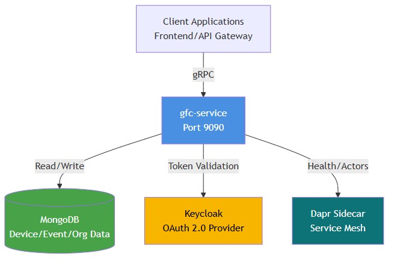
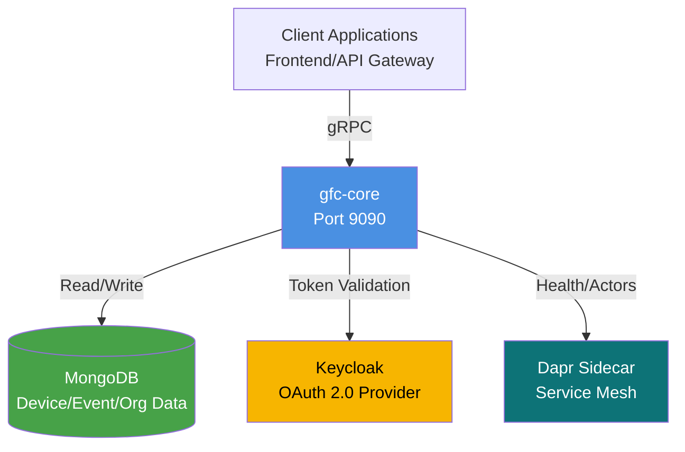

# Introduction
- [Problem statement](#problem-statement)
- [Motivation](#motivation)
- [Design](#design)
- [Design principles](#design-principles)
- [Technology stack](#technology-stack)
- [Project structure](#project-structure)
- [Dependencies](#dependencies)
- [Protos](#protos)
- [Core responsibilities](#core-responsibilities)
## Problem statement
- Grid Flex Control application requires a centralized service to manage flexibilities lifecycles, events, multi-tenant organizations, and authorization. 
- Traditional REST APIs with JSON payloads introduce performance bottlenecks and lack strong typing for complex query operations.
## Motivation
- `High-throughput` requirements for device and event management
- Need for `type-safe contracts` between frontend and backend
- Multi-tenant isolation at the organization level
- Fine-grained authorization with role-based access control
- `Integration with service mesh infrastructure` for distributed systems
## Design
- `gfc-core` implements a **gRPC-based microservice** providing CRUD operations for the Grid Flex Control application. 
- It serves as the 
  - Core backend
  - Exposing type-safe APIs through protocol buffers 
  - Integration with 
    - MongoDB for persistence
    - Keycloak for authentication
    - Dapr for service mesh capabilities.


<details>
  <summary>mermaid</summary>


</details>

## Design principles
- **Layered architecture**: Separation between
  - `gRPC handlers`
  - Business logic (`services`)
  - Data access (`dao`)
- **Dependency injection**: Full `Dagger-based DI` for testability and modularity
- **Multi-tenancy**: `Organization-scoped data isolation` at the `DAO layer`
- **Security first**: `Token-based authentication` with method-level authorization checks
- **Observability**: Health indicators, structured logging, and latency tracking via interceptors
## Technology stack
- **Runtime**: `Java 25` with preview features (`--enable-preview` for unnamed variables)
- **API**: `gRPC` with Protocol Buffers for `type-safe contracts`
- **DI framework**: `Dagger 2` for **`compile-time`** dependency injection
- **Database**: `MongoDB` with Atlas search support for **full-text queries**
- **AuthN/AuthZ**: `Keycloak` (OAuth 2.0 / OpenID Connect) for token validation
- **Service mesh**: `Dapr` sidecar for health checks and distributed system integration
- **Configuration**: `Typesafe Config` (**HOCON** format) with environment variable overrides
- **Logging**: `SLF4J` with `Logback` for structured logging

## Project structure

| Folder/File | Purpose |
|-------------|---------|
| `gfc/` | Core Java application code |
| `gfc/di/` | Dependency injection components using Dagger 2; defines application-wide and gRPC server components with module bindings |
| `gfc/grpc/` | gRPC service implementations (Device, Authorization, Event, Organization, Tag, Revision services) and interceptors |
| `gfc/server/` | Server bootstrap, configuration loading, graceful shutdown hooks, and main application runner |
| `gfc/services/` | Business logic services (queries, commands, authorization, git info management) |
| `gfc/dao/` | Data Access Objects for MongoDB operations and authorization role mappings |
| `gfc/domain/` | Domain models and business entities (Device, Organization, OperationContext, Group, etc.) |
| `gfc/keycloak/` | Keycloak integration utilities for JWT token validation, security context, and RBAC |
| `gfc/rbac/` | Role-Based Access Control logic and permission checking |
| `gfc/monitoring/` | Health checks (readiness/liveness), MongoDB connection monitoring, Dapr health integration |
| `gfc/exceptions/` | Custom exception classes (AccessDeniedException, ResourceNotFoundException, etc.) |
| `src/main/dist/etc/` | Distribution configs: `application.conf` (Typesafe Config), `logback.xml` (logging configuration) |
| `src/test/` | Unit and integration tests with test-specific configurations |
| `pom.xml` | Maven build configuration with dependencies, plugins, and build profiles |
| `Dockerfile` / `Dockerfile-dev` | Container images for production and development environments |
| `envfile.env` | Environment variables for containerized deployments |

- Application resources such as manufacturer mappings, configuration files, static data: `src/main/resources/com/landisgyr/gfc/`

## Dependencies
- **gRPC 1.77.0** - RPC framework
- **Dapr SDK 1.16.0** - Distributed application runtime
- **MongoDB Driver 5.6.2** - Database client
- **Keycloak 26.x** - Identity/access management
- **Dagger 2.57.2** - Dependency injection
- **Netty 4.2.8** - Network transport
- **Logback/SLF4J** - Logging
- **Typesafe Config** - Configuration management
## Protos
- The location of proto files can be found in `pom.xml` line 419:
```xml
<protoSourceRoot>${basedir}/../gfc-apis/proto</protoSourceRoot>
```
- This points to `../gfc-apis/proto` (sibling directory), so the `.proto` files are in the `gfc-apis` repository/module, not in `gfc-service`.
  - The `gfc-apis` directory exists as a sibling to `gfc-service`.
- **During build**, the protobuf plugin compiles them from that location.
- This is a common pattern where:
  - **API contracts are centralized** in `gfc-apis` (shared repository)
  - **Multiple services reference them** (like `gfc-service`, `api-gateway`, etc.)
  - **Build-time compilation** happens via the protobuf Maven plugin pointing to `${basedir}/../gfc-apis/proto`
- The proto files are located at:
  - `../gfc-apis/proto/core/api/` - main service definitions (device, event, organization, tag, authorization, revision)
  - `../gfc-apis/proto/core/type/` - shared types (search, metering_point, shared)
  - `../gfc-apis/proto/iec61968_connector/` - connector-specific APIs
- During `mvn compile`, the protobuf plugin:
  - Reads proto files from `../gfc-apis/proto`
  - Generates Java classes in `target/generated-sources/protobuf/java`
  - Generates gRPC service stubs in `target/generated-sources/protobuf/grpc-java`
- This keeps **API contracts** in `one place` and `shared across services`.
## Core responsibilities
- **Device management**: Lifecycle, registration, state transitions, and querying with complex filters
- **Event management**: Storage, filtering, and retrieval of operational events
- **Organization management**: Multi-tenant settings, configuration, and data isolation
- **Tag management**: Device categorization and metadata tagging
- **Authorization**: Permission management and RBAC enforcement
