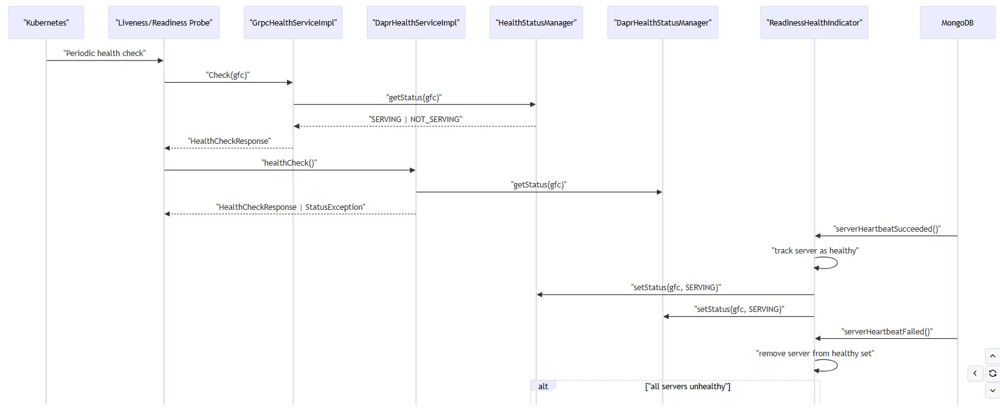
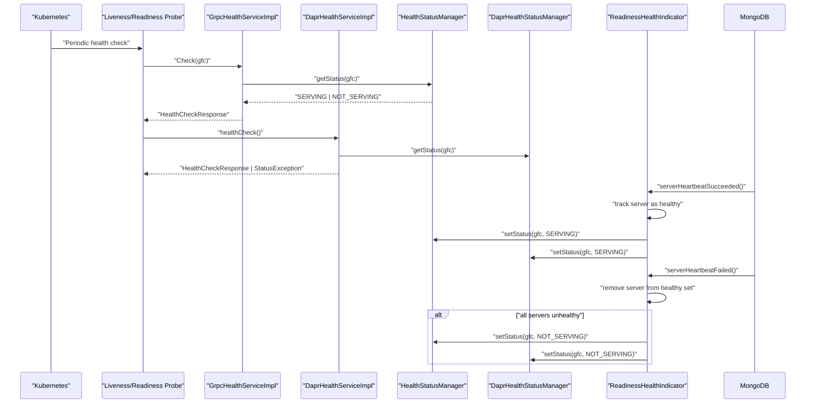

# Observability, Health and Readiness
- [Health mechanisms](#health-mechanisms)
  - [gRPC health service](#grpc-health-service)
  - [DaprHealthStatusManager](#daprhealthstatusmanager)
  - [MongoDB health monitoring](#mongodb-health-monitoring)
  - [ReadinessHealthIndicator](#readinesshealthindicator)
- [Logging](#logging)
  - [Logback configuration](#logback-configuration)
  - [SLF4J bridge](#slf4j-bridge)
  - [Log levels and appenders](#log-levels-and-appenders)
- [Health check flow](#health-check-flow)

## Health mechanisms
- Three health check implementations
  - Standard gRPC health
  - Dapr health
  - MongoDB-driven readiness
- Health status `synchronized across all mechanisms for consistent reporting`
- Service names
  - `"gfc"` (service-specific)
  - `"*"` (all services) for health status tracking
- Status values
  - `SERVING` (healthy)
  - `NOT_SERVING` (unhealthy)
  - `SERVICE_UNKNOWN` (not found)
- **Terminal state**: entered during `shutdown` to prevent new health checks from returning `SERVING`
- Health status stored in `ConcurrentHashMap` for thread-safe concurrent reads
### gRPC health service
- Standard gRPC health checking protocol implementation (`grpc.health.v1.Health`)
- `GrpcHealthServiceImpl` is placeholder class; actual implementation managed by `HealthStatusManager` from gRPC library
- Health status managed by `HealthStatusManager` singleton instance

| Aspect               | Details                                                                                |
| -------------------- | -------------------------------------------------------------------------------------- |
| Service registration | Health status set via `HealthStatusManager.setStatus(serviceName, status)`             |
| Health check RPC     | `Check(HealthCheckRequest)` returns current status for service name                    |
| Watch RPC            | `Watch(HealthCheckRequest)` streams health status changes (not implemented in service) |

### DaprHealthStatusManager
- Wrapper around `DaprHealthServiceImpl` for Dapr-specific health status management
- Thread-safe status updates via synchronized methods in `DaprHealthServiceImpl`

| Aspect                    | Details                                                                       |
| ------------------------- | ----------------------------------------------------------------------------- |
| Terminal state protection | Status updates ignored after `enterTerminalState()` called                    |
| Status map                | `ConcurrentHashMap<String, ServingStatus>` for concurrent health status reads |
| Initial state             | `SERVICE_NAME_ALL_SERVICES` set to `SERVING` on initialization                |
| Dapr health endpoint      | Responds to Dapr sidecar health checks via `healthCheck()` RPC                |

### MongoDB health monitoring
- Health monitoring via MongoDB driver's `ServerMonitorListener` interface

| Aspect                | Details                                                                                         |
| --------------------- | ----------------------------------------------------------------------------------------------- |
| Listener registration | `ReadinessHealthIndicator` registered in `MongoClientSettings` via `addServerMonitorListener()` |
| Heartbeat events      | MongoDB driver sends heartbeat events at configured `heartbeatFrequencyMS` interval             |
| Server tracking       | Tracks individual MongoDB server health in cluster (supports replica sets and sharded clusters) |
| Health propagation    | MongoDB connection health directly drives service readiness status                              |
| Connection loss       | When all MongoDB servers fail heartbeat, service marked `NOT_SERVING` immediately               |
| Reconnection          | When MongoDB heartbeat succeeds, service marked `SERVING` automatically                         |

### ReadinessHealthIndicator
- Implements MongoDB `ServerMonitorListener` interface for connection health tracking
- Tracks healthy MongoDB servers in `Set<ServerId>` for multi-server cluster support
- Health status updated on MongoDB heartbeat events: `serverHeartbeatSucceeded` and `serverHeartbeatFailed`

| Aspect                 | Details                                                                                      |
| ---------------------- | -------------------------------------------------------------------------------------------- |
| Status synchronization | Updates both `HealthStatusManager` and `DaprHealthStatusManager` simultaneously              |
| Service names          | Tracks health for `"gfc"` and `"*"` (all services)                                           |
| Health logic           | `SERVING` when at least one MongoDB server healthy; `NOT_SERVING` when all servers unhealthy |
| Shutdown handling      | `applicationShutdownStarted()` marks all services as `NOT_SERVING` and enters terminal state |

## Logging

| Aspect                  | Details                                                                                |
| ----------------------- | -------------------------------------------------------------------------------------- |
| Logging framework       | SLF4J API with Logback implementation for structured logging                           |
| Log format              | JSON (`LogstashEncoder`) for production; human-readable console format for development |
| Log appender selection  | `log.appender` system property (`JSON_STDOUT` or `STDOUT`)                             |
| Log level configuration | `log.level` system property (default: `INFO`)                                          |
| Logging bridge          | `SLF4JBridgeHandler` redirects `java.util.logging` (JUL) to SLF4J                      |
| Package-level logging   | `com.landisgyr.gfc` package configurable; MongoDB driver logging at `INFO`             |

### Logback configuration

| Aspect               | Details                                                                                |
| -------------------- | -------------------------------------------------------------------------------------- |
| Configuration file   | `logback.xml` (packaged in JAR, path via `-Dlogback.configurationFile`)                |
| Appenders            | `STDOUT` (console with colored pattern), `JSON_STDOUT` (JSON for log aggregation)      |
| Log pattern          | ISO8601 timestamp, thread name, level, logger name, message                            |
| JSON encoder         | `LogstashEncoder` with `severity` field mapping for GCP/cloud logging compatibility    |
| Logger configuration | Application package (`com.landisgyr.gfc`) level configurable; MongoDB driver at `INFO` |
| Root logger          | `INFO` level; appender selection via `${log.appender:-JSON_STDOUT}` (defaults to JSON) |

### SLF4J bridge

| Aspect              | Details                                                                            |
| ------------------- | ---------------------------------------------------------------------------------- |
| JUL bridge          | `SLF4JBridgeHandler` installed in `Bootstrap.main()` to redirect JUL logs to SLF4J |
| Bridge installation | `removeHandlersForRootLogger()` then `install()` to replace JUL handlers           |
| Configuration       | `logging.properties` registers `SLF4JBridgeHandler` as handler for JUL root logger |
| Unified logging     | All logging (SLF4J, JUL, third-party libraries) goes through SLF4J/Logback         |
| Log level control   | JUL log levels controlled via SLF4J/Logback configuration                          |

### Log levels and appenders

| Aspect             | Details                                                                                  |
| ------------------ | ---------------------------------------------------------------------------------------- |
| Log levels         | `TRACE`, `DEBUG`, `INFO`, `WARN`, `ERROR` (standard SLF4J levels)                        |
| Default level      | `INFO` for root logger and application package                                           |
| MongoDB driver     | `INFO` level for connection and protocol logging (reduces noise)                         |
| Appender selection | Environment variable or system property `log.appender` (`STDOUT` or `JSON_STDOUT`)       |
| Development        | `STDOUT` appender with colored, human-readable format                                    |
| Production         | `JSON_STDOUT` appender with structured JSON for log aggregation systems (GCP, ELK, etc.) |

## Health check flow
- Health checks flow from `Kubernetes probes` through `health endpoints` to `dependency monitoring`
- Readiness depends on MongoDB connection health, liveness indicates service process health
- Health status synchronized across `gRPC health` and `Dapr health` endpoints

  
mermaid

