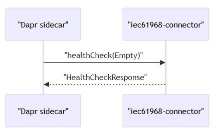
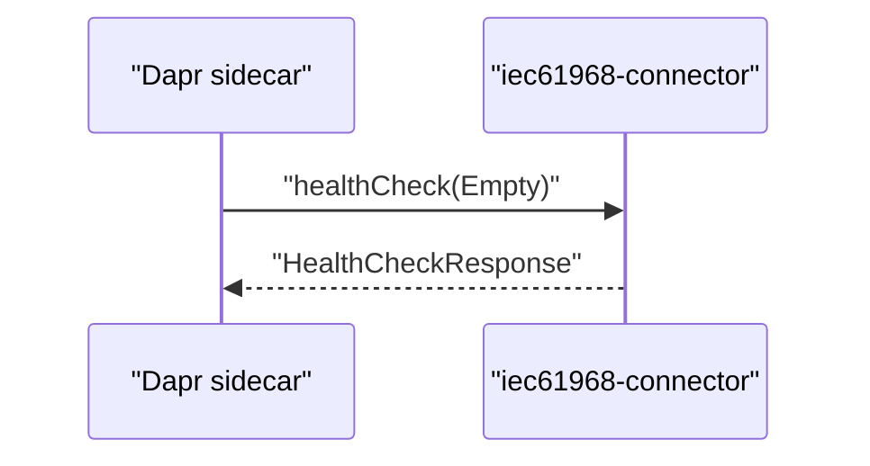

# API reference
* [Overview](#overview)
* [gRPC endpoints](#grpc-endpoints)
* [Message bus interface](#message-bus-interface)
* [Payload schemas](#payload-schemas)
* [Health and observability](#health-and-observability)
* [Limitations and unknowns](#limitations-and-unknowns)
## Overview
* External interfaces exposed by the repository
  * `gRPC` application callback health endpoint used by the `Dapr` sidecar
  * Message bus topics (`ActiveMQ` via `Dapr` pub/sub) for input and output
  * XML payload structures aligned with `IEC 61968` schemas
## gRPC endpoints
* **Server**
  * Protocol: `gRPC` over `TCP`
  * Default listen port: `9090`
  * Config key: `iec61968-connector.dapr-grpc-callback-server.listen`
  * Example `Dapr` run configuration sets `app-port` to `5006`
* **Implemented service**
  * Class: `com.landisgyr.gfc.iec61968_connector.app.HealthService`
  * Extends: `AppCallbackHealthCheckGrpc.AppCallbackHealthCheckImplBase`
  * Annotation: `@GrpcService(grpcClass = AppCallbackHealthCheckGrpc.class)`
* **RPCs**
  * `healthCheck`
    * Request: `com.google.protobuf.Empty`
    * Response: `DaprAppCallbackProtos.HealthCheckResponse`
    * Purpose: Responds to `Dapr` application health probes
* **Notes**
  * No additional `gRPC` services or methods are visible in the repository
  * Concrete fields of `HealthCheckResponse` are not shown

  
mermaid

## Message bus interface
* **Transport**
  * `ActiveMQ` accessed via a `Dapr` pub/sub component
* **Component name**
  * Default: `iec4hes-activemq`
  * Config key: `iec61968-connector.message-bus.pubsub-name`
* **Subscriptions**
  * Topics configured under `iec61968-connector.message-bus.topics.subscribe`
  * Network filtering via `iec61968-connector.message-bus.subscribe-to-network`
* **Publications**
  * Outbound topics configured under `iec61968-connector.message-bus.topics.publish`
  * Logical keys map to topic names via configuration
* **Concurrency and flow control**
  * Fetch size: `iec61968-connector.message-bus.subscription-fetch-size`
  * Concurrency: `iec61968-connector.message-bus.concurrency`
* **Notes**
  * Topic names and message formats are configuration-defined, not hard-coded
## Payload schemas
* **IEC 61968 message envelope**
  * File: `src/main/resources/schemas/xsd/Message.xsd`
  * Namespace: `http://iec.ch/TC57/2011/schema/message`
  * Defines headers, request/reply structures, payload containers, and operations
* **End device control domain**
  * File: `src/main/resources/schemas/xsd/EndDeviceControls.xsd`
  * Namespace: `http://iec.ch/TC57/2011/EndDeviceControls#`
  * Defines `EndDeviceControl`, `EndDeviceAction`, `ControlledAppliance`
* **Code generation**
  * `JAXB` classes generated at build time
  * Output directory: `target/generated-sources/xjc`
## Health and observability
* **Dapr configuration** (examples from README)
  * `--app-protocol grpc`
  * `--app-port 5006`
  * `--enable-app-health-check`
  * `--app-health-probe-interval 15`
  * `--app-health-probe-timeout 3000`
* **Zipkin**
  * Local tracing UI referenced at `http://localhost:9411/zipkin/`
* **Notes**
  * Repository indicates `Dapr` health checks for HTTP and `gRPC`
  * Only the `gRPC` `healthCheck` implemented by `HealthService` is visible
# Limitations and unknowns
* **gRPC**
  * Only `healthCheck` is evidenced
  * Other `Dapr` AppCallback methods are not shown
  * `.proto` files are sourced from `../gfc-apis/proto` and not included
* **Message bus**
  * Exact topic names and message schemas are configuration-dependent
* **Payloads**
  * `JAXB` marshalling and unmarshalling usage is not shown
  * No concrete XML message examples are included
