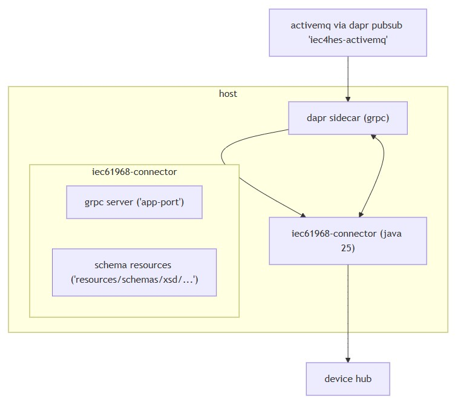

# Architecture
- [Components](#components)
- [Runtime interactions](#runtime-interactions)
- [Message bus configuration](#message-bus-configuration)
- [Configuration inputs](#configuration-inputs)
- [Schema resources](#schema-resources)

## Components
### iec61968-connector service
- `Java 25` application exposing a `gRPC server`
- Uses dependency injection annotations (`@Inject`) and a main server abstraction (`Server`) for runtime
- Contains configuration records for `gRPC` and `message bus` settings

### Dapr sidecar
- Runs alongside the service and communicates over `gRPC`
- Used for health checks and component integration

### Message bus
- Configured via a `Dapr pubsub` component named `"iec4hes-activemq"` by default
- Supports topic subscriptions and publishes with configurable fetch size and concurrency

### Schema resources
- IEC-related `XSDs` (e.g., `EndDeviceControls.xsd`) under `resources/schemas/xsd` for structured payloads

## Runtime interactions
- The service listens on a `gRPC` port (default `9090` from code; can be overridden; README example uses `5006`)
- The `Dapr sidecar` connects to the service using `gRPC` (`app-protocol grpc`, `app-port` set in run command)
- Messages are consumed from the configured `pubsub` topics and forwarded to a `device hub`
- Exact `device hub` communication details are not present in the repository

## Message bus configuration
| Parameter                 | Description / Default Value        |
| ------------------------- | ---------------------------------- |
| `pubsubName`              | Default `"iec4hes-activemq"`       |
| `subscribeToNetwork`      | CSV list; default `["NW_TEST_1"]`  |
| `deviceIdentifier`        | Default `"SerialNumber"`           |
| `subscription fetch size` | Default `1`                        |
| `concurrency`             | Default `25`                       |
| `topics.subscribe`        | List of topic names                |
| `topics.publish`          | Map of logical keys to topic names |

## Configuration inputs
- `application.conf` and environment variables are used by the HOCON-based `Config`
- `logback.xml` provides logging configuration

## Schema resources
- `XSDs` define `IEC 61968`-aligned structures (e.g., `EndDeviceControl`, `PanDemandResponse`)
- Repository does not show explicit code linking these schemas to runtime validation or generation



<details>
  <summary>mermaid</summary>

```mermaid
flowchart TD
  A["activemq via dapr pubsub 'iec4hes-activemq'"] --> D["dapr sidecar (grpc)"]
  D --> B["iec61968-connector (java 25)"]
  B --> F["device hub"]

  subgraph "host"
    D <--> B
    subgraph "iec61968-connector"
      C["grpc server ('app-port')"]
      E["schema resources ('resources/schemas/xsd/...')"]
    end
  end
