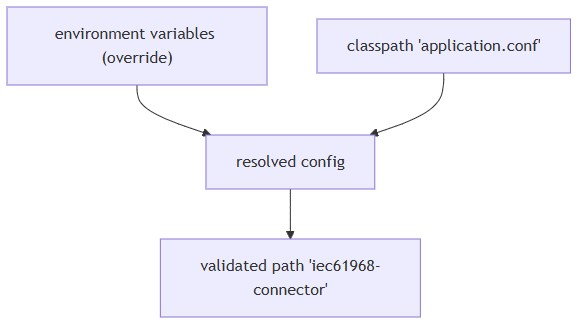
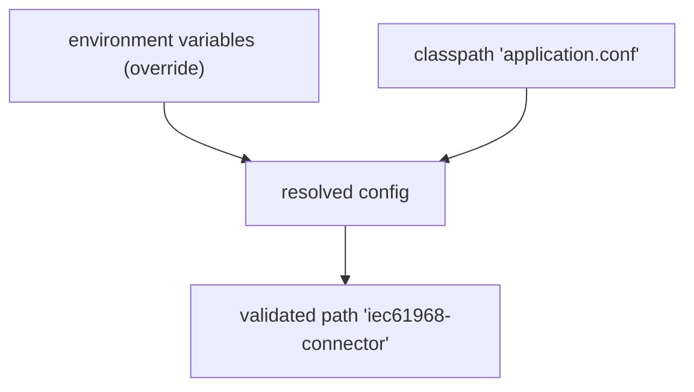

# Configuration
* [Overview](#overview)
* [Loading order and sources](#loading-order-and-sources)
* [Required root path](#required-root-path)
* [System properties used in this repository](#system-properties-used-in-this-repository)
* [Dapr parameters (example flags observed)](#dapr-parameters-example-flags-observed)
* [Configuration keys and defaults under `"iec61968-connector"`](#configuration-keys-and-defaults-under-iec61968-connector)
* [Environment variable overrides](#environment-variable-overrides)
* [Logging configuration](#logging-configuration)
* [Validation behavior](#validation-behavior)
## Overview
* Configuration is loaded with **environment variable overrides first**, then **classpath/application files**
* The application requires a **root configuration object** at path `"iec61968-connector"`
* Typical file paths used in this repository:

| File / Resource    | Path                                 |
| ------------------ | ------------------------------------ |
| `application.conf` | `src/main/dist/etc/application.conf` |
| `logback.xml`      | `src/main/dist/etc/logback.xml`      |

## Loading order and sources
* **Environment variables** (via Typesafe `Config.systemEnvironmentOverrides`)
* **Classpath configuration** (via `ConfigFactory.load`), which includes `application.conf` on the classpath
* If `"iec61968-connector"` is absent, the application throws a **missing configuration error**

  
mermaid

## Required root path
* The application logs and validates the presence of `"iec61968-connector"`
* Missing this path results in a **startup failure**
## System properties used in this repository

| Property                                              | Description                                                      |
| ----------------------------------------------------- | ---------------------------------------------------------------- |
| `config.file`                                         | Path to `application.conf` when running locally                  |
| `logback.configuration` / `logback.configurationFile` | Path to `logback.xml` for logging; used variably across examples |

## Dapr parameters (example flags observed)

| Flag                          | Description / Example       |
| ----------------------------- | --------------------------- |
| `--app-id`                    | `iec61968-connector`        |
| `--app-protocol`              | `grpc`                      |
| `--app-port`                  | `5006`                      |
| `--dapr-grpc-port`            | `50013`                     |
| `--enable-app-health-check`   | Enables health probes       |
| `--app-health-probe-interval` | `15` seconds                |
| `--app-health-probe-timeout`  | `3000` ms                   |
| `--enable-profiling`          | Enables profiling endpoints |
| `--resources-path`            | `./components/`             |

## Configuration keys and defaults under `"iec61968-connector"`

| Key                                | Sub-key / Description      | Default                           |
| ---------------------------------- | -------------------------- | --------------------------------- |
| `dapr-grpc-callback-server`        | `listen`                   | `9090`                            |
|                                    | `max-inbound-message-size` | `8 MiB`                           |
| `ping-message-bus-in-health-check` | Boolean                    | `false`                           |
| `message-bus`                      | `pubsub-name`              | `"iec4hes-activemq"`              |
|                                    | `subscribe-to-network`     | `["NW_TEST_1"]`                   |
|                                    | `device-identifier`        | `"SerialNumber"`                  |
|                                    | `subscription-fetch-size`  | `1`                               |
|                                    | `concurrency`              | `25`                              |
|                                    | `topics.subscribe`         | List of strings                   |
|                                    | `topics.publish`           | Map of string keys to topic names |

## Environment variable overrides

* Repository README shows use of `CONFIG_FORCE_...` variables to force values via environment
* Example patterns:

| Override                       | Example Value                                                                              | Purpose                         |
| ------------------------------ | ------------------------------------------------------------------------------------------ | ------------------------------- |
| Set pubsub name                | `CONFIG_FORCE_iec61968__connector_message__bus_pubsub__name=iec4hes-activemq`              | Override `pubsub-name`          |
| Set CSV networks               | `CONFIG_FORCE_iec61968__connector_message__bus_subscribe__to__network=NW_TEST_1,NW_TEST_2` | Override `subscribe-to-network` |
| Add subscribe topics           | `CONFIG_FORCE_iec61968__connector_message__bus_topics_subscribe_0=TOPIC_A`                 | Add first topic                 |
|                                | `CONFIG_FORCE_iec61968__connector_message__bus_topics_subscribe_1=TOPIC_B`                 | Add second topic                |
| Define a publish mapping entry | `CONFIG_FORCE_iec61968__connector_message__bus_topics_publish_command=/some/topic/name`    | Map key to topic                |

## Logging configuration
* Logback configuration is provided via a file; repository references:
  * `logback.configuration` (used by Maven exec)
  * `logback.configurationFile` (used in run examples)
* Ensure **only one** is used consistently in your setup
## Validation behavior
* On startup, the application logs the **resolved `"iec61968-connector"` subtree** in a formatted, comment-free render
* Missing this subtree results in **startup failure**
