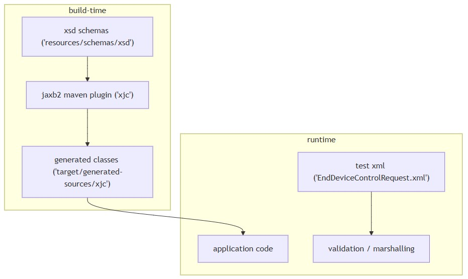
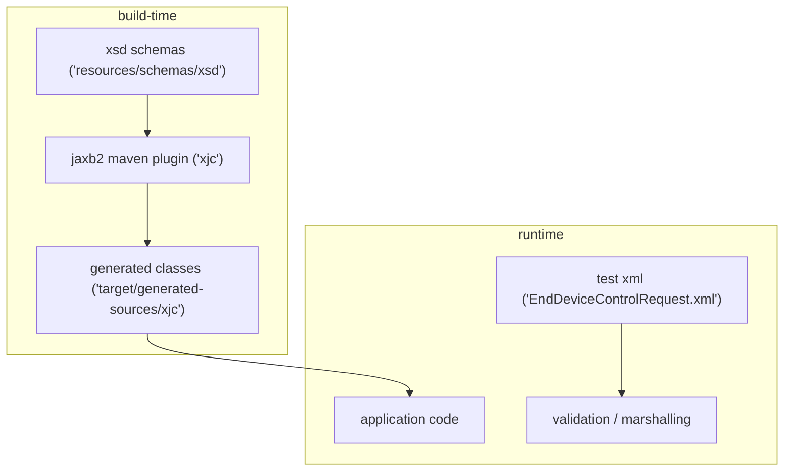

# Data model
* [Overview](#overview)
* [Build-time code generation](#build-time-code-generation)
* [Schemas and namespaces observed](#schemas-and-namespaces-observed)
* [Key types in Message.xsd](#key-types-in-message-xsd-selected)
* [Selected types in EndDeviceControls.xsd](#selected-types-in-enddevicecontrols-xsd-from-provided-excerpt)
* [Test XML sample indicating schema usage](#test-xml-sample-indicating-schema-usage)
## Overview
* Repository includes `IEC 61968`-aligned `XSD` files under `src/main/resources/schemas/xsd`
* `JAXB` classes are generated at build time via `jaxb2-maven-plugin` into `target/generated-sources/xjc`
* `build-helper-maven-plugin` adds generated sources to compilation
* Test XML sample `EndDeviceControlRequest.xml` references IEC message schema to form a `RequestMessage`
## Build-time code generation
* **JAXB plugin configuration**

| Setting             | Value / Path                                                      |
| ------------------- | ----------------------------------------------------------------- |
| Output directory    | `target/generated-sources/xjc`                                    |
| Sources             | `src/main/resources/schemas/xsd`                                  |
| Customizations path | `src/main/resources/schemas/xjb` (referenced, contents not shown) |
| Maven phase         | `generate-sources`                                                |

* Evidence paths from `pom.xml`
  * `jaxb2-maven-plugin` with `xjc` goal configured
  * `build-helper-maven-plugin` adds generated directory to sources

## Schemas and namespaces observed
* `Message.xsd`
  * File: `src/main/resources/schemas/xsd/Message.xsd`
  * `targetNamespace`: `http://iec.ch/TC57/2011/schema/message`
  * Defines common IEC 61968 message envelope and related types
* `EndDeviceControls.xsd`
  * File: `src/main/resources/schemas/xsd/EndDeviceControls.xsd`
  * `targetNamespace`: `http://iec.ch/TC57/2011/EndDeviceControls#`
  * Declares `xmlns:m` for target namespace; default `xmlns=http://langdale.com.au/2005/Message#`
* `GetMeterReadings.xsd`
  * File: `src/main/resources/schemas/xsd/GetMeterReadings.xsd`
  * `targetNamespace`: `http://iec.ch/TC57/2011/GetMeterReadings#`
  * Content redacted in provided materials

## Key types in Message.xsd (selected)
* **Message envelope and variants**
  * `Message` (`MessageType`)
  * `RequestMessage` (`RequestMessageType`)
  * `ResponseMessage` (`ResponseMessageType`)
  * `EventMessage` (`EventMessageType`)
  * `FaultMessage` (`FaultMessageType`)
* **Header and control** (`HeaderType`) with elements:
  * `Verb` (enumeration: cancel, canceled, change, changed, create, created, close, closed, delete, deleted, get, reply, execute, executed)
  * `Noun` (string)
  * `Context` (enumeration: PRODUCTION, TESTING, DEVELOPMENT, STUDY, TRAINING)
  * `Timestamp`, `Source`, `AsyncReplyFlag`, `ReplyAddress`, `AckRequired`, `User`, `MessageID`, `CorrelationID`, `Comment`, `Property`, extensibility via `xs:any`
* **Request and reply bodies**
  * `RequestType` with `StartTime`, `EndTime`, `Option` (`OptionType`), `ID`, extensibility via `xs:any`
  * `ReplyType` with `Result` (enumeration: OK, PARTIAL, FAILED), `Error` (`ErrorType`), `ID`, extensibility via `xs:any`, `operationId`
* **Payload and operations**
  * `PayloadType` with choice of `xs:any`, `OperationSet`, `Compressed` (string)
  * `OperationSet` containing `enforceMsgSequence`, `enforceTransactionalIntegrity`, `Operation` (`OperationType`)
  * `OperationType` with `operationId`, `noun`, `verb`, `elementOperation`, and an `xs:any` payload
* **Error details and supporting types**
  * `ErrorType` with `code`, `level` (enumeration: INFORM, WARNING, FATAL, CATASTROPHIC), `reason`, `details`, `xpath`, `stackTrace`, `Location`, `object` (`IdentifiedObject`), `operationId`
  * `LocationType` with `node`, `pipeline`, `stage`
  * `UserType` with `UserID`, `Organization`
  * `IdentifiedObject` with `mRID`, `Name`, `objectType`
  * `Name`, `NameType`, `NameTypeAuthority`
## Selected types in EndDeviceControls.xsd (from provided excerpt)
* **Container elements**
  * `EndDeviceControls` element of type `m:EndDeviceControls`
  * Type includes `EndDeviceControl` and `EndDeviceControlType` sequences
* **Domain entities and values**
  * `ControlledAppliance` boolean flags (e.g., `isElectricVehicle`, `isExteriorLighting`, `isGenerationSystem`, etc.)
  * `DateTimeInterval` with `start` and `end` (`xs:dateTime`)
  * `EndDevice` with `mRID` and `Names` (`Name`)
  * `EndDeviceAction` with `command`, `duration` (`Minutes`), `durationIndefinite`, `startDateTime`
  * `EndDeviceControl` with `mRID`, `drProgramLevel`, `drProgramMandatory`, `issuerID`, `issuerTrackingID`, `priceSignal` (`FloatQuantity`), `reason`, and an action choice
* **Action choice elements within EndDeviceControl**
  * `PanDemandResponse`, `PanDisplay`, `PanPricing`
  * `STSTokenTransfer`, `Limiter`, `LimiterEmergency`
  * `IntegrationPeriod`, `IntegrationPeriodOutput`
  * `ComModuleRepeaterState`, `ComModuleTransmitterGain`
  * `SecurityCredentialChange`, `TimeOfUse`, `LoadControlManagementCommand`, `ChannelActivation`, `FuseLimiter`, `DisableRFComm`, `Binding`, `DigitalOutput`, `MediumVoltageFeeder`, `DisconnectorSetting`, `ClockSynchronization`, `OverUnderVoltageMonitoring`, `EnergyPulsesOutput`, `SCSEventMonitoring`, `DemandSupervisionControl`
* Many types reference `CIM` model elements via `sawsdl:modelReference` annotations
## Test XML sample indicating schema usage
* File: `src/test/resources/com/landisgyr/gfc/iec61968_connector/jaxb/EndDeviceControlRequest.xml`
* Declares `p` namespace as `http://iec.ch/TC57/2011/schema/message`
* Provides `xsi:schemaLocation` mapping to `Message.xsd`
* Content redacted but indicates creation of a `RequestMessage` aligned with `Message.xsd`

  
mermaid

