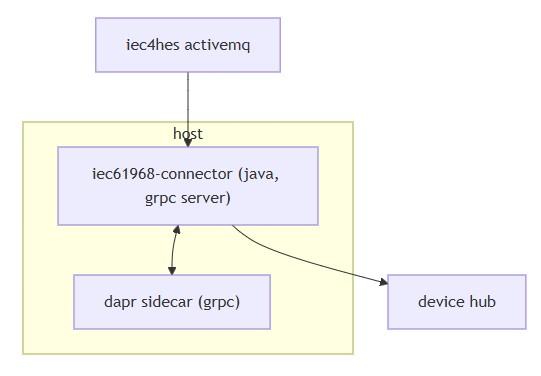
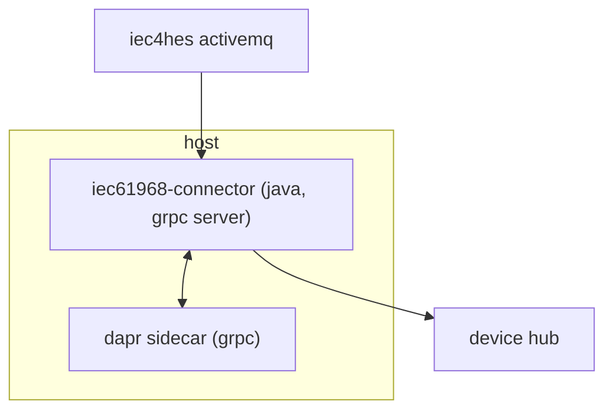

# Introduction
- [Overview](#overview)
## Overview
* **Purpose**
  * Java connector that pulls messages from an `iec4hes ActiveMQ` source and forwards them to a `device hub`
* **System type**
  * Runnable service packaged as a `JAR`, optionally buildable as a `GraalVM native image`
* **Runtime context**
  * Runs alongside a `Dapr sidecar` using `gRPC`
  * `Dapr` health checks enabled for both `HTTP` and `gRPC`
* **Core technologies**
  * `Java 25`, `Maven 3.x`
  * `gRPC server`, `Logback`
  * Optional `GraalVM native-image` and `Docker` support
* **Configuration**
  * Managed via `application.conf` and environment variables
  * `gRPC` port configurable (default `9090`; README example `5006` via `Dapr`)
* **Data modeling assets**
  * IEC-related `XSD` schemas (e.g., `EndDeviceControls.xsd`) under `resources`
  * Structured payloads aligned with `IEC 61968` concepts
* **Deployment and operations**
  * Local execution with `Dapr CLI`, including example commands
  * Health and observability references (e.g., `Zipkin`)
  * `Kubernetes` usage hints for `GCP` (rollout/restart example)
* **Known scope limits from repository evidence**
  * Exact protocols and formats for `device hub` communication not shown
  * `ActiveMQ` configuration and message schemas beyond `XSD` resources are not fully visible

  
mermaid

- Diagram notes
  - The connector communicates with the Dapr sidecar over gRPC for health and runtime integration
  - The flows to and from ActiveMQ and the device hub are shown at a high level; specific protocols and endpoints are not present in the repository and are therefore not depicted 
