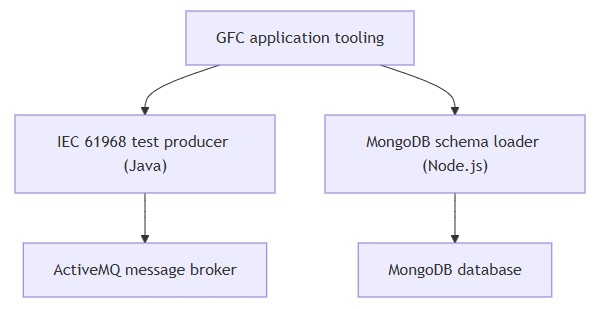
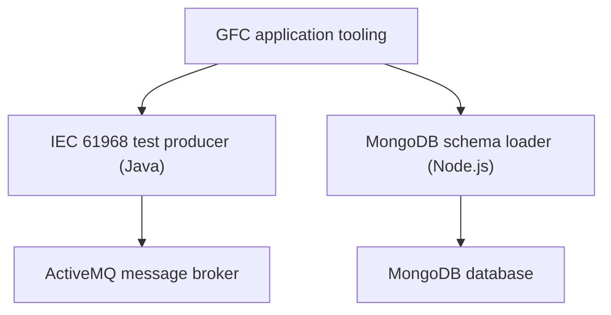
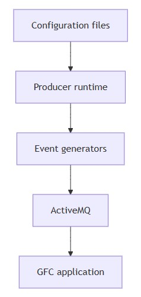
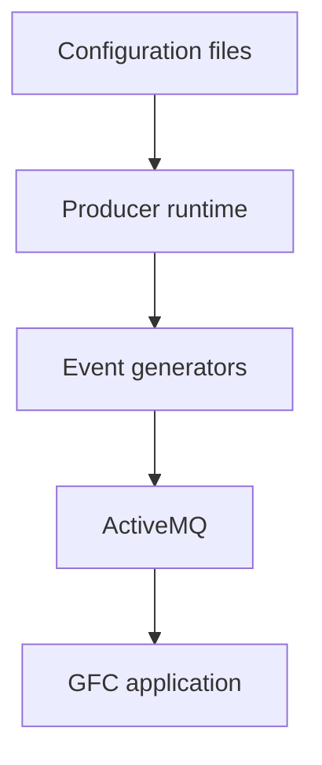
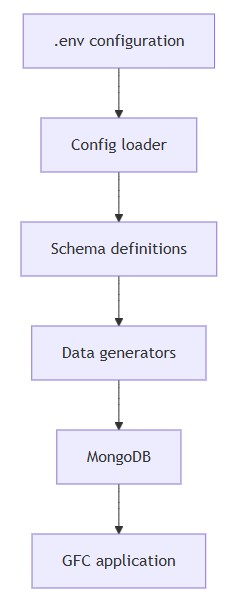
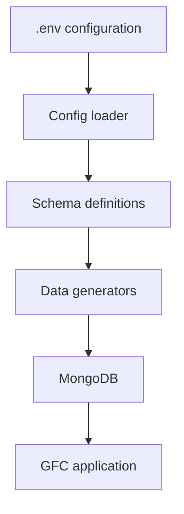
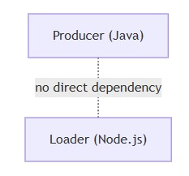
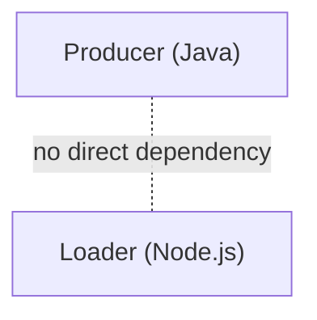
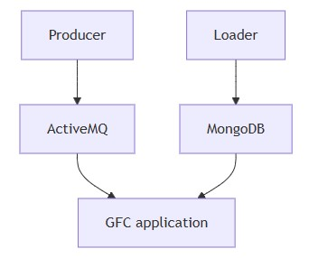
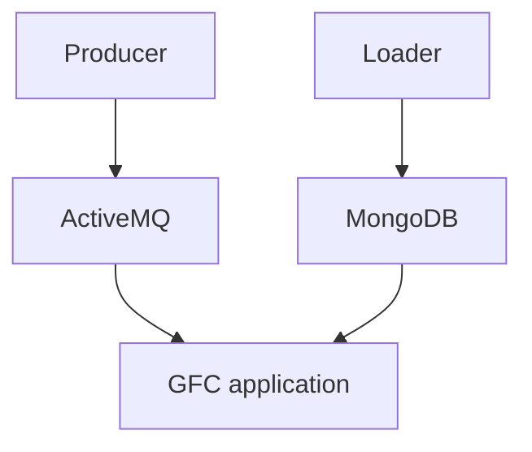

# Architecture
* [System overview](#system-overview)
* [Component breakdown](#component-breakdown)
* [Technology stack rationale](#technology-stack-rationale)
* [Component interactions](#component-interactions)
* [Execution models](#execution-models)
* [Configuration architecture](#configuration-architecture)
* [Scalability considerations](#scalability-considerations)
* [Error handling architecture](#error-handling-architecture)
* [External dependencies](#external-dependencies)
## System overview
* The tooling suite follows a decoupled, single-responsibility architecture
* Each tool targets a different part of the GFC infrastructure
* No runtime dependency exists between the tools
* Coordination happens indirectly through the GFC application

  
mermaid

* Each tool operates independently
* Each tool prepares a different infrastructure dependency for GFC

## Component breakdown
### IEC 61968 test producer (Java)
* Location is `tooling/iec61968-test-producer`
* Purpose is generation of IEC 61968-compliant test messages
* Messages are published to JMS queues
* ActiveMQ is used as the message broker

  
mermaid

* Responsibilities include
  * Synthetic event and alarm generation
  * Weighted probability distributions
  * Bulk device range simulation
* Design emphasizes realism over uniform randomness
* Configuration supports classpath and filesystem loading
### MongoDB schema loader (Node.js)
* Location is `tooling/mongodb-schemas`
* Purpose is schema-based MongoDB initialization
* Mongoose is used as the ODM
  * ODM stands for `Object Data Modeling` (sometimes called `Object Document Mapper`).
  * Mongoose acts as the ODM for MongoDB in Node.js:
    * Defines schemas for documents
    * Enforces structure and validation
Maps MongoDB documents ↔ JavaScript objects
    * Provides query, update, and lifecycle hooks
* Execution is script-driven and developer-controlled

  
mermaid

* Responsibilities include
  * Schema definition
  * Test data population
  * Temporal and geospatial data handling
* Execution control is achieved via explicit function calls
## Technology stack rationale
### Java for test producer
* Java is common in enterprise utility systems
* IEC 61968 implementations are typically Java-based
* Strong typing benefits complex domain models
* Native JMS support simplifies ActiveMQ integration
* Domain model reuse with GFC is plausible
### Node.js for schema loader
* Mongoose enables declarative schema modeling
* JavaScript enables rapid iteration
* MongoDB plugin ecosystem supports utility-specific data types
* Runtime is lightweight compared to JVM
* JSON-native workflow aligns with document databases
## Component interactions
### Independence
* No direct communication exists between the tools

  
mermaid

### Indirect coordination via GFC
* Both tools prepare inputs consumed by GFC

  
mermaid

* Producer generates temporal event streams
* Loader initializes persistent application state
### Data correlation
* Identifiers such as device ID or serial number enable correlation
* Events and metadata converge inside GFC processing logic
## Execution models
### Producer execution
* Entry points include `ClassicProducer.main` and `Producer.main`
* Execution supports long-running or batch-based modes
* JMS lifecycle follows standard connection-session-producer pattern
### Loader execution
* Entry point is `node index.js`
* Execution is script-based and manually controlled
* Single MongoDB connection is reused for all operations
## Configuration architecture
### Producer configuration
* Broker URL configures ActiveMQ connectivity
* Event templates define message payloads
* Device range parameters control scale
* Configuration sources are file-based or argument-driven
### Loader configuration
* Configuration is environment-based
* `.env` files supply MongoDB connection details
* Node.js memory limits support large dataset generation
## Scalability considerations
### Producer scalability
* Current design is single-instance oriented
* Horizontal scaling is possible via multiple producers
* Device ranges can be partitioned
* Message batching can reduce broker overhead
### Loader scalability
* Bulk inserts support large datasets
* Heap size configuration indicates high-volume intent
* Batch and streaming strategies are viable extensions
## Error handling architecture
### Producer
* Exception handling is minimal and development-oriented
* Errors are logged to standard output
### Loader
* Promise-based error handling is used
* Connection failures are explicitly handled
## External dependencies
### Producer
* Requires a running ActiveMQ broker
* Depends on JMS-compatible infrastructure
### Loader
* Requires a reachable MongoDB instance
* Depends on Mongoose and related plugins
