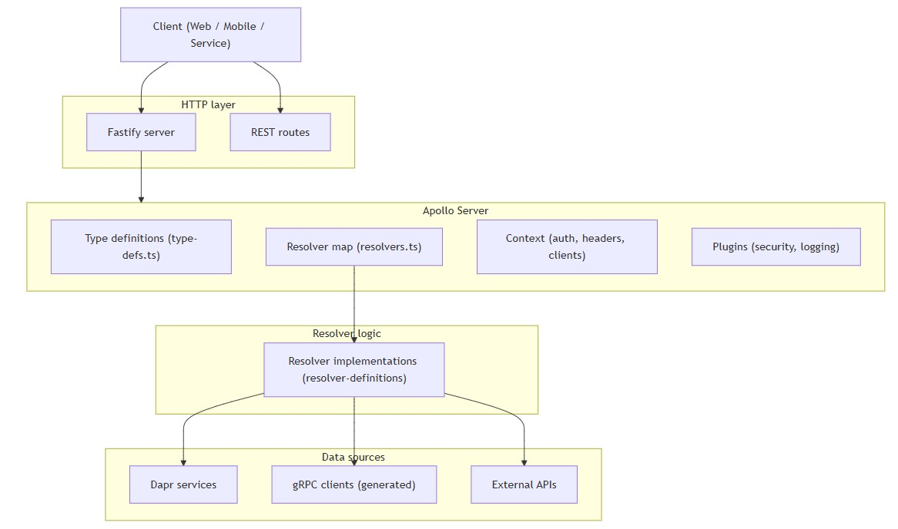
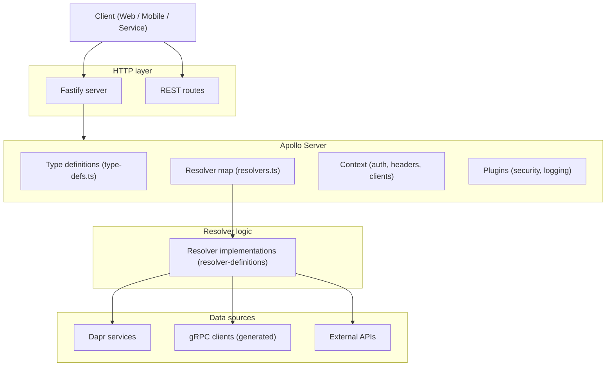
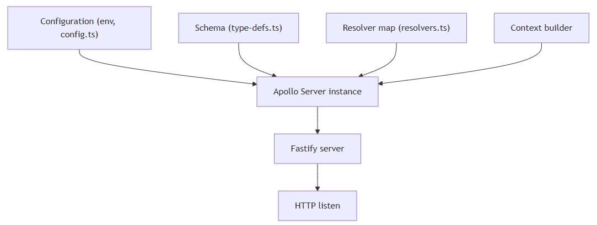
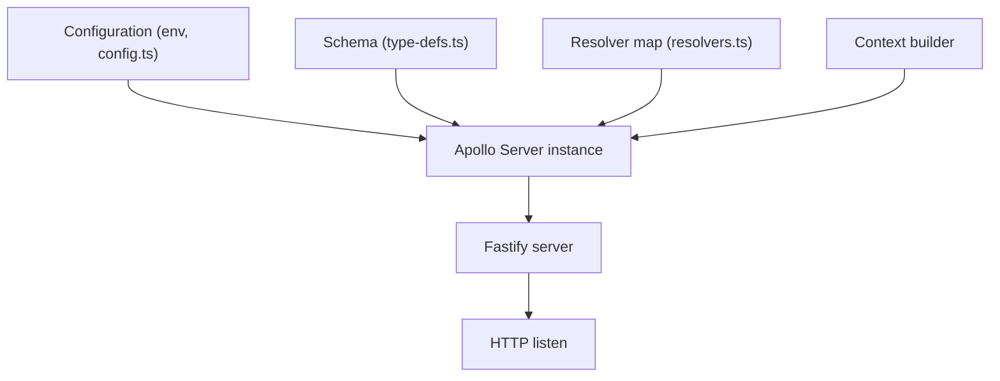
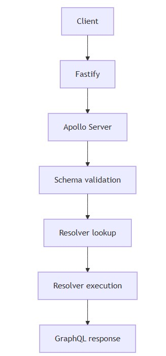
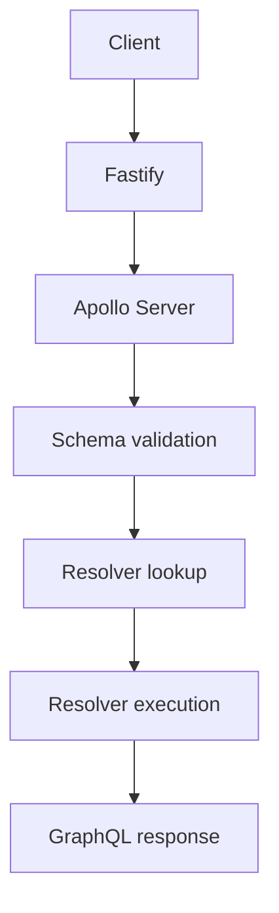
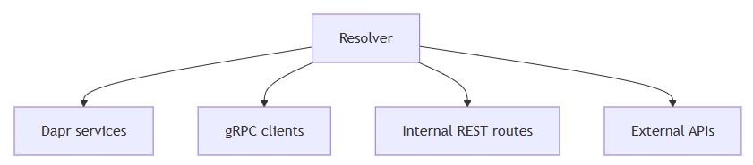
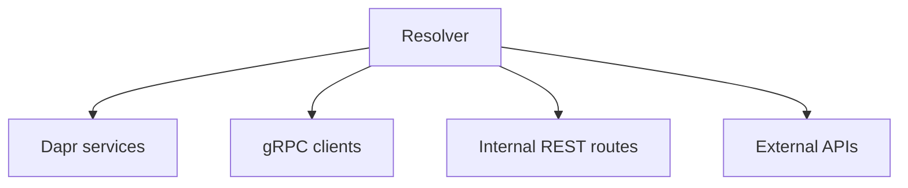

# Apollo server
- [Introduction](#introduction)
- [Structure](#structure)
- [Apollo Server responsibilities](#apollo-server-responsibilities)
- [Startup flow](#startup-flow)
- [Directory-to-responsibility map](#directory-to-responsibility-map)
- [Request lifecycle](#request-lifecycle)
- [Data access paths](#data-access-paths)
- [What Apollo Server does not own](#what-apollo-server-does-not-own)
- [Minimal mental model](#minimal-mental-model)
## Introduction
- Top to bottom is `request flow`
- Left to right is `responsibility split`
- Apollo Server is the `orchestrator`, not the business logic
- `Resolvers` are the only place where **real work** happens
- `Fastify` is just the `transport shell`


<details>
  <summary>mermaid</summary>


</details>

## Structure
```
api-gateway/
│
├── Configuration Files
│   ├── Dockerfile                      # Docker container configuration
│   ├── README.md                       # Project documentation
│   ├── biome.json                      # Biome linter/formatter config
│   ├── codegen.yml                     # GraphQL code generation config
│   ├── package.json                    # NPM dependencies and scripts
│   ├── package-lock.json               # NPM dependency lock file
│   ├── tsconfig.json                   # TypeScript compiler configuration
│   ├── protoc.bat                      # Protocol buffer compilation (Windows)
│   └── protoc.sh                       # Protocol buffer compilation (Linux)
│
├── src/                                # Source code directory
│   ├── index.ts                        # Application entry point
│   ├── resolvers.ts                    # GraphQL resolvers
│   ├── type-defs.ts                    # GraphQL type definitions
│   │
│   ├── common/                         # Shared utilities and configurations
│   │   ├── config.ts                   # Application configuration
│   │   ├── dapr-client.ts              # Dapr client setup
│   │   ├── to-date-time.ts             # DateTime conversion utility
│   │   ├── to-date.ts                  # Date conversion utility
│   │   │
│   │   └── scalars/                    # GraphQL custom scalar types
│   │       ├── date-time.ts            # DateTime scalar
│   │       ├── date.ts                 # Date scalar
│   │       ├── json-map-scalar.ts      # JSON Map scalar
│   │       ├── latitude.ts             # Latitude scalar
│   │       └── longitude.ts            # Longitude scalar
│   │
│   ├── integrations/                   # Third-party integrations
│   │   ├── apollo-escape.ts            # Apollo GraphQL Armor security
│   │   └── apollo-fastify.ts           # Apollo-Fastify integration
│   │
│   ├── resolver-definitions/           # GraphQL resolver implementations
│   │   └── core/
│   │       └── authorization/          # Authorization resolvers
│   │       └── device/                 # Device resolvers
│   │       └── event/                  # Event resolvers
│   │       └── organization/           # Organization resolvers
│   │       └── tag/                    # Tag resolvers
│   │
│   ├── routes/                         # REST API routes
│   │   └── flexibilities-import.route.ts  # File upload endpoint
│   │
│   └── __generated__/                  # Auto-generated code (from protoc/codegen)
│       └── core/
│           └── api/
│               └── device/
│                   └── v1/
│                       ├── device_grpc_pb.ts    # gRPC client stubs
│                       └── device_pb.ts         # Protocol buffer messages
│
└── test/                               # Test files and fixtures
    └── Flexibilities-L540.csv          # Sample CSV test file
```
## Apollo Server responsibilities
- Apollo Server **coordinates**, it does not implement business logic.

| Responsibility    | What it means              | Where in your project    |
| ----------------- | -------------------------- | ------------------------ |
| HTTP exposure     | `/graphql` endpoint        | `index.ts` + Fastify     |
| Schema loading    | API shape                  | `type-defs.ts`           |
| Resolver wiring   | Field → function mapping   | `resolvers.ts`           |
| Execution context | auth, headers, clients     | Fastify → Apollo context |
| Plugins           | security, logging, metrics | `integrations/*`         |

## Startup flow


<details>
  <summary>mermaid</summary>


</details>

## Directory-to-responsibility map

| Path                          | Role           | Notes                              |
| ----------------------------- | -------------- | ---------------------------------- |
| `src/index.ts`                | bootstrap      | create Fastify + Apollo            |
| `src/type-defs.ts`            | schema         | types, queries, mutations, scalars |
| `src/resolvers.ts`            | resolver map   | pure mapping, no logic             |
| `src/resolver-definitions/**` | resolver logic | business logic lives here          |
| `src/common/`                 | shared infra   | config, Dapr, scalars              |
| `src/integrations/`           | Apollo plugins | Fastify, Armor                     |
| `src/routes/`                 | REST endpoints | parallel API                       |
| `src/__generated__/`          | gRPC clients   | consumed by resolvers              |

## Request lifecycle


<details>
  <summary>mermaid</summary>


</details>

## Data access paths
- Resolvers are the **only entry point** to data sources.


<details>
  <summary>mermaid</summary>


</details>

## What Apollo Server does not own
- Apollo Server does **zero domain work**.

| Concern            | Owned by                 |
| ------------------ | ------------------------ |
| Business logic     | resolvers                |
| Data fetching      | Dapr / gRPC / REST       |
| Transport          | Fastify                  |
| Federation routing | Apollo Router (not here) |
| Code generation    | `codegen.yml`, `protoc`  |

## Minimal mental model
```text
Apollo Server =
  schema
+ resolver map
+ context
+ HTTP adapter
```
