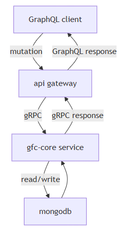
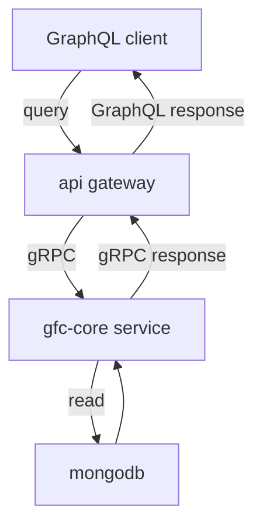
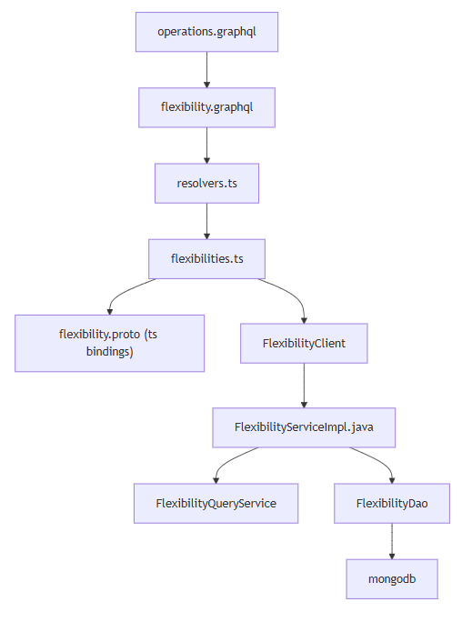
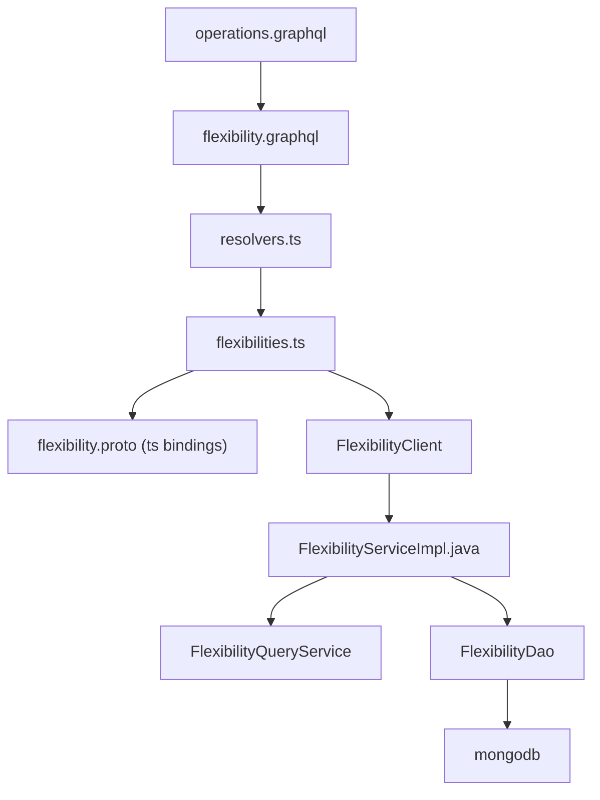
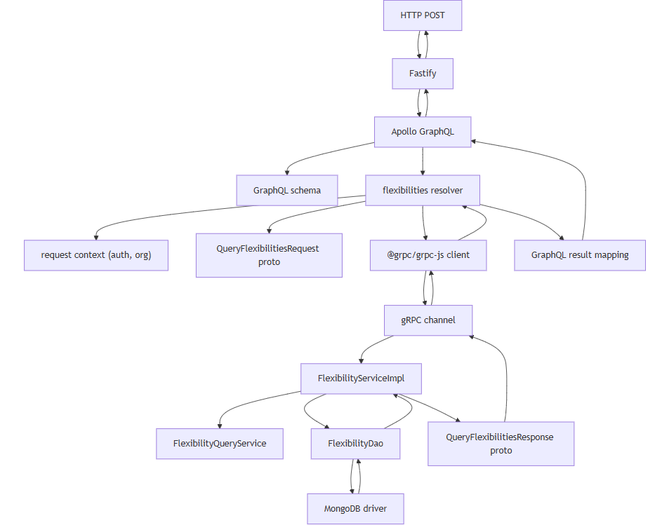
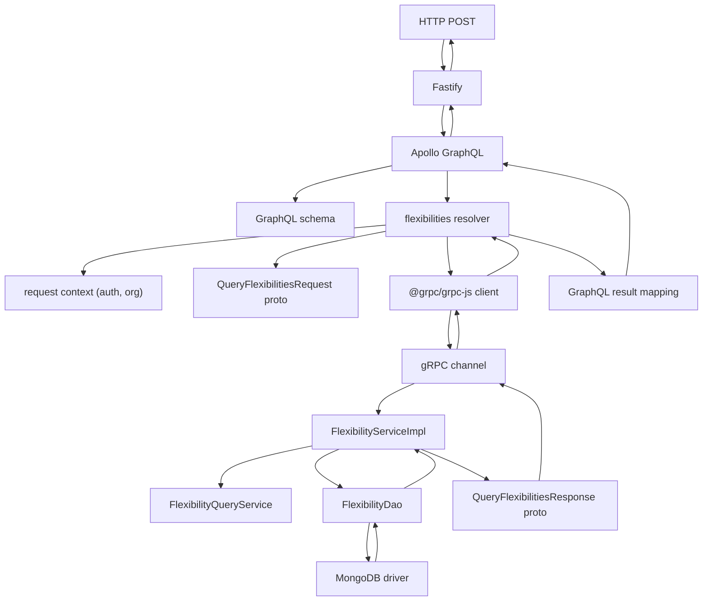

# Query Flexibilities
- [Overview](#overview)
- [GraphQL query](#graphql-query)
- [Tracing the code](#tracing-the-code)
- [Dependencies](#dependencies)
- [API gateway](#api-gateway)
- [GFC core](#gfc-core)
- [Request path](#request-path)
- [Response path](#response-path)
- [Design notes](#design-notes)
## Overview
- Gateway acts as protocol translator
  - `schema, resolver, gRPC client`
- gfc-core owns query logic and data retrieval
  - `gRPC service, query service, DAO`
- MongoDB for persistence


<details>
  <summary>mermaid</summary>


</details>

## GraphQL query
- **GraphQL playground/client**: `http://127.0.0.1:4000/api/graphql`
- Query
```graphql
query ExampleQuery($input: FlexibilitiesInput) {
  flexibilities(input: $input) {
    items {
      flexibilityType
      name
      id
    }
    meta {
      totalCount
    }
  }
}
```

- **Variables:**
```json
{
  "input": {
    "filter": {
      "flexibilityIdIn": [],
      "flexibilityNameIn": [],
      "flexibilityTypeIn": []
    },
    "pagination": {
      "pageNumber": 1,
      "pageSize": 50
    }
  }
}
```
</details>

## Tracing the code


<details>
  <summary>mermaid</summary>


</details>

## Dependencies
- Fastify hosts Apollo
- Apollo resolves schema to resolver
- gRPC handles transport
- MongoDB driver handles queries and pagination


<details>
  <summary>mermaid</summary>


</details>

## API gateway
* **Schema definition**
  * [`graphql/operations.graphql`](../api-gateway/graphql/operations.graphql)
    * Defines the flexibilities `query` signature
    * Declares `flexibilities` query
    * Defines input and response contract
    * Single source of truth for API shape
  * [`graphql/core/api/v1/flexibility.graphql`](../api-gateway/graphql/flexibility.graphql)
    * Defines `Flexibility` type (individual flexibility data)
    * Defines `Flexibilities` type (list with metadata)
    * Defines `FlexibilitiesInput` input type (filters and pagination)
    * Defines `FlexibilityFilter` for filtering options
    * Defines `Pagination` for page control
* **Resolver execution**
  * [`src/resolvers.ts`](../api-gateway/src/resolvers.ts)
    * Maps query name `flexibilities` to resolver function
    * Thin routing layer only
    * No business logic
  * [`src/resolver-definitions/core/flexibilities/flexibilities.ts`](../api-gateway/src/resolver-definitions/core/flexibilities/flexibilities.ts)
    * Receives GraphQL arguments and context
    * Extracts auth token from context
    * Creates `FlexibilityClient` instance
    * Builds `QueryFlexibilitiesRequest` protobuf object from input
    * Maps filter parameters:
      - `flexibilityIdIn`
      - `flexibilityNameIn`
      - `flexibilityTypeIn`
    * Maps pagination parameters:
      - `pageNumber`
      - `pageSize`
    * Calls `client.queryFlexibilities(request, token)`
    * Maps gRPC response to GraphQL `Flexibilities` type
    * Converts proto items to GraphQL items
    * Extracts totalCount from meta
    * Handles errors and converts to GraphQL errors
* **flexibility.ts** (generated proto bindings)
  * [`src/__generated__/core/api/flexibility/v1/flexibility.ts`](../api-gateway/src/__generated__/core/api/flexibility/v1/flexibility.ts)
  * Auto-generated from `.proto`
  * Defines `QueryFlexibilitiesRequest` interface
  * Defines `QueryFlexibilitiesResponse` interface
  * Defines `FlexibilityQueryFilter` interface
  * Defines `Flexibility` interface
  * Defines `Flexibilities` interface
  * Handles encode/decode and builders
  * Ensures type safety across gateway and core
* **gRPC client**
  * [`src/clients/flexibility-client.ts`](../api-gateway/src/clients/flexibility-client.ts)
  * `queryFlexibilities()` method
  * Retrieves Dapr proxy
  * Creates dapr metadata with auth token
  * Makes gRPC call via Dapr
  * Returns promise with response
## GFC core
* **Proto:** [`gfc-apis/proto/core/api/flexibility/v1/flexibility.proto`](../gfc-apis/proto/core/api/flexibility/v1/flexibility.proto)
  * Defines `FlexibilityService` with `QueryFlexibilities` RPC
  * Defines `QueryFlexibilitiesRequest` message
  * Defines `QueryFlexibilitiesResponse` message
  * Defines `FlexibilityQueryFilter` message
  * Defines `Flexibility` message
  * Defines `Flexibilities` message with items and meta
* **FlexibilityServiceImpl**: [`src/main/java/com/landisgyr/gfc/grpc/FlexibilityServiceImpl.java`](../gfc-core/src/main/java/com/landisgyr/gfc/grpc/FlexibilityServiceImpl.java)
  * gRPC entry point for `queryFlexibilities`
  * Validates JWT token (Keycloak)
  * Extracts filter parameters from request:
    - `flexibilityIdIn`
    - `flexibilityNameIn`
    - `flexibilityTypeIn`
  * Uses default pagination values (pageNumber=1, pageSize=50)
  * Gets orgCode from context (currently hardcoded as "GFC_CPE")
  * Calls `FlexibilityDao.findFlexibilities()`
  * Converts MongoDB documents to domain objects
  * Maps domain objects to protobuf messages via `toFlexibilityProto()`
  * Builds response with items and metadata
  * Handles errors and returns gRPC status
* **toFlexibilityProto() method**
  * Converts domain `Flexibility` to protobuf `Flexibility`
  * Maps only fields that exist in proto:
    - `id` (from flexibilityId)
    - `name` (from flexibilityName)
    - `flexibilityType`
  * Returns protobuf builder result
* **FlexibilityDao**: [`dao/FlexibilityDao.java`](../gfc-core/dao/FlexibilityDao.java)
  * `findFlexibilities()` method
  * Builds MongoDB query with filters
  * Applies pagination
  * Executes query
  * Returns `QueryResult` with documents and totalCount
  * `fromDocument()` converts MongoDB document to domain object
* **MongoDB query**
  * **Database:** `gfc-dev`
  * **Collection:** `flexibilities`
  * Applies filters using `$in` operators
  * Applies pagination using `skip()` and `limit()`
  * Counts total matching documents
  * Returns paginated results
## Request path
1. GraphQL query received at API Gateway
2. Resolver extracts input parameters
3. Resolver builds `QueryFlexibilitiesRequest` protobuf
4. gRPC call to gfc-core via Dapr
5. FlexibilityServiceImpl receives request
6. Extracts filters and pagination
7. Calls FlexibilityDao with parameters
8. DAO builds MongoDB query
9. MongoDB executes query with filters and pagination
10. Results returned to DAO
11. DAO converts documents to domain objects
12. Domain objects returned to service
## Response path
1. Service converts domain objects to protobuf
2. Builds `QueryFlexibilitiesResponse` with items and meta
3. gRPC response returned to FlexibilityClient
4. Gateway maps proto response to GraphQL type
5. Maps items array
6. Extracts totalCount from meta
7. Response returned to resolver
8. GraphQL formats final response
9. JSON response sent to client
```
MongoDB → FlexibilityDao → FlexibilityServiceImpl → Dapr → FlexibilityClient → flexibilities resolver → Apollo → Client
```

## Design notes
### Authentication Flow
- Client sends JWT in `Authorization` header
- API Gateway extracts token → context
- Token forwarded via Dapr metadata
- gfc-core validates against Keycloak
- Checks realm: `gfc`, client: `test-client-01`
### Filtering
- Supports multiple filter types:
  - `flexibilityIdIn`: Filter by flexibility IDs
  - `flexibilityNameIn`: Filter by flexibility names
  - `flexibilityTypeIn`: Filter by flexibility types
- Filters are optional (empty arrays = no filter)
- Multiple values in same filter use OR logic
- Different filter types use AND logic
### Pagination
- Default values: pageNumber=1, pageSize=50
- Client can override via input
- Response includes totalCount for pagination UI
- MongoDB uses skip/limit for efficient pagination
### Error Handling
- **GraphQL errors:** Thrown as `GraphQLError` with codes
- **gRPC errors:** Caught and wrapped in GraphQL errors
- **Auth failures:** Return `UNAUTHENTICATED` status
- **Query failures:** Return `INTERNAL_SERVER_ERROR` status
- Detailed error messages logged server-side
### Data Mapping
- Proto to GraphQL mapping in resolver
- MongoDB document to domain object in DAO
- Domain object to proto in service
- Only fields present in proto are mapped
- Null safety handled at each layer
### Configuration dependencies
- **API gateway:** `BACKEND_API`, Keycloak config
- **gfc-core:** MongoDB credentials, Keycloak validation
- **Dapr:** App IDs, ports, config
- **MongoDB:** Connection string, database name, collection 
