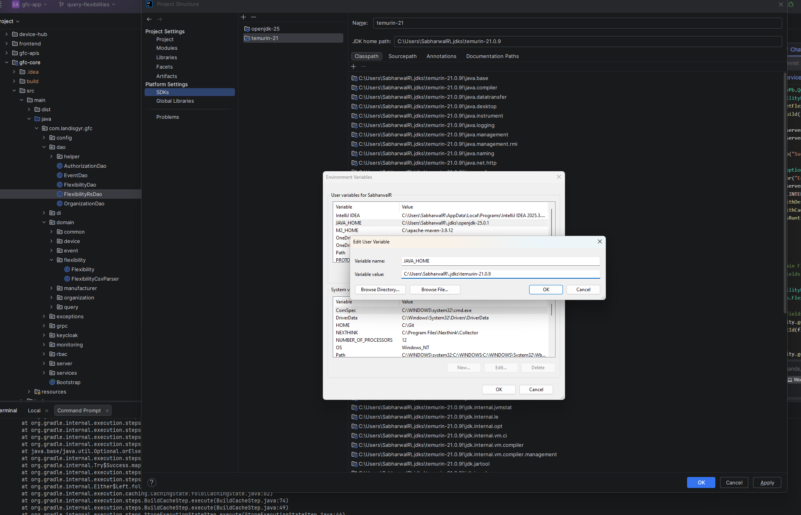
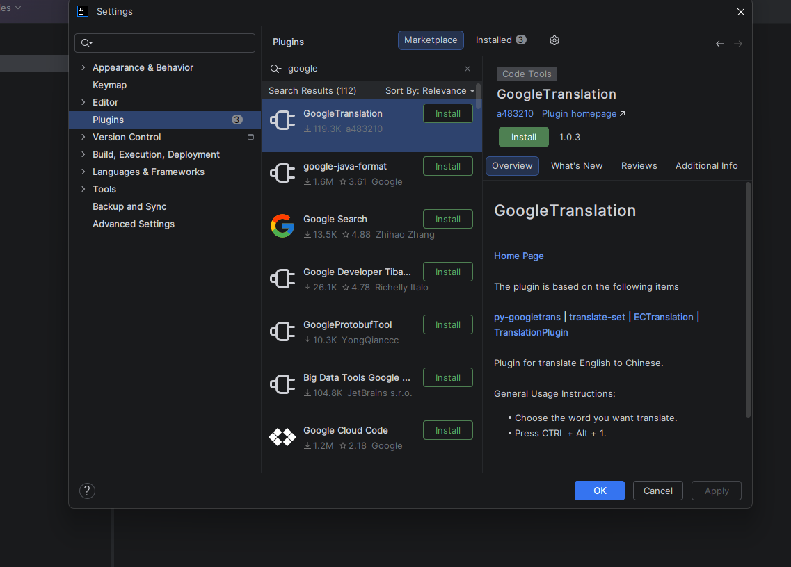
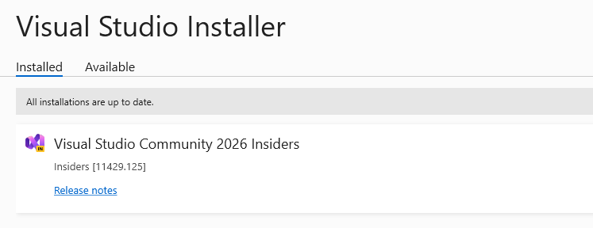
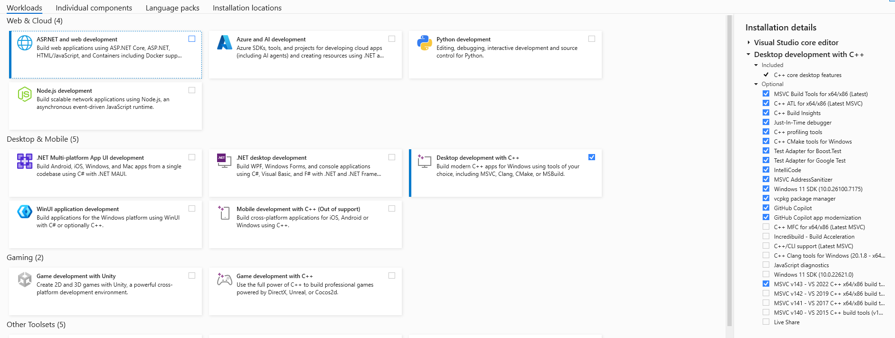

# Running the application
- [Gradle](gradle/README.md)
- [Maven](maven/README.md)
- Java setup via IntelliJ IDEA

- env-path

- google-java-formatter-plugin
  - `gradle format`

- Install [Visual studio installer](https://visualstudio.microsoft.com/downloads/) for latest build tools

