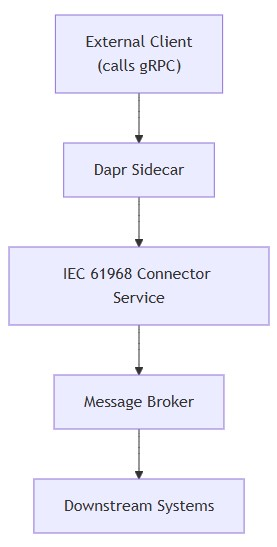
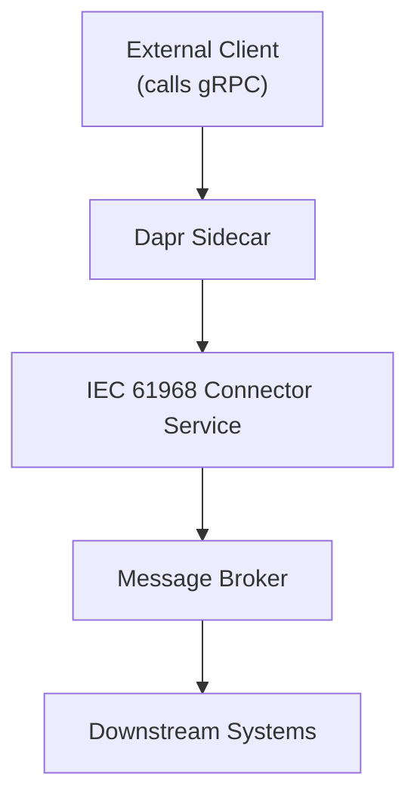
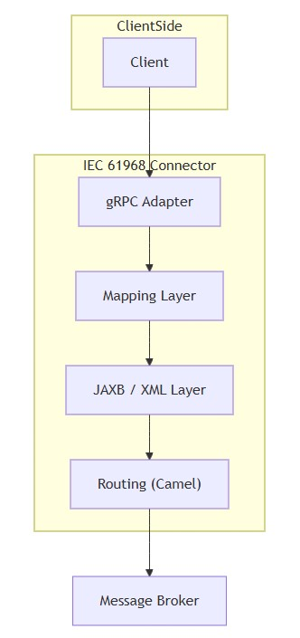
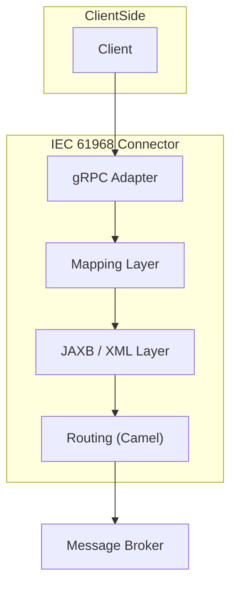
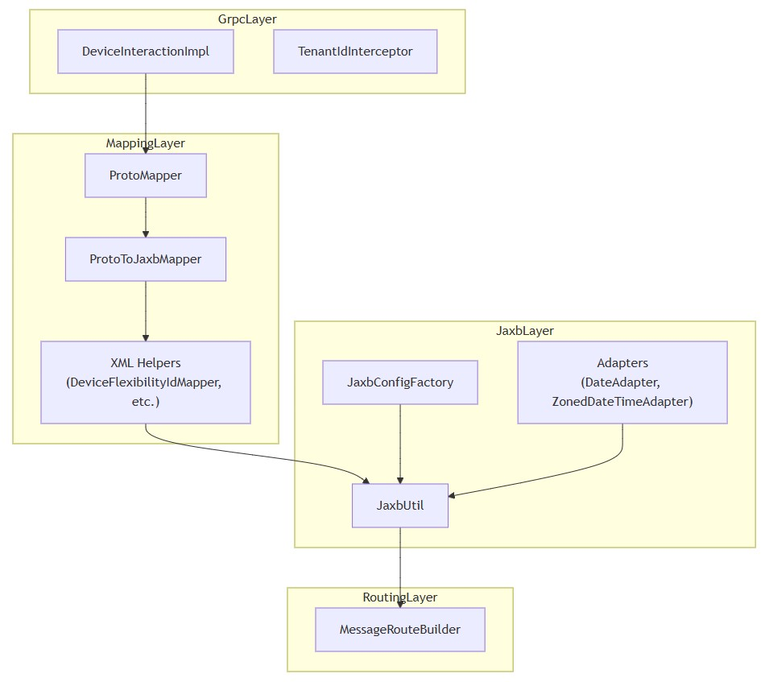
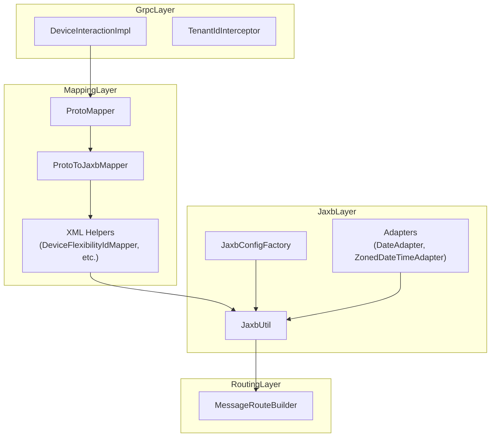
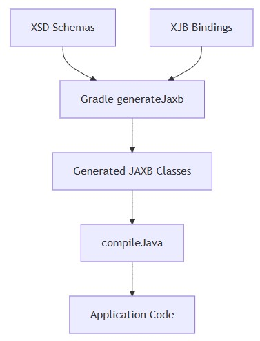
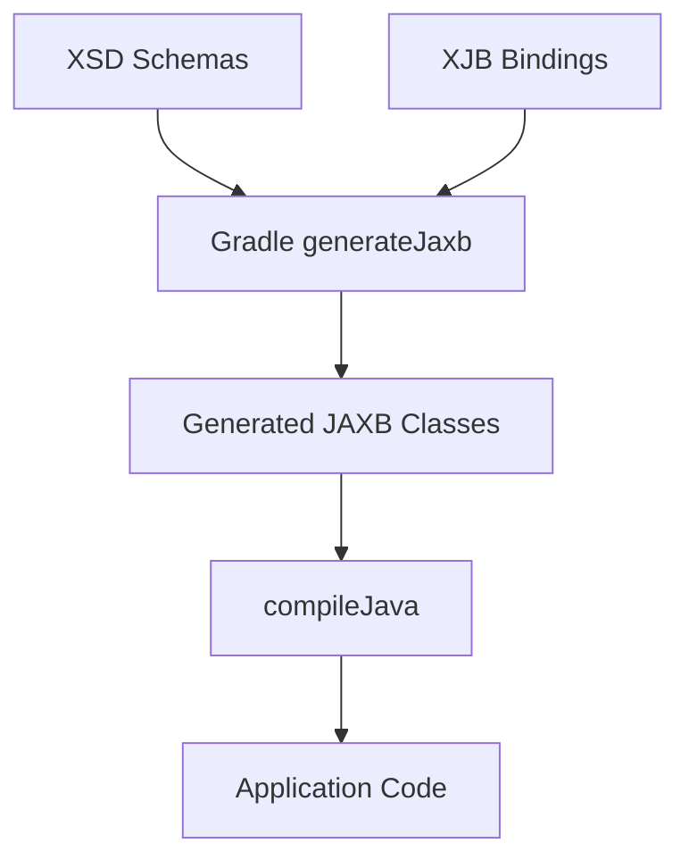

# Send commands
* [System context](#system-context)
* [Container view](#container-view)
* [Component view](#component-view)
* [Code mapping](#code-mapping)
## System context
- Who interacts with your system?

  
mermaid

## Container view
- What are the major building blocks inside?
  - **gRPC adapter** → entry point
  - **mapping layer** → intent → schema model
  - **jaxb layer** → object → XML
  - **routing** → delivery via Camel
- This behaves like an **assembly line**

  
mermaid

## Component view
- What are the real moving parts (your actual classes)?
  - The **most critical boundary** sits at:
    - `ProtoToJaxbMapper`

  
mermaid

## Code mapping
- How does the build enforce architecture?
  - Schema is not documentation, Schema is **compiled truth**
  - If the schema changes, your code must obey or fail

  
mermaid

