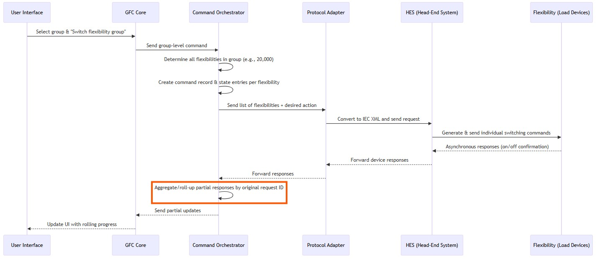
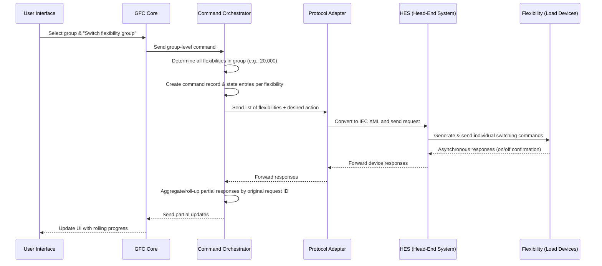

# Switching flexibilities
* **Load devices (Flexibilities)**
  * Execute commands (on/off)
  * Send **responses asynchronously**
    * Some responses arrive **immediately**, others may take **minutes or even 30+ minutes**
* **HES (Head-End System)**
  * Receives these **asynchronous responses**
  * Forwards each response **upstream** to **protocol adapter**
* **Protocol Adapter**
  * Receives individual device responses from HES
  * Forwards them to **command orchestrator**
* **Command Orchestrator**
  * Tracks responses by **original request ID** (from UI → GFC Core → command orchestrator)
  * Performs **rolling aggregation**:
    * Example: original request had 20,000 flexibilities
      * First batch: 5,000 responses
      * Next batch: 6,000 responses
      * And so on, until all 20,000 responses are received
  * Continually **sends partial updates** to **GFC Core**
* **GFC Core**
  * Receives partial/rolling updates from command orchestrator
  * Sends **current progress** to **UI**, so the user sees the **switching progress update in real-time**
* **User Interface**
  * Shows **dynamic progress** of switching operations (e.g., 5,000 done, 11,000 done … until completion)
* The system is **highly asynchronous**, with responses arriving at unpredictable intervals, and the architecture is designed to **roll-up partial results progressively** so the user always sees live status.
  * We need a broker (`pub/sub`) in between `Command Orchestrator` and `GFC Core` services
  * `GFC Core` will `pull` partial responses from the broker (`pub/sub`) and deliver to the user interface for live tracking

  
mermaid

