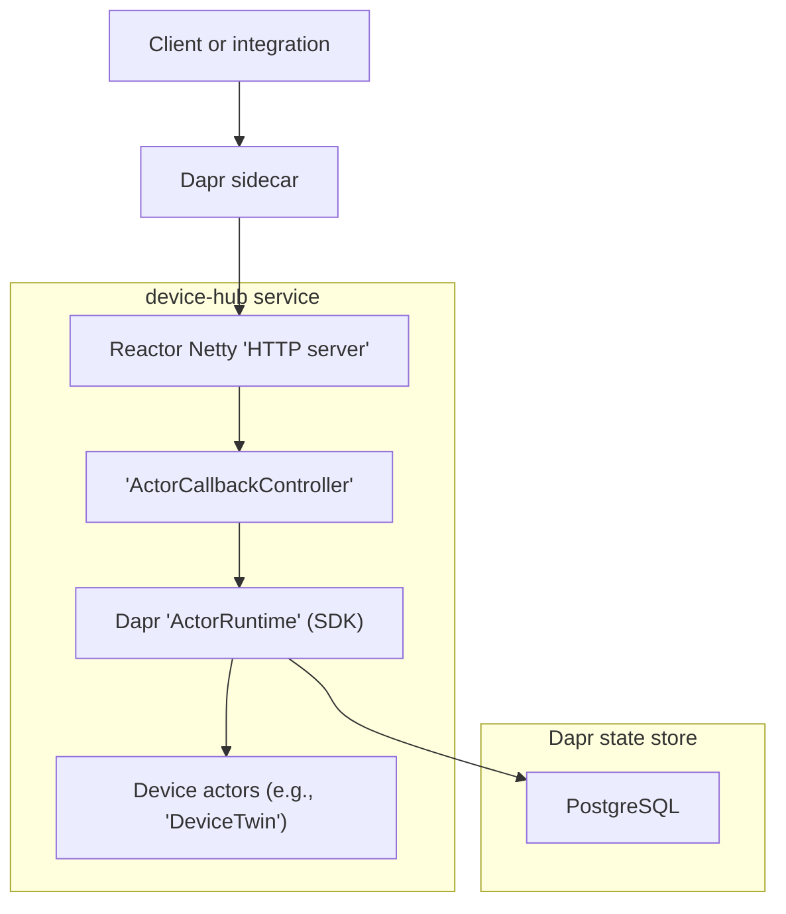
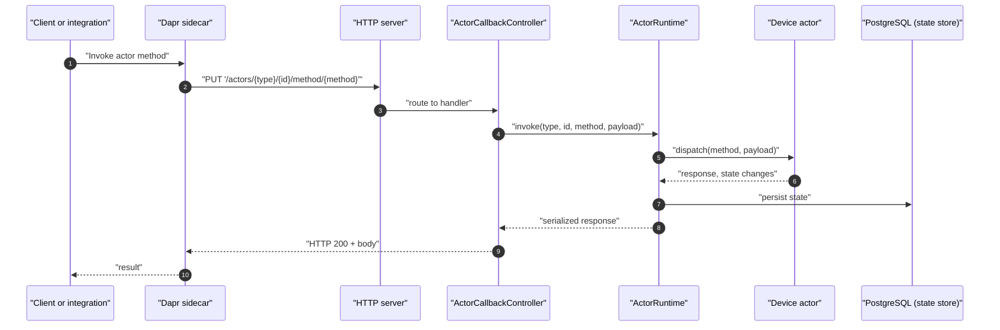

## Architecture
- [Overview](#overview)
- [actor-based design](#actor-based-design)
- [dapr sidecar interaction](#dapr-sidecar-interaction)
- [http callback server](#http-callback-server)
- [state store usage](#state-store-usage)
- [high-level component interactions](#high-level-component-interactions)

## Overview
- Actor-hosting microservice that runs alongside a Dapr sidecar; actors encapsulate per-device state and behavior
- Reactor Netty HTTP server exposes Dapr-required callbacks and forwards to Dapr’s ActorRuntime
- PostgreSQL is used as the Dapr state store for durable actor state
- Configuration is provided via Typesafe Config; defaults and structure are defined in ApplicationSetting
## Actor-based design
- Actors are registered at startup with Dapr’s ActorRuntime and created on-demand per `actor id`
- Per-actor state is accessed through Dapr’s state abstractions
  - Serialization uses the SDK-configured `ObjectMapper`
- Reminders and timers are supported via ActorRuntime
  - Scheduling parameters (initial delay, period, partitions, execution window) are configurable in `ApplicationSetting`
- Example domain model present:
  - `DeviceConfiguration` with `builder` and `getters/setters` used by device actors
## Dapr sidecar interaction
- Sidecar invokes the service’s HTTP callbacks to:

| Purpose                           | HTTP method | Endpoint                                       |
| --------------------------------- | ----------- | ---------------------------------------------- |
| Fetch actor runtime configuration | GET         | `/dapr/config`                                 |
| Deactivate an actor               | DELETE      | `/actors/{type}/{id}`                          |
| Invoke an actor method            | PUT         | `/actors/{type}/{id}/method/{method}`          |
| Deliver reminders                 | PUT         | `/actors/{type}/{id}/method/remind/{reminder}` |
| Deliver timers                    | PUT         | `/actors/{type}/{id}/method/timer/{timer}`     |

- ActorCallbackController receives these requests and delegates to ActorRuntime for execution
- Actor runtime configuration is serialized and returned to the sidecar by GET /dapr/config

## HTTP callback server
- Implemented with Reactor Netty
  - Routes are registered by `RoutingService` implementations (e.g., `ActorCallbackController`)
- Server binds to the configured interface and port (defaults: `0.0.0.0:3501`) and uses dedicated `selector/worker` event loops
- Graceful shutdown is handled by adding a JVM shutdown hook to dispose the Reactor Netty server
## State store usage
- Dapr persists actor state to PostgreSQL configured via the component YAML under `components/postgresql.yaml`
- State operations are performed by the ActorRuntime through the Dapr SDK
  - No direct JDBC usage is present in the service code
- Tests include an `in-memory` Dapr state provider to facilitate isolated actor behavior verification

## High-level component interactions

