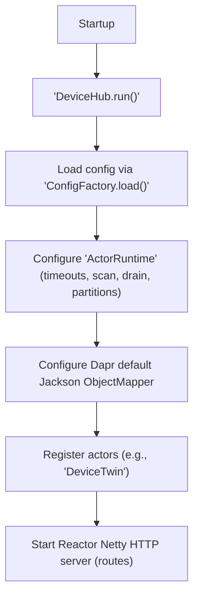
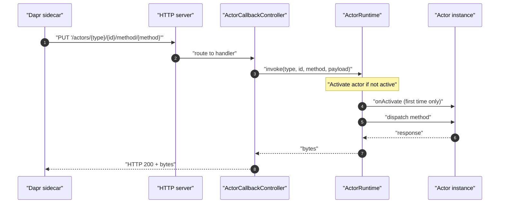
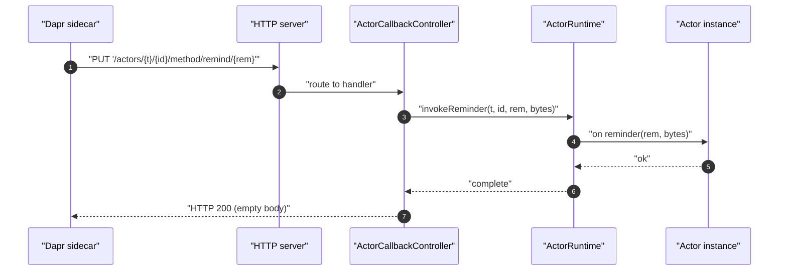

## Runtime
- [Overview](#overview)
- [Actor lifecycle handling](#actor-lifecycle-handling)
- [Reminder and timer flows](#reminder-and-timer-flows)
- [Runtime interactions with dapr](#runtime-interactions-with-dapr)

## Overview
- The service configures Dapr’s ActorRuntime at startup, registers actors, and starts a Reactor Netty HTTP server to receive Dapr callbacks
- Dapr sidecar invokes HTTP endpoints for actor configuration, method calls, reminders, timers, and deactivation
- Actor activation/deactivation hooks (onActivate/onDeactivate) are provided in actors and executed by the runtime

## Actor lifecycle handling
- activation
  - Actors are registered with ActorRuntime before the server starts
  - On the first invocation for a given actor id, the runtime activates the actor and calls its onActivate hook
- deactivation
  - Endpoint: DELETE /actors/{type}/{id}
  - ActorCallbackController delegates to ActorRuntime.deactivate(type, id)
  - The actor’s onDeactivate hook is invoked by the runtime during deactivation
- configuration fetch
  - Endpoint: GET /dapr/config
  - Returns serialized ActorRuntime configuration to the Dapr sidecar

## Reminder and timer flows
- reminder delivery
  - Endpoint: PUT /actors/{type}/{id}/method/remind/{reminder}
  - Body is forwarded to ActorRuntime.invokeReminder
  - On error, the handler logs a warning and propagates the error (server error response)
- timer delivery
  - Endpoint: PUT /actors/{type}/{id}/method/timer/{timer}
  - Body is forwarded to ActorRuntime.invokeTimer
  - On error, the handler logs a warning and propagates the error (server error response)
- reminders storage
  - The number of reminders storage partitions is set on ActorRuntime configuration at startup

## Runtime interactions with dapr
- configuration exchange
  - Dapr sidecar calls GET /dapr/config; the service returns ActorRuntime configuration bytes
- method invocation
  - Endpoint: PUT /actors/{type}/{id}/method/{method}
  - Body is forwarded to ActorRuntime.invoke; on handler error, the service returns a 200 with the bytes of the string "error"
- deactivation
  - Endpoint: DELETE /actors/{type}/{id}; ActorRuntime handles deactivation
- server and shutdown
  - Reactor Netty server runs on the configured host/port with registered routes
  - A shutdown hook is added to dispose the server gracefully when the JVM 
