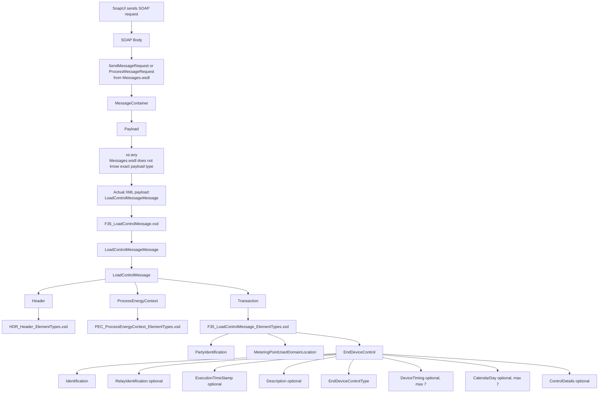

# Data hub simulator
- [Gradle build](#gradle-build)
- [Camel routes](#camel-routes)
## Gradle build
- This Gradle build creates a Docker‑deployable Java simulator application using `Apache Camel` + `CXF to expose SOAP and REST services`, packaged as an executable JAR with external dependencies and embedded Git build metadata.
```
Gradle Build
│
├── Plugins
│   └── Git properties (build traceability)
│
├── Variables
│   └── CXF version
│
├── Dependencies
│   ├── Internal modules
│   │   └── data-hub-api
│   │
│   ├── Core infrastructure
│   │   ├── Logging
│   │   └── Typesafe Config
│   │
│   ├── Integration layer
│   │   └── Apache Camel
│   │       ├── SOAP (CXF)
│   │       └── REST (JAX-RS)
│   │
│   ├── Web services
│   │   ├── CXF JAX-WS (SOAP)
│   │   ├── CXF JAX-RS (REST)
│   │   └── Jetty HTTP
│   │
│   └── Serialization & APIs
│       ├── Jackson (Jakarta)
│       └── Jakarta WS / JWS / RS
│
├── Packaging
│   ├── Executable JAR
│   │   ├── Main class
│   │   ├── External libs
│   │   └── JVM module opens
│   │
│   └── Security cleanup
│
├── Distribution
│   ├── App JAR
│   ├── Libs folder
│   └── Config folder
│
└── Build metadata
    └── Git commit info
```

## [Camel](https://github.com/sbhrwl/system_design/blob/main/docs/services/camel/README.md) routes
- This class is opening 2 APIs, one SOAP and one REST, using Camel as the router forwarding requests to service logic.
  - SOAP comes in → `webServiceImpl`
  - REST comes in → `Camel chooses operation` → service method
```
CamelRoutes
│
├── SOAP side
│   ├── Endpoint: /soap/FGR
│   ├── Uses WSDL
│   ├── Logs request
│   └── Calls webServiceImpl
│
└── REST side
    ├── Endpoint: /rest/FGR
    ├── Resource class: MessageResourceImpl
    ├── JSON provider: Jackson
    ├── Dispatch by operation name
    │   ├── peekMessage     -> direct:market-rs.list
    │   ├── processMessage  -> direct:market-rs.get
    │   ├── sendMessage     -> direct:market-rs.send
    │   └── dequeueMessage  -> direct:market-rs.delete
    │
    └── Implemented handlers
        ├── direct:market-rs.list -> MarketMessagingService.peekMessage()
        └── direct:market-rs.send -> MarketMessagingService.sendMessage()
```


- Key idea:
  - WSDL = SOAP API shape
  - `F35_LoadControlMessage.xsd` = root business message shape
  - `F35_LoadControlMessage_ElementTypes.xsd` = Transaction body shape
  - `loadcontrolmessage.xml` = actual message instance
  - So `Messages.wsdl` carries the payload, but `F35_LoadControlMessage.xsd` and its ElementTypes schema define whether the **payload content is valid**.

```
Messages.wsdl
  SendMessageRequest / ProcessMessageRequest
    MessageContainer
      Payload
        xs:any
          loadcontrolmessage.xml
            rsm:LoadControlMessageMessage
              validated by F35_LoadControlMessage.xsd
                Header                  -> HDR schema
                ProcessEnergyContext    -> PEC schema
                Transaction             -> F35_LoadControlMessage_ElementTypes.xsd
```
