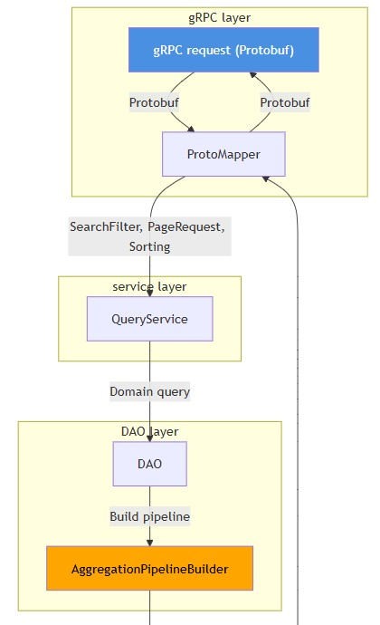
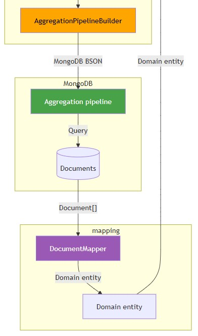
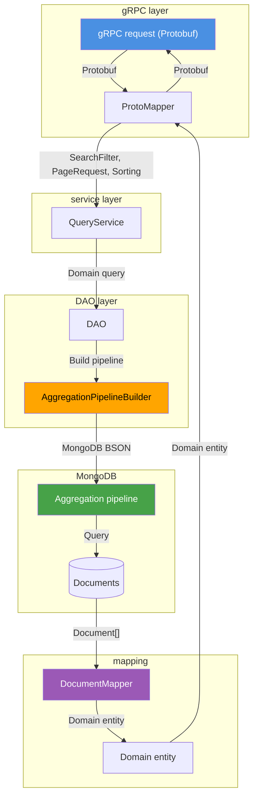

# Data Model & Persistence
- [Domain entities](#domain-entities)
  - [Device entity](#device-entity)
  - [Event entity](#event-entity)
  - [Organization entity](#organization-entity)
  - [Tag entity](#tag-entity)
- [Query model](#query-model)
  - [SearchFilter interface](#searchfilter-interface)
  - [PageRequest](#pagerequest)
  - [Sorting](#sorting)
- [Aggregation pipeline builder](#aggregation-pipeline-builder)
- [Data flow](#data-flow)
- [Document mappers](#document-mappers)

## Domain entities
- Domain model follows rich domain pattern with entities containing business logic
- All entities use MongoDB `ObjectId` for primary keys stored as hex strings in domain layer
- Organization code (`orgCode`) used for multi-tenant data isolation across all entities
- Field name constants defined in entity classes for type-safe field references
- Entities are POJOs with getters/setters, no JPA annotations (MongoDB driver uses `Document`)

## Device entity
- Core entity representing smart meter devices with lifecycle and state management
- Key fields: `deviceTwinId` (unique identifier), `deviceState`, `lifecycleState`, `deviceModel`, `serialNumber`
- Embedded objects: `MeteringPoint` (location and connection details), `Tag` references (array of `ObjectId`)
- Communication fields: `commTechnology`, `commQuality`, `lastCommunicationTime`
- Lifecycle tracking: `imported`, `manufactured`, `warrantyStartDate`, `warrantyEndDate`
- Business fields: `price`, `firmwareVersion`, `hardwareVersion`, `configurationId`, `batchNumber`
- Manufacturer resolution via `ManufacturerResolver` using `manufacturerId`
- Device identifier type configurable per organization (`SerialNumber` or `UtilitySerialNumber`)

## Event entity
- Represents operational events linked to devices via `deviceTwinId` and `device` (`ObjectId`)
- Key fields: `type`, `timestamp`, `orgCode`, `source`, `domain`, `category`, `severity`, `description`
- Event types: `device.imported`, `issue.triggered`, `issue.escalated`, `issue.resolved`, `wo.received`
- Attributes stored as `Map<String, String>` for extensible event metadata
- Embedded `MeteringPoint` for location context
- Retention level support for data lifecycle management
- Unique constraint: combination of `deviceTwinId`, `type`, and `timestamp` for upsert operations

## Organization entity
- Multi-tenant organization with hierarchical support via `parent` field
- Key fields: `orgCode` (primary identifier), `name`, `settings` (embedded `Settings` object)
- Settings include: `deviceIdentifier` type (determines which field used as device alias)
- Default settings provided if organization has no settings configured
- Cached in `OrganizationService` with 10-minute TTL for performance
- Used for access control and data isolation across all operations

## Tag entity
- Simple entity for device categorization and metadata tagging
- Key fields: `id` (`ObjectId`), `name`, `color`, `orgCode`
- Tags referenced in devices as array of `ObjectId` in `tags` field
- Organization-scoped: tags belong to single organization, validated before device assignment
- Maximum 1000 tags per bulk tagging operation to prevent request size issues

## Query model
- Query abstraction layer separates domain filters from MongoDB-specific query syntax
- All query components implement `Aggregable` interface for visitor pattern translation
- Query components: `SearchFilter` (filters), `Sorting` (sort criteria), `PageRequest` (pagination)
- Translation happens via `QueryVisitor` pattern implemented by `AggregationPipelineBuilder`
- Field projection supported via `List<String>` field names list
- Query model is protocol-agnostic, works with both gRPC and potential REST endpoints

## SearchFilter interface
- Base interface for all query filters with `isEmpty()` method
- Filter types: `UnaryFilter` (single property/value), `CompoundFilter` (AND/OR combinations)
- Unary filters: `EqFilter`, `InFilter`, `NinFilter`, `LtFilter`, `ExistsFilter`, `DateIntervalFilter`
- Text search: `FreeTextFilter` (full-text search), `AutocompleteFilter` (prefix matching)
- Spatial: `NearFilter` (geospatial proximity search)
- Compound: `AndFilter`, `OrFilter` (logical combinations)
- Special: `Unfiltered` (no filtering, returns all documents)
- Filters visitable via `QueryVisitor` pattern for MongoDB aggregation translation

## PageRequest
- Immutable record for pagination with `pageNumber`, `pageSize`, and `onlyCount` flag
- Default page size 50 for queries, `Integer.MAX_VALUE` for unpaged queries
- `onlyCount` flag enables count-only queries without document retrieval
- Static factory: `PageRequest.unpaged()` for queries without pagination
- Implements `Aggregable` for visitor pattern translation to MongoDB `$facet` stage

## Sorting
- Mutable class with `LinkedHashMap<String, Order>` to preserve field order
- Order enum: `ASC`, `DESC` for ascending/descending sort
- Multiple sort fields supported with order preservation
- Static factory: `Sorting.unsorted` for queries without sorting
- Implements `Aggregable` for visitor pattern translation to MongoDB `$sort` stage

## Aggregation pipeline builder
- Translates domain query model to MongoDB aggregation pipeline stages
- Implements `QueryVisitor` pattern for type-safe filter translation
- Search strategy selection: `PRIMARY` (index-based) vs `ATLAS` (Atlas Search) based on filter types
- Pipeline stages: `$match` (filtering), `$lookup` (tag joins), `$sort` (sorting), `$project` (field projection), `$facet` (pagination)
- Atlas Search integration: uses `$search` stage for full-text and autocomplete filters
- Filter stage building: recursive visitor pattern traverses filter tree, builds nested `$and`/`$or` expressions
- Field projection: builds `$project` stage with included fields, handles nested field paths
- Pagination: uses `$facet` with `data` (documents) and `count` (total) pipelines
- Query logging: debug-level logging of generated pipeline JSON for troubleshooting

## Data flow
- Request flow from gRPC protobuf through domain model to MongoDB and back
- Field projection reduces payload size by selecting only required fields
- Query translation happens at DAO layer via `AggregationPipelineBuilder`
- MongoDB aggregation pipeline executed, returns `Document` objects
- Document mappers convert `Document` to domain entities
- Domain entities converted back to protobuf via `ProtoMapper` for gRPC responses

  
mermaid

## Document mappers
| Mapper                        | Responsibility                                                                    |
| ----------------------------- | --------------------------------------------------------------------------------- |
| Static utility classes        | bidirectional mapping between MongoDB `Document` and domain entities              |
| Type conversions              | converts `ObjectId` ↔ `String`, `LocalDateTime` ↔ `Date`, handles nested objects  |
| Field name mapping            | maps MongoDB snake_case fields to domain camelCase properties                     |
| Null safety                   | handles missing fields gracefully, applies defaults where appropriate             |
| Wmbedded objects              | delegates mapping of `MeteringPoint`, `Settings`, `Group`, `Location`             |
| `DeviceDocumentMapper`        | maps device documents, resolves manufacturer name, handles device identifier type |
| `EventDocumentMapper`         | maps event documents, handles attributes map and metering point embedding         |
| `OrgDocumentMapper`           | maps organization documents, applies default settings                             |
| `TagDocumentMapper`           | maps tag documents with straightforward field mapping                             |
| `MeteringPointDocumentMapper` | maps embedded metering point documents with location and position                 |
| `GroupDocumentMapper`         | maps aggregation group results with attributes and counts                         |
| `LocationMapper`              | maps embedded location objects including address and position                     |
| `SettingsMapper`              | maps organization settings including device identifier type                       |
