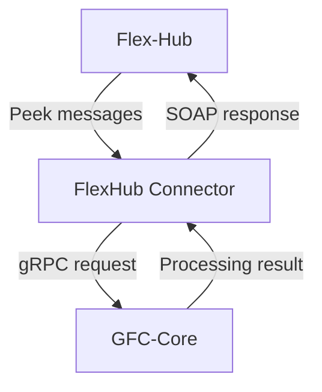
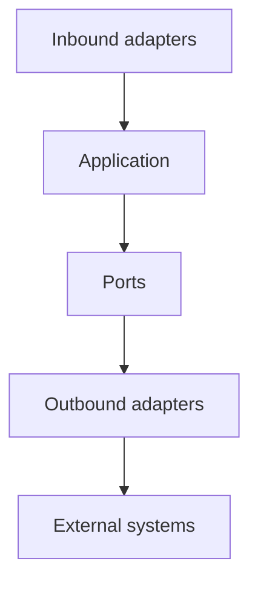
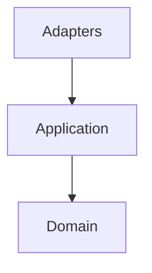
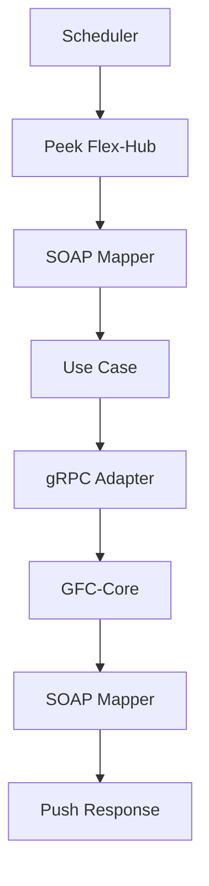
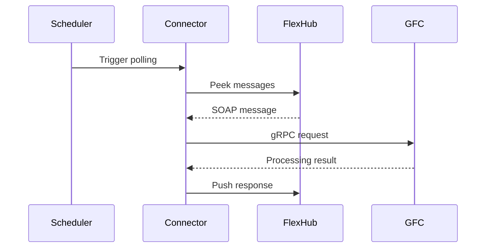

# Index

* [Service overview](#service-overview)
* [Architecture](#architecture)
* [Package structure](#package-structure)
* [Message flow](#message-flow)
* [Runtime sequence](#runtime-sequence)
* [Layer responsibilities](#layer-responsibilities)
* [Architecture assessment](#architecture-assessment)
* [Recommendations](#recommendations)

# Service overview

* **Purpose**

  * Acts as an **integration connector** between **Flex-Hub** and **GFC-Core**.
  * Bridges different communication protocols while isolating business processing.
* **Responsibilities**

  * Periodically **peek** messages from **Flex-Hub**.
  * Convert external SOAP payloads into internal domain models.
  * Forward requests to **GFC-Core** using `gRPC`.
  * Receive processing results from **GFC-Core**.
  * Convert responses into Flex-Hub message format.
  * Push responses back to **Flex-Hub**.
* **Design principles**
  * Business logic resides in **GFC-Core**.
  * Connector focuses on **integration**, **orchestration**, **mapping**, and **protocol translation**.
  * Follows **Hexagonal Architecture (Ports & Adapters)**.

# Architecture
* **Architectural style**
  * Implements **Hexagonal Architecture**.
  * Separates **Application**, **Domain**, and **Infrastructure** concerns.
* **Inbound adapters**
  * Receive requests or trigger application workflows.
* **Application layer**
  * Coordinates business use cases.
  * Depends only on **Ports**.
* **Outbound adapters**
  * Communicate with external systems.
  * Implement application ports.
* **Domain**
  * Contains business models.
  * Independent of frameworks and transport protocols.

# Package structure
## `adapters`
* Contains all infrastructure-specific implementations.
* Isolates protocol and framework dependencies.
### `adapters.inbound.grpc`
* `FlexibilityHubGrpcAdapter`
  * Receives incoming `gRPC` requests.
* `HealthGrpcService`
  * Provides health check endpoints.
* `TenantIdInterceptor`
  * Handles tenant context propagation.
* `ProtoMapper`
  * Maps between `Protobuf` and domain models.
### `adapters.inbound.scheduler`
* `ScheduledCamelRoutes`
  * Periodically polls Flex-Hub.
  * Triggers message processing workflows.
### `adapters.outbound.grpc`
* `ControlCommandGrpcClient`
  * Low-level `gRPC` client.
* `ControlCommandGrpcClientAdapter`
  * Implements application port.
  * Invokes **GFC-Core**.
* `ProtoMapper`
  * Converts domain models to `Protobuf`.
### `adapters.outbound.soap`
* `SoapClientAdapter`
  * Sends responses to Flex-Hub.
* `OutboundCamelRoutes`
  * Defines Camel integration routes.
* `MessageMapper`
  * Converts domain objects into SOAP messages.
* `MasterDataMPEventMapper`
  * Maps master data events.

## `app`
* Contains orchestration logic.
### `app.port`
* `PeekMessagesPort`
  * Abstraction for retrieving Flex-Hub messages.
* `RelayControlCommandPort`
  * Abstraction for forwarding requests to GFC-Core.
### `app.service`
* Contains reusable application services.
* Examples:
  * `OrganizationIdLookupService`
  * `OrganizationUserLookupService`
  * `TenantIdLookupService`
### `app.usecase`
* Implements application workflows.
* Examples:
  * `PeekMessagesUseCase`
  * `SendConfirmationMessageUseCase`
  * `UpdateAccountingPointControllabilityUseCase`
## `domain`
* Contains business models.
* Independent of:
  * `SOAP`
  * `gRPC`
  * `Apache Camel`
  * Spring infrastructure

# Message flow
* Scheduler triggers periodic polling.
* Connector peeks messages from Flex-Hub.
* SOAP payload is mapped to domain objects.
* Application use case is invoked.
* Request is forwarded to **GFC-Core** through `RelayControlCommandPort`.
* `gRPC` adapter calls **GFC-Core**.
* Processing result is returned.
* Domain response is mapped to SOAP.
* Response is pushed back to Flex-Hub.

# Runtime sequence
* `ScheduledCamelRoutes`
  * Initiates polling.
* `PeekMessagesUseCase`
  * Retrieves pending messages.
* `PeekMessagesPort`
  * Delegates retrieval to outbound adapter.
* `SoapClientAdapter`
  * Reads message from Flex-Hub.
* `MessageMapper`
  * Converts payload into domain model.
* `RelayControlCommandPort`
  * Invokes GFC-Core.
* `ControlCommandGrpcClientAdapter`
  * Executes `gRPC` request.
* `SendConfirmationMessageUseCase`
  * Creates response.
* `SoapClientAdapter`
  * Sends confirmation to Flex-Hub.

# Layer responsibilities
* **Inbound adapters**
  * Accept external requests.
  * Trigger application workflows.
  * Perform protocol-specific mapping.
* **Application**
  * Coordinates use cases.
  * Depends only on ports.
  * Contains no transport-specific logic.
* **Ports**
  * Define contracts for external dependencies.
  * Enable dependency inversion.
* **Outbound adapters**
  * Implement ports.
  * Integrate with SOAP and `gRPC`.
* **Domain**
  * Encapsulates business models.
  * Remains framework independent.
# Architecture assessment
* **Strengths**
  * Clear separation of concerns.
  * Strong adherence to **Hexagonal Architecture**.
  * External protocols isolated within adapters.
  * Business workflows encapsulated in use cases.
  * Dependency inversion achieved through ports.
  * Domain remains independent of infrastructure.
  * Easily testable through port mocking.
  * Supports replacing external systems with minimal impact.

# Recommendations
* Add resilience patterns for external integrations.
  * `Retry`
  * `Circuit Breaker`
  * `Dead Letter Queue (DLQ)`
  * `Idempotency`
* Add observability.
  * Distributed tracing.
  * Structured logging.
  * Metrics.
  * Correlation IDs.
* Maintain framework independence by keeping `SOAP`, `gRPC`, and `Apache Camel` confined to adapter implementations.
