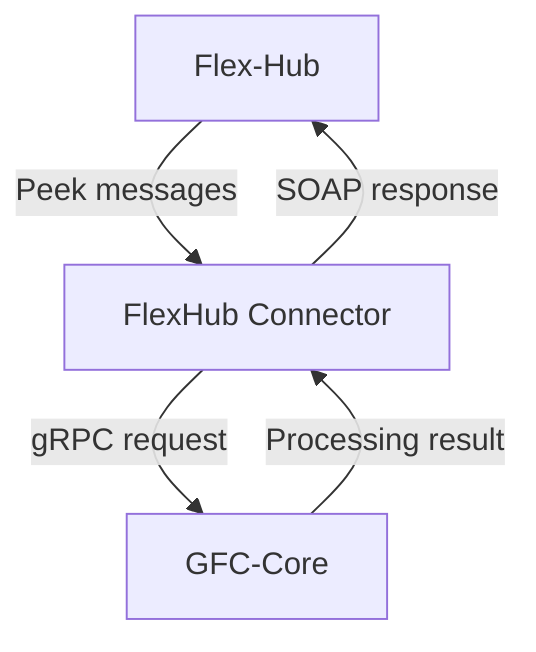
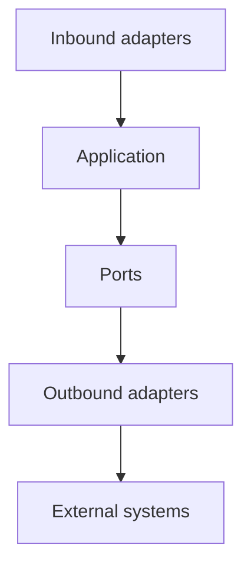
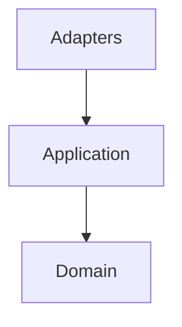
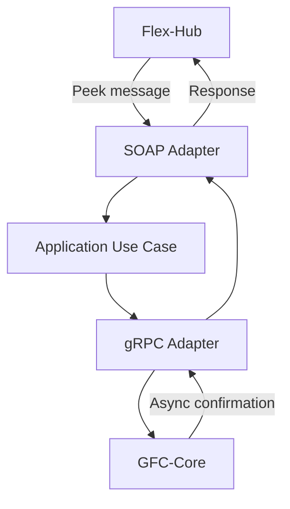
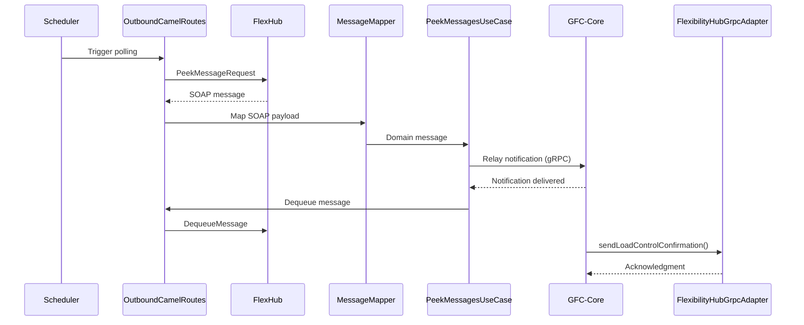

# FHC
- [Service overview](#service-overview)
- [Architecture](#architecture)
- [Package structure](#package-structure)
  - [Adapters](#adapters)
    - [Inbound](#inbound)
      - [Grpc](#grpc)
      - [Scheduler](#scheduler)
    - [Outbound](#outbound)
      - [Grpc](#grpc-1)
      - [Soap](#soap)
  - [App](#app)
    - [Port](#port)
    - [Service](#service)
    - [Usecase](#usecase)
  - [Domain](#domain)
- [Message flow](#message-flow)
- [Processing lifecycle](#processing-lifecycle)
- [Layer responsibilities](#layer-responsibilities)
- [Architecture assessment](#architecture-assessment)
- [Recommendations](#recommendations)
## Service overview
* **Purpose**
  * Acts as an **integration connector** between **Flex-Hub** and **GFC-Core**.
  * Bridges different communication protocols while isolating business processing.
* **Responsibilities**
  * Periodically **peek** messages from **Flex-Hub**.
  * Convert external SOAP payloads into internal domain models.
  * Forward requests to **GFC-Core** using `gRPC`.
  * Receive processing results from **GFC-Core**.
  * Convert responses into Flex-Hub message format.
  * Push responses back to **Flex-Hub**.
* **Design principles**
  * Business logic resides in **GFC-Core**.
  * Connector focuses on **integration**, **orchestration**, **mapping**, and **protocol translation**.
  * Follows **Hexagonal Architecture (Ports & Adapters)**.



## Architecture
* **Architectural style**
  * Implements **Hexagonal Architecture**.
  * Separates **Application**, **Domain**, and **Infrastructure** concerns.
* **Inbound adapters**
  * Receive requests or trigger application workflows.
* **Application layer**
  * Coordinates business use cases.
  * Depends only on **Ports**.
* **Outbound adapters**
  * Communicate with external systems.
  * Implement application ports.
* **Domain**
  * Contains business models.
  * Independent of frameworks and transport protocols.



## Package structure
```
java
└── com.landisgyr.gfc.flexhub_connector
    ├── adapters
    │   ├── inbound
    │   │   ├── grpc
    │   │   │   ├── FlexibilityHubGrpcAdapter
    │   │   │   ├── HealthGrpcService
    │   │   │   ├── ProtoMapper
    │   │   │   └── TenantIdInterceptor
    │   │   └── scheduler
    │   │       └── ScheduledCamelRoutes
    │   └── outbound
    │       ├── grpc
    │       │   ├── ControlCommandGrpcClient
    │       │   ├── ControlCommandGrpcClientAdapter
    │       │   └── ProtoMapper
    │       └── soap
    │           ├── MasterDataMPEventMapper
    │           ├── MessageMapper
    │           ├── OutboundCamelRoutes
    │           └── SoapClientAdapter
    ├── app
    │   ├── port
    │   │   ├── PeekMessagesPort
    │   │   └── RelayControlCommandPort
    │   ├── service
    │   │   ├── OrganizationIdLookupService
    │   │   ├── OrganizationUserLookupService
    │   │   └── TenantIdLookupService
    │   ├── usecase
    │   │   ├── PeekMessagesUseCase
    │   │   ├── SendConfirmationMessageUseCase
    │   │   └── UpdateAccountingPointControllabilityUseCase
    │   └── Main
    ├── domain
    │   ├── model
    │   └── type
    └── infrastructure
```
### `adapters`
* Contains all infrastructure-specific implementations.
* Isolates protocol and framework dependencies.
#### `adapters.inbound.grpc`
* `FlexibilityHubGrpcAdapter`
  * Receives incoming `gRPC` requests.
* `HealthGrpcService`
  * Provides health check endpoints.
* `TenantIdInterceptor`
  * Handles tenant context propagation.
* `ProtoMapper`
  * Maps between `Protobuf` and domain models.
#### `adapters.inbound.scheduler`
* `ScheduledCamelRoutes`
  * Periodically polls Flex-Hub.
  * Triggers message processing workflows.
#### `adapters.outbound.grpc`
* `ControlCommandGrpcClient`
  * Low-level `gRPC` client.
* `ControlCommandGrpcClientAdapter`
  * Implements application port.
  * Invokes **GFC-Core**.
* `ProtoMapper`
  * Converts domain models to `Protobuf`.
#### `adapters.outbound.soap`
* `SoapClientAdapter`
  * Sends responses to Flex-Hub.
* `OutboundCamelRoutes`
  * Defines Camel integration routes.
* `MessageMapper`
  * Converts domain objects into SOAP messages.
* `MasterDataMPEventMapper`
  * Maps master data events.

### `app`
* Contains orchestration logic.
#### `app.port`
* `PeekMessagesPort`
  * Abstraction for retrieving Flex-Hub messages.
* `RelayControlCommandPort`
  * Abstraction for forwarding requests to GFC-Core.
#### `app.service`
* Contains reusable application services.
* Examples:
  * `OrganizationIdLookupService`
  * `OrganizationUserLookupService`
  * `TenantIdLookupService`
#### `app.usecase`
* Implements application workflows.
* Examples:
  * `PeekMessagesUseCase`
  * `SendConfirmationMessageUseCase`
  * `UpdateAccountingPointControllabilityUseCase`
### `domain`
* Contains business models.
* Independent of:
  * `SOAP`
  * `gRPC`
  * `Apache Camel`
  * Spring infrastructure



## Message flow
- The connector continuously polls **Flex-Hub** for pending messages.
- Retrieved SOAP messages are mapped into internal domain models.
- The application layer orchestrates message processing.
- Requests are forwarded to **GFC-Core** using `gRPC`.
- After successful delivery, the original message is removed from the Flex-Hub queue.
- Once business processing is completed, **GFC-Core** sends an asynchronous confirmation to the connector.
- The connector processes the confirmation and prepares the corresponding response for **Flex-Hub**.



## Processing lifecycle
- **Polling**
  - `ScheduledCamelRoutes` periodically triggers message polling.
  - `OutboundCamelRoutes` sends a `PeekMessageRequest` to Flex-Hub.
- **Message retrieval**
  - Flex-Hub returns the next available SOAP message.
  - `MessageMapper` converts the SOAP payload into a domain model.
- **Application processing**
  - `PeekMessagesUseCase` receives the mapped message.
  - The appropriate application workflow is initiated.
- **Notification relay**
  - `ControlCommandGrpcClient` maps the domain model into a `gRPC` request.
  - The request is delivered to **GFC-Core**.
- **Queue management**
  - After successful delivery, `OutboundCamelRoutes` sends a `DequeueMessage` request.
  - The processed message is removed from the Flex-Hub queue.
- **Asynchronous callback**
  - After completing business processing, **GFC-Core** invokes `sendLoadControlConfirmation`.
  - `FlexibilityHubGrpcAdapter` receives the callback.
  - The connector acknowledges the request and prepares the response for Flex-Hub.



### Runtime log correlation

| Timestamp | Component | Event |
|-----------|-----------|-------|
| `13:04:31.700` | `OutboundCamelRoutes` | Send `PeekMessageRequest` to Flex-Hub |
| `13:04:31.701` | `MessageMapper` | Map incoming `LoadControl` SOAP message |
| `13:04:31.730` | `PeekMessagesUseCase` | Start application workflow |
| `13:04:32.372` | `ControlCommandGrpcClient` | Deliver notification to GFC-Core |
| `13:04:32.409` | `OutboundCamelRoutes` | Dequeue processed message from Flex-Hub |
| `13:04:39.564` | `FlexibilityHubGrpcAdapter` | Receive `sendLoadControlConfirmation` callback |
| `13:04:39.578` | `FlexibilityHubGrpcAdapter` | Send acknowledgment |

## Layer responsibilities
* **Inbound adapters**
  * Accept external requests.
  * Trigger application workflows.
  * Perform protocol-specific mapping.
* **Application**
  * Coordinates use cases.
  * Depends only on ports.
  * Contains no transport-specific logic.
* **Ports**
  * Define contracts for external dependencies.
  * Enable dependency inversion.
* **Outbound adapters**
  * Implement ports
  * Integrate with SOAP and `gRPC`
* **Domain**
  * Encapsulates business models.
  * Remains framework independent.
## Architecture assessment
* **Strengths**
  * Clear separation of concerns.
  * Strong adherence to **Hexagonal Architecture**.
  * External protocols isolated within adapters.
  * Business workflows encapsulated in use cases.
  * Dependency inversion achieved through ports.
  * Domain remains independent of infrastructure.
  * Easily testable through port mocking.
  * Supports replacing external systems with minimal impact.

## Recommendations
* Add resilience patterns for external integrations.
  * `Retry`
  * `Circuit Breaker`
  * `Dead Letter Queue (DLQ)`
  * `Idempotency`
* Add observability.
  * Distributed tracing.
  * Structured logging.
  * Metrics.
  * Correlation IDs.
* Maintain framework independence by keeping `SOAP`, `gRPC`, and `Apache Camel` confined to adapter implementations.
