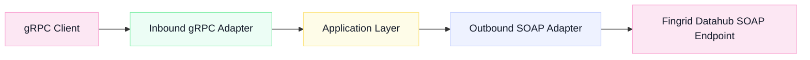
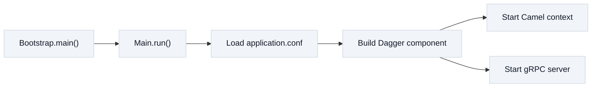
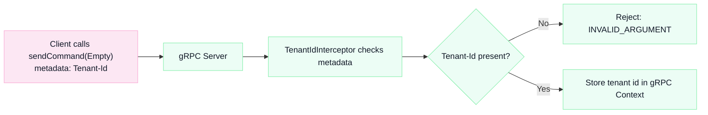
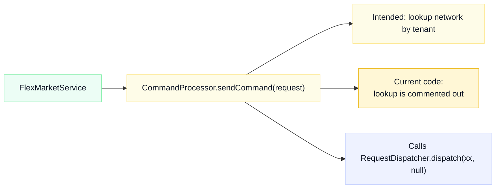

# Introduction
- [High level flow](#high-level-flow)
- [Startup](#startup)
- [gRPC client to TenantIdInterceptor](#grpc-client-to-tenantidinterceptor)
- [FlexMarketService to CommandProcessor](#flexmarketservice-to-commandprocessor)
## High level flow

## Startup

## gRPC client to TenantIdInterceptor

## FlexMarketService to CommandProcessor

