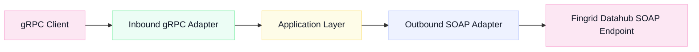

# Introduction
- [High level flow](#high-level-flow)
## High level flow

```mermaid
flowchart LR
    %% High-level component flow

    classDef inbound fill:#ecfdf5,stroke:#86efac,color:#111827
    classDef app fill:#fefce8,stroke:#fde68a,color:#111827
    classDef outbound fill:#eef2ff,stroke:#c7d2fe,color:#111827
    classDef external fill:#fce7f3,stroke:#f9a8d4,color:#111827

    Client["gRPC Client"] --> Inbound["Inbound gRPC Adapter"]
    Inbound --> App["Application Layer"]
    App --> Outbound["Outbound SOAP Adapter"]
    Outbound --> Datahub["Fingrid Datahub SOAP Endpoint"]

    class Client,Datahub external
    class Inbound inbound
    class App app
    class Outbound outbound
```
