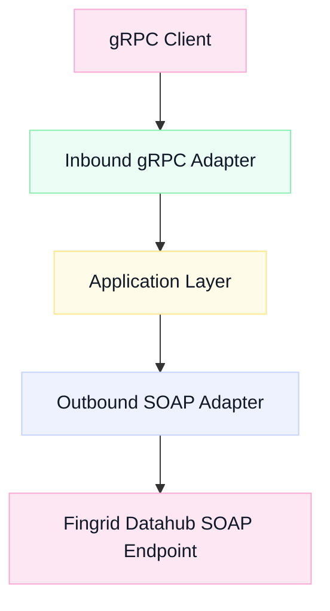
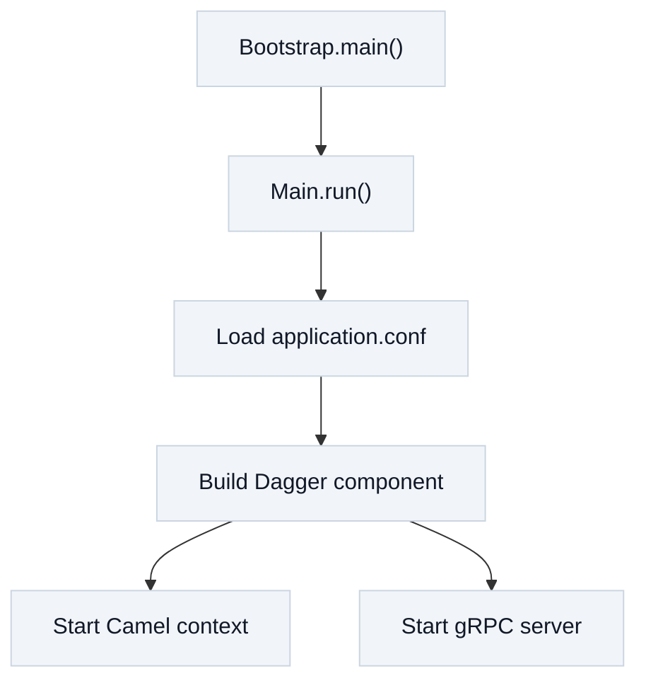
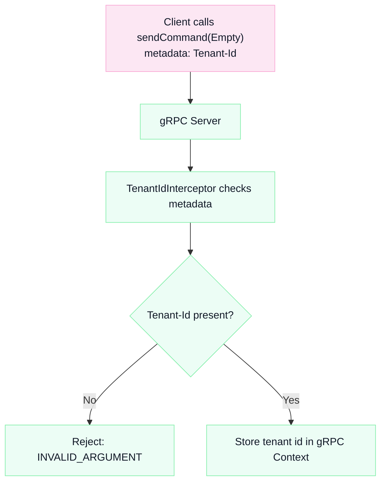
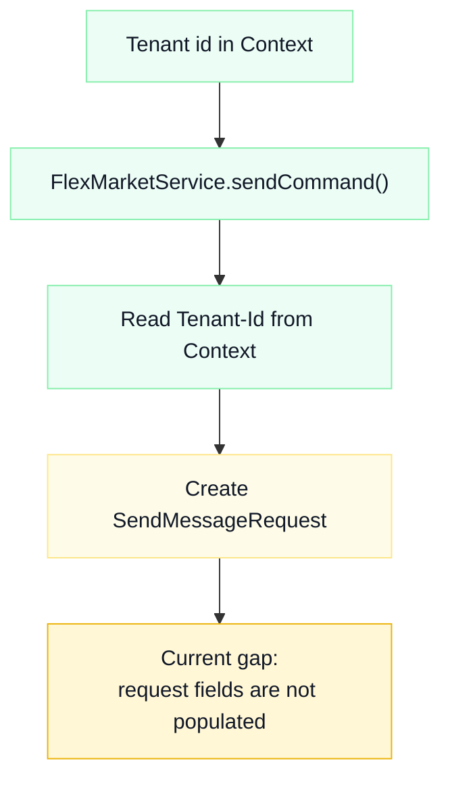
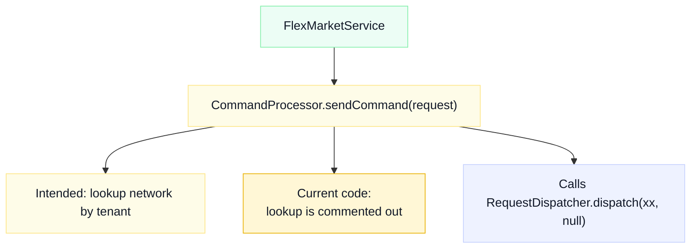
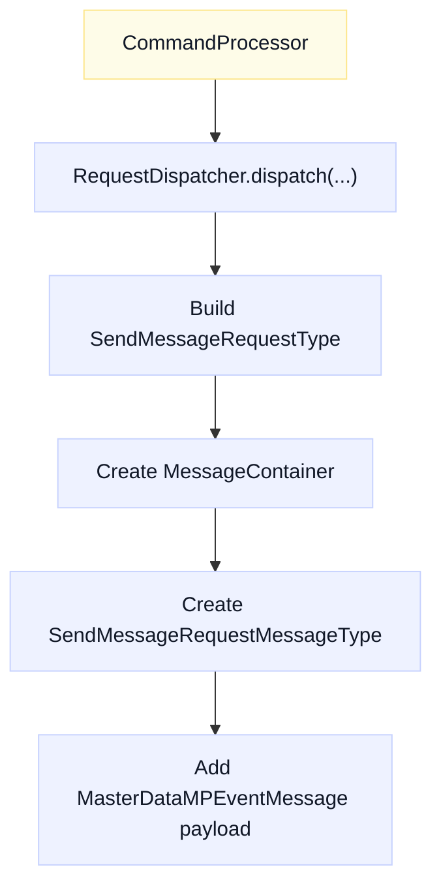
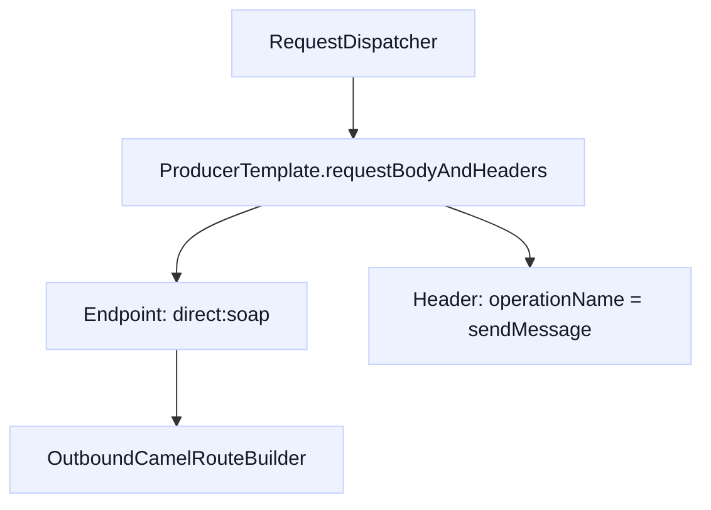
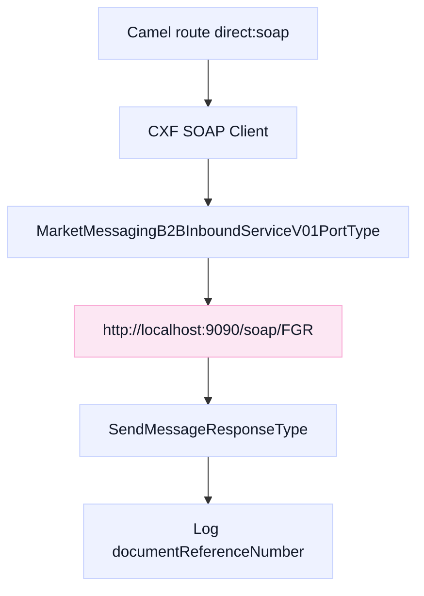

# Introduction
- [High level flow](#high-level-flow)
- [Startup](#startup)
- [gRPC client to TenantIdInterceptor](#grpc-client-to-tenantidinterceptor)
- [TenantIdInterceptor to FlexMarketService](#tenantidinterceptor-to-flexmarketservice)
- [FlexMarketService to CommandProcessor](#flexmarketservice-to-commandprocessor)
- [CommandProcessor to RequestDispatcher](#commandprocessor-to-requestdispatcher)
- [RequestDispatcher to Camel route](#requestdispatcher-to-camel-route)
- [Camel route to SOAP endpoint](#camel-route-to-soap-endpoint)

## High level flow

## Startup

## gRPC client to TenantIdInterceptor

## TenantIdInterceptor to FlexMarketService

## FlexMarketService to CommandProcessor

## CommandProcessor to RequestDispatcher

## RequestDispatcher to Camel route

## Camel route to SOAP endpoint

