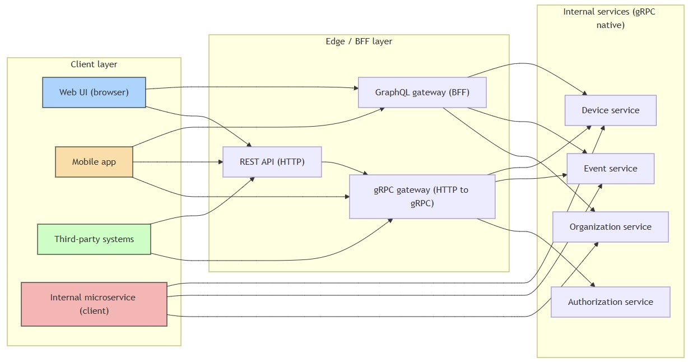
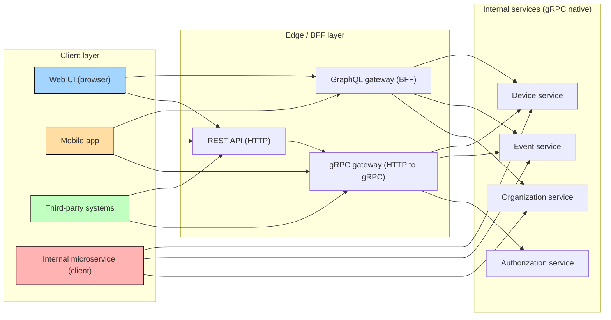

# API architecture
- [Architectural layers](#architectural-layers)
  - [Client layer](#client-layer)
  - [Edge layer](#edge-layer)
  - [Services layer](#services-layer)
- [Schema definition layer](#schema-definition-layer)
  - [Protocol Buffers to GraphQL mapping](#protocol-buffers-to-graphql-mapping)
  - [Mapping rules](#mapping-rules)
- [Schema synchronization strategy](#schema-synchronization-strategy)
- [API evolution strategy](#api-evolution-strategy)
- [Documentation synchronization](#documentation-synchronization)
## Architectural Layers
- The project follows a `BFF` (Backend for Frontend) and `API gateway` (**Apollo router**) pattern
- Apollo router
  - **GraphQL gateway/federation layer**: 
    - Routes and composes queries from clients to multiple GraphQL services.
  - **Optimizes UI queries**: 
    - Parallelizes requests, caches results, enforces query complexity limits.

  
mermaid

### Client layer
| Client Type | Description | Recommended Protocol |
|-------------|-------------|--------------------|
| Web Applications | Operator dashboards, management consoles, real-time monitoring | GraphQL or REST |
| Mobile Applications | Field technician apps, on-site device management | GraphQL or REST |
| Third-party Integrations | External utility systems, legacy enterprise apps, partner integrations | REST |
| Internal Microservices | Service-to-service communication, background jobs, data sync | gRPC Native |

### Edge layer

| Gateway | Purpose | Strengths | Best For | Implementation |
|---------|---------|----------|----------|----------------|
| GraphQL | Flexible, client-driven queries | Single request for multiple resources, precise field selection, reduced network overhead | Web/mobile UIs, complex data aggregation, exploratory queries | Custom resolvers mapping to gRPC services |
| gRPC Native | High-performance, strongly-typed communication | Binary protocol, code generation, streaming, type safety | Microservice communication, bulk operations, real-time streams | Direct gRPC service calls |
| [REST via gRPC-Gateway](rest-apis/README.md) | Standard HTTP/JSON API | Universal support, simple tooling | Third-party integrations, legacy systems, simple CRUD | Auto-generated from proto HTTP annotations; coverage: select endpoints only |

### Services layer

| Service | Domain | Key Operations |
|---------|--------|----------------|
| Device Service | Smart meters, sensors, device lifecycle | Register devices, query/update state, track communication, bulk import |
| Event Service | System events, alarms, notifications | Add/query events, manage retention, device state tracking |
| Organization Service | Utility hierarchy, settings, policies | Create/update organizations, query hierarchy, configure warranties |
| Tag Service | Metadata, categorization, device tagging | Create/update tags, tag devices, query tags |
| Authorization Service | Permissions, roles, org-level security | Get permissions, validate access |
| IEC 61968 Connector | Industry-standard utility integration | CIM support, bridge to external systems |

## Schema definition

| Component | Description | Location / Notes |
|-----------|------------|----------------|
| Protocol Buffers (`.proto`) | Canonical data models and service definitions, source of truth, HTTP annotations for REST | `proto/core/api/`, `proto/core/type/` |
| GraphQL Schemas (`.graphql`) | Client-optimized types, camelCase, self-documenting | `graphql/operations/` |
| Type Mappings | snake_case ↔ camelCase, custom scalars (DateTime, JsonMap, geospatial), enums, repeated fields → arrays | Automatic conversion |
| API Versioning | Semantic versioning, coordinated deprecation, backward compatibility | Namespaces: `core.api.device.v1`, `gfc/api/v1/` |

### Protocol Buffers to GraphQL Mapping

| Proto Concept | GraphQL Equivalent | Notes |
|---------------|-----------------|-------|
| `string` | `String` | Direct mapping |
| `int32`, `int64` | `Int` | GraphQL `Int` is 32-bit signed |
| `double`, `float` | `Float` | Floating-point numbers |
| `bool` | `Boolean` | Boolean values |
| `google.type.DateTime` | `DateTime` (custom scalar) | ISO 8601 format |
| `google.type.Date` | `Date` (custom scalar) | Date-only format |
| `map<string, string>` | `JsonMap` (custom scalar) | Key-value storage |
| `repeated` | `[Type]` | GraphQL arrays |
| `enum` | `enum` | Proto enums → GraphQL enums |

### Mapping rules
- Proto `snake_case` fields → GraphQL `camelCase`
- Repeated fields → GraphQL arrays
- Enums maintain names, values preserved
- Custom scalars (DateTime, JsonMap) provide consistent client usage
- All GraphQL types derived from proto definitions to ensure a single source of truth
## Schema synchronization strategy
- **Protocol Buffers as the source of truth**
  - Canonical data models defined in `.proto`
  - GraphQL schemas derived from proto definitions
- **Naming convention mapping**
  - Proto uses `snake_case`
  - GraphQL uses `camelCase`
  - Automated tooling handles conversion
- **Type mapping**
  - Scalars map directly where possible
  - Custom GraphQL scalars for dates, times, and JSON
  - Repeated fields map to lists
  - Enums remain consistent across protocols
- **Version alignment**
  - Semantic versioning for both APIs
  - Versioned package paths in proto
  - Versioned namespaces in GraphQL
  - Breaking changes introduce new major versions

## API evolution strategy
- **Adding features**
  - Extend proto definitions
  - Update gRPC services
  - Reflect changes in GraphQL schemas
  - Preserve backward compatibility within major versions
- **Deprecation**
  - Mark proto fields as deprecated
  - Document deprecations in GraphQL
  - Provide clear migration timelines
  - Remove deprecated elements in the next major version
## Documentation synchronization
- Field and type descriptions originate in proto files
- GraphQL schemas inherit documentation automatically
- Shared usage examples for both protocols
- GraphQL introspection provides self-documenting APIs
