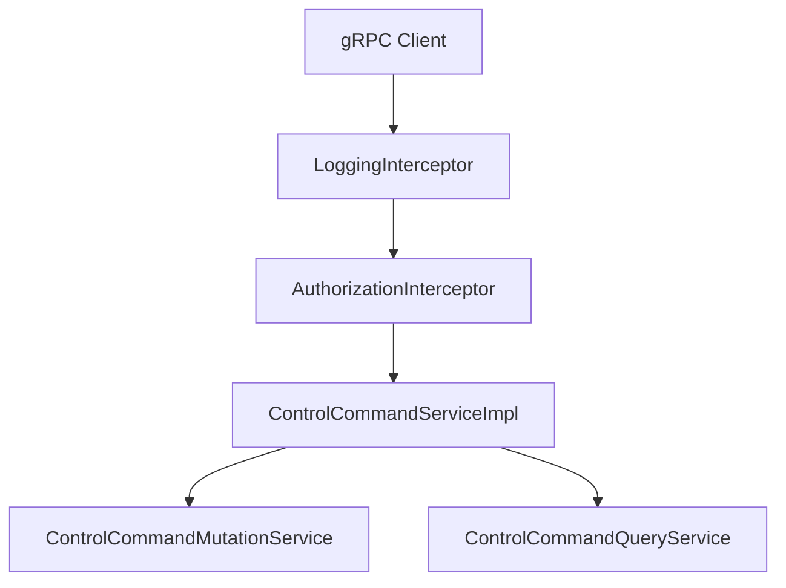
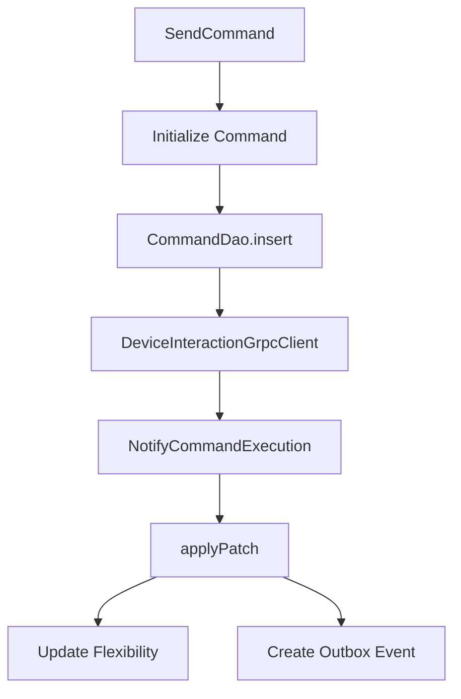
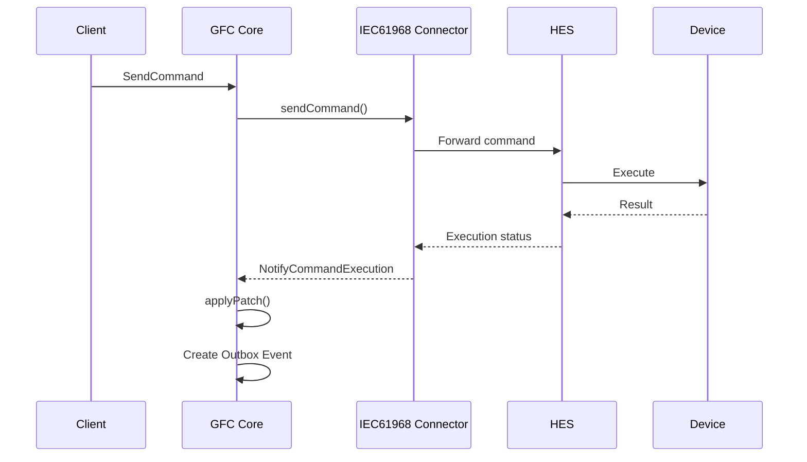

# Request flow
- [Request processing](#request-processing)
- [Control command lifecycle](#control-command-lifecycle)
- [Runtime log correlation](#runtime-log-correlation)
- [Security](#security)
- [Processing responsibilities](#processing-responsibilities)
- [Where to extend](#where-to-extend)

## Request processing
* **Entry point**
  * `ControlCommandServiceImpl` exposes the gRPC API.
  * `LoggingInterceptor` logs request start and execution time.
  * `AuthorizationInterceptor` authenticates the request and injects tenant context.
* **Command submission**
  * `sendCommand()` converts the protobuf request into a `ControlCommand`.
  * Delegates processing to `ControlCommandMutationService`.
  * Returns the generated command identifier immediately after persistence and dispatch.
* **Command status updates**
  * `notifyCommandExecution()` receives asynchronous execution callbacks.
  * Maps the callback to `ControlCommandPatch`.
  * Delegates state updates to `ControlCommandMutationService`.
* **Read operations**
  * `getCommand()` retrieves a single command.
  * `queryCommands()` returns paginated command results.

## Control command lifecycle
* **Command creation**
  * Initializes command state as `INITIATED`.
  * Resolves target flexibility.
  * Calculates aggregated power.
  * Enriches the command with resolved targets.
* **Persistence**
  * Persists the command using `CommandDao.insert()`.
* **Command dispatch**
  * Sends a single command through `DeviceInteractionGrpcClient.sendCommand()`.
  * Sends batch commands through `DeviceInteractionGrpcClient.sendBatchCommand()`.
* **Execution callback**
  * Receives `NotifyCommandExecution`.
  * Updates command state using `CommandDao.applyPatch()`.
  * Updates flexibility operational state for successful executions.
  * Creates an Outbox event for completed device executions.

## Runtime log correlation
* **Request received**
  * **Log**
    * `Request to endpoint ControlCommandService/SendCommand`
  * **Implementation**
    * `LoggingInterceptor`
* **Authentication**
  * **Log**
    * `Authenticated request to tenant gfc1-dev`
  * **Implementation**
    * `AuthorizationInterceptor`
* **Request processing**
  * **Log**
    * `Send command request received`
  * **Implementation**
    * `ControlCommandServiceImpl.sendCommand()`
* **Command persistence**
  * **Log**
    * `Command inserted successfully`
  * **Implementation**
    * `CommandDao.insert()`
* **Execution callback**
  * **Log**
    * `notifyCommandExecution request received`
  * **Implementation**
    * `ControlCommandServiceImpl.notifyCommandExecution()`
* **Command update**
  * **Log**
    * `Command updated at ... with new state ACCEPTED`
    * `Command updated at ... with new state SUCCEEDED`
  * **Implementation**
    * `ControlCommandMutationService.applyPatch()`
* **Flexibility update**
  * **Log**
    * `Flexibility ... turned to OFF`
  * **Implementation**
    * `ControlCommandMutationService.applyPatch()`
* **Outbox processing**
  * **Log**
    * `Found 1 outbox events to deliver`
    * `Sent 1/1 outbox requests`
  * **Implementation**
    * `ProcessOutboxUseCase.process()`

## Security
* **Authentication**
  * `AuthorizationInterceptor` validates incoming requests.
  * Authorized tenant information is propagated through `AuthClaims`.
* **Tenant propagation**
  * Tenant context is available throughout request processing.
  * Background jobs recreate the tenant context before processing each tenant.
* **JWT verification**
  * Configured using `jwt-verifier`.
  * Supports trusted issuers and authorized client identifiers.
* **Background execution**
  * `ProcessOutboxUseCase` executes independently for every configured tenant.
  * Prevents tenant data from crossing execution boundaries.

## Processing responsibilities

| Responsibility           | Primary class                   |
| ------------------------ | ------------------------------- |
| Receive gRPC request     | `ControlCommandServiceImpl`     |
| Authenticate request     | `AuthorizationInterceptor`      |
| Log requests             | `LoggingInterceptor`            |
| Process business logic   | `ControlCommandMutationService` |
| Read commands            | `ControlCommandQueryService`    |
| Persist commands         | `CommandDao`                    |
| Update flexibility       | `FlexibilityDao`                |
| Send device commands     | `DeviceInteractionGrpcClient`   |
| Create Outbox events     | `ControlCommandMutationService` |
| Process Outbox           | `ProcessOutboxUseCase`          |
| Schedule background jobs | `ScheduledCamelRoutes`          |

## Where to extend
* **Add a new gRPC operation**
  * `ControlCommandServiceImpl`
* **Modify command orchestration**
  * `ControlCommandMutationService`
* **Change persistence**
  * `CommandDao`
  * `FlexibilityDao`
* **Integrate a new external gRPC service**
  * `adapters.outbound.grpc`
* **Modify scheduled processing**
  * `ScheduledCamelRoutes`
* **Change notification delivery**
  * `ProcessOutboxUseCase`
