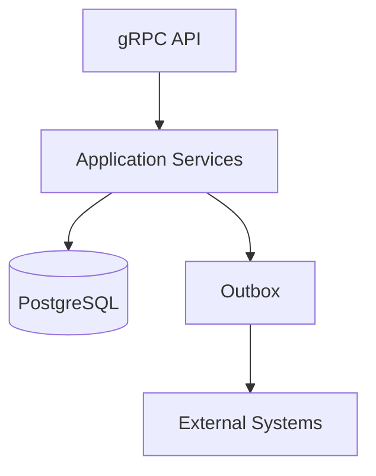
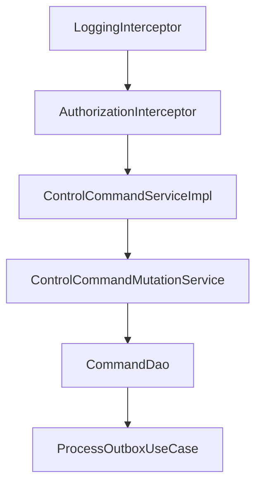

## Extension guide
- [Architecture assessment](#architecture-assessment)
- [Extension guide](#extension-guide)
- [Service responsibilities](#service-responsibilities)
- [Observability](#observability)
- [Recommendations](#recommendations)
- [Summary](#summary)
## Architecture assessment
- **Strengths**
  - Clear separation between inbound adapters, application services, domain model, and outbound adapters.
  - Business orchestration is centralized in `ControlCommandMutationService`.
  - Read and write operations are separated using **CQRS**.
  - Reliable asynchronous communication is implemented using the **Outbox Pattern**.
  - Scheduled processing is isolated from request processing.
  - Multi-tenant execution is supported through propagated `AuthClaims`.
  - External integrations are isolated behind outbound adapters.
  - Configuration is externalized through `application.conf` and environment variables.
- **Design characteristics**
  - Stateless request processing enables horizontal scaling.
  - Asynchronous callbacks prevent long-running client requests.
  - Business transactions complete before notification delivery.
  - Background processing is independent from client requests.
- **Trade-offs**
  - Command dispatch failures are logged but do not currently update command state.
  - Outbox processing is eventually consistent.
  - Event type dispatch currently relies on string identifiers (`DH-1231-1`, `DH-129-1`).

## Extension guide
- **Add a new command type**
  - Extend the domain model.
  - Update `ControlCommandMutationService`.
  - Extend `ProtoMapper`.
  - Update outbound gRPC mapping if required.
- **Add a new external integration**
  - Create an outbound adapter in `adapters.outbound.grpc`.
  - Define a new outbound port.
  - Inject the implementation using Dagger.
- **Add a new notification**
  - Create a new `OutboxRequest`.
  - Extend `ProcessOutboxUseCase`.
  - Implement delivery through `DataHubNotificationPort`.
- **Add a new scheduled process**
  - Register a Camel timer in `ScheduledCamelRoutes`.
  - Implement processing in a dedicated use case.
- **Add a new persistence operation**
  - Extend the corresponding DAO.
  - Keep business orchestration inside the application layer.
## Service responsibilities
| Responsibility | Implementation |
|---------------|----------------|
| Application entry point | `Bootstrap` |
| Application initialization | `Main` |
| Dependency injection | `DaggerApplicationComponent` |
| gRPC API | `ControlCommandServiceImpl` |
| Command orchestration | `ControlCommandMutationService` |
| Read operations | `ControlCommandQueryService` |
| Device communication | `DeviceInteractionGrpcClient` |
| Command persistence | `CommandDao` |
| Flexibility persistence | `FlexibilityDao` |
| Outbox persistence | `OutboxRepositoryAdapter` |
| Scheduled processing | `ScheduledCamelRoutes` |
| Outbox delivery | `ProcessOutboxUseCase` |
| Authentication | `AuthorizationInterceptor` |
| Request logging | `LoggingInterceptor` |
## Observability
- **Startup logs**
  - Confirm successful application startup.
  - Display active configuration.
  - Display listening gRPC port.
  - Display Git build information.
- **Request logs**
  - Record request entry.
  - Record execution duration.
  - Record authenticated tenant.
- **Business logs**
  - Record command creation.
  - Record command state transitions.
  - Record flexibility updates.
- **Background processing logs**
  - Record pending Outbox events.
  - Record successful deliveries.
  - Record processing failures and retry attempts.
- **Primary execution sequence**
  - `LoggingInterceptor`
  - `AuthorizationInterceptor`
  - `ControlCommandServiceImpl`
  - `ControlCommandMutationService`
  - `CommandDao`
  - `DeviceInteractionGrpcClient`
  - `ControlCommandServiceImpl.notifyCommandExecution()`
  - `ProcessOutboxUseCase`

## Recommendations
- Replace string-based event identifiers with strongly typed event definitions.
- Introduce a dedicated notification dispatcher to remove event-specific branching from `ProcessOutboxUseCase`.
- Capture command dispatch failures by updating command state instead of logging only.
- Externalize retry strategy to configuration.
- Add metrics for Outbox queue size, retry count, processing latency, and delivery success rate.
- Introduce distributed tracing across `Flexibility Hub Connector`, `GFC Core`, and `IEC61968 Connector`.
- Add correlation identifiers to all log messages to simplify end-to-end tracing.
## Summary
- **GFC Core** acts as the orchestration service between upstream business systems and downstream device systems.
- gRPC APIs receive and validate requests before delegating business processing.
- `ControlCommandMutationService` orchestrates command execution, persistence, and external communication.
- Asynchronous execution callbacks update command and flexibility state.
- The **Outbox Pattern** guarantees reliable notification delivery to the **Data Hub**.
- Scheduled background processing is isolated from request handling through Apache Camel.
- Runtime logs directly map to the request lifecycle, making production troubleshooting straightforward.
- The architecture is modular, extensible, and aligned with common microservice design principles.
