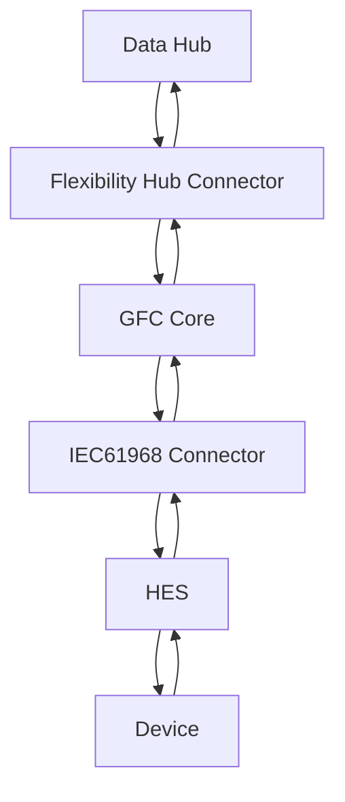
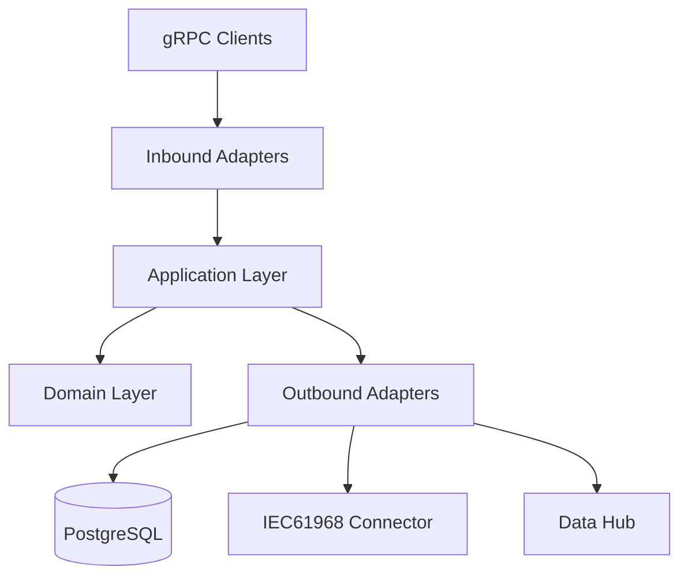

# Gfc core
* [Service overview](#service-overview)
* [System context](#system-context)
* [Architecture](#architecture)
* [Package structure](#package-structure)
* [Application startup](#application-startup)
* [Configuration](#configuration)
## Service overview
* **GFC Core** is the central orchestration service responsible for processing control commands between upstream business systems and downstream device systems.
* Receives requests from the **Flexibility Hub Connector** through gRPC.
* Validates, enriches, and persists control commands.
* Dispatches commands to the **IEC61968 Connector**.
* Processes asynchronous execution callbacks.
* Updates command and flexibility state.
* Publishes asynchronous notifications to the **Data Hub** using the **Outbox Pattern**.
* Executes scheduled background jobs using **Apache Camel**.
## System context
* **Request flow**
  * `Data Hub`
  * `Flexibility Hub Connector`
  * `GFC Core`
  * `IEC61968 Connector`
  * `HES`
  * `Device`
* **Response flow**
  * `Device`
  * `HES`
  * `IEC61968 Connector`
  * `GFC Core`
  * `Flexibility Hub Connector`
  * `Data Hub`



## Architecture
* **Architecture style**
  * **Hexagonal Architecture**
  * **Ports and Adapters**
  * **CQRS**
  * **Outbox Pattern**
* **Inbound adapters**
  * gRPC services
  * Authentication interceptors
  * Scheduled Camel routes
* **Application layer**
  * Coordinates business workflows.
  * Contains query services, mutation services, and use cases.
* **Domain layer**
  * Defines business entities and domain models.
  * Contains no transport or persistence logic.
* **Outbound adapters**
  * PostgreSQL persistence.
  * gRPC clients.
  * Data Hub notifications.



## Package structure
```txt
com.landisgyr.gfc.core
├── adapters
│   ├── inbound
│   │   ├── grpc
│   │   │   ├── support
│   │   │   ├── ControlCommandServiceImpl
│   │   │   ├── EventServiceImpl
│   │   │   ├── FlexibilityServiceImpl
│   │   │   ├── LatencyLimiterInterceptor
│   │   │   ├── LoggingInterceptor
│   │   │   ├── MeteringPointServiceImpl
│   │   │   ├── MovingAverageLatencyTracker
│   │   │   ├── ProtoMapper
│   │   │   └── RevisionServiceImpl
│   │   ├── scheduler
│   │   │   └── ScheduledCamelRoutes
│   │   └── security
│   │       ├── AuthClaims
│   │       ├── AuthorizationInterceptor
│   │       ├── JwtVerifier
│   │       └── SecurityContext
│   └── outbound
│       ├── grpc
│       │   ├── DeviceInteractionGrpcClient
│       │   ├── FlexibilityConnectorGrpcAdapter
│       │   └── ProtoMapper
│       └── persistence
│           ├── mapper
│           ├── AccountingPointDao
│           ├── CommandDao
│           ├── DbTransactionContext
│           ├── FlexibilityDao
│           ├── ImportFileDao
│           ├── JobRepositoryAdapter
│           ├── MarketEventDao
│           ├── OutboxRepositoryAdapter
│           ├── PostgresCopyAdapter
│           └── UnitOfWork
├── app
│   ├── exceptions
│   ├── port
│   │   ├── DataHubNotificationPort
│   │   ├── JobRepository
│   │   └── OutboxRepositoryPort
│   ├── service
│   │   ├── helper
│   │   ├── mapper
│   │   │   └── FlexibilityDocumentMapper
│   │   ├── AccountingPointQueryService
│   │   ├── ControlCommandMutationService
│   │   ├── ControlCommandQueryService
│   │   ├── CsvImportService
│   │   ├── EventQueryService
│   │   ├── FlexibilityMutationService
│   │   ├── FlexibilityQueryService
│   │   └── FlexibilityUploadService
│   ├── usecase
│   │   ├── ProcessBatchJobUseCase
│   │   └── ProcessOutboxUseCase
│   ├── GracefulShutdownHook
│   └── Main
├── domain
│   ├── accounting_point
│   ├── command
│   ├── common
│   ├── event
│   ├── flexibility
│   ├── job
│   ├── outbox
│   └── query
└── infrastructure
    └── Bootstrap
```

| **Layer**               | **Package / Component**             | **Purpose / Responsibility**                                                                                     |
| ----------------------- | ----------------------------------- | ---------------------------------------------------------------------------------------------------------------- |
| **Adapters**            |                                     | Contains protocol-specific implementations and isolates infrastructure concerns.                                 |
|                         | **`adapters.inbound.grpc`**         | Exposes gRPC APIs, maps Protobuf requests to domain models, and serves as the entry point for external requests. |
|                         | **`adapters.inbound.scheduler`**    | Defines scheduled Apache Camel routes and triggers background processing.                                        |
|                         | **`adapters.inbound.security`**     | Performs authentication and propagates tenant context.                                                           |
|                         | **`adapters.outbound.grpc`**        | Sends commands to external services via gRPC.                                                                    |
|                         | **`adapters.outbound.persistence`** | Persists commands, flexibility state, market events, and Outbox records.                                         |
| **Application (`app`)** |                                     | Coordinates application workflows and orchestrates business use cases.                                           |
|                         | **`app.service`**                   | Implements command orchestration and separates query and mutation responsibilities.                              |
|                         | **`app.usecase`**                   | Implements background processing and processes Outbox events.                                                    |
|                         | **`app.port`**                      | Defines outbound ports (interfaces) implemented by infrastructure adapters.                                      |
| **Domain**              |                                     | Contains protocol-independent business models and business rules.                                                |
|                         | **`domain`**                        | Defines the core business models, aggregates, value objects, and domain logic.                                   |
| **Infrastructure**      |                                     | Provides technical capabilities supporting the application.                                                      |
|                         | **`infrastructure`**                | Configures dependency injection, application configuration, monitoring, and other framework-specific concerns.   |

## Application startup
* `Bootstrap.main()`
  * Installs `SLF4JBridgeHandler`.
  * Creates `Main`.
  * Starts the application.
* `Main.run()`
  * Loads application configuration.
  * Merges datasource configuration.
  * Masks credentials before logging.
  * Creates the Dagger application component.
  * Starts the application.
  * Registers graceful shutdown.
  * Starts the gRPC server.
  * Waits for server termination.

```mermaid
flowchart TD
    BOOT[Bootstrap]
    MAIN[Main]
    CONFIG[Load Configuration]
    DAGGER[Create Dagger Component]
    APP[Application.start()]
    SERVER[gRPC Server]
    WAIT[Await Termination]
    BOOT --> MAIN
    MAIN --> CONFIG
    CONFIG --> DAGGER
    DAGGER --> APP
    APP --> SERVER
    SERVER --> WAIT
```

## Configuration
* **Configuration source**
  * `application.conf`
  * Environment variables
  * External PostgreSQL configuration files
* **Runtime configuration**
  * gRPC server port.
  * Message size limits.
  * Thread pools.
  * JWT verification.
  * Remote gRPC endpoints.
  * Scheduled task intervals.
  * Datasources.
  * High availability mode.
  * Feature flags.
* **Security**
  * Passwords and usernames are masked before configuration is written to the logs.
* **External services**
  * `device-interaction-grpc-client`
  * `flexibility-hub-connector-grpc-client`
* **Schedulers**
  * `process-outbox`
  * Configurable initial delay.
  * Configurable execution period.
