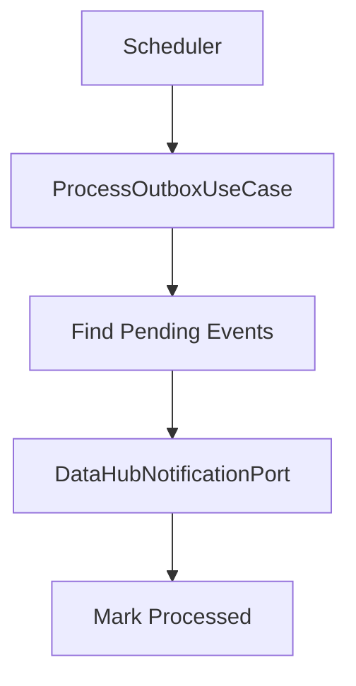
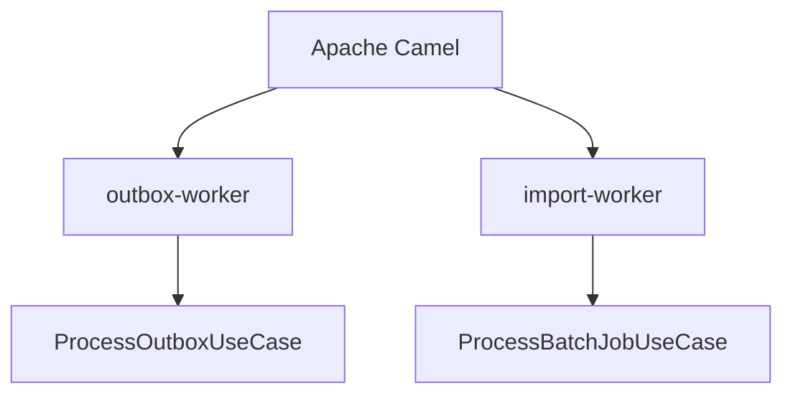
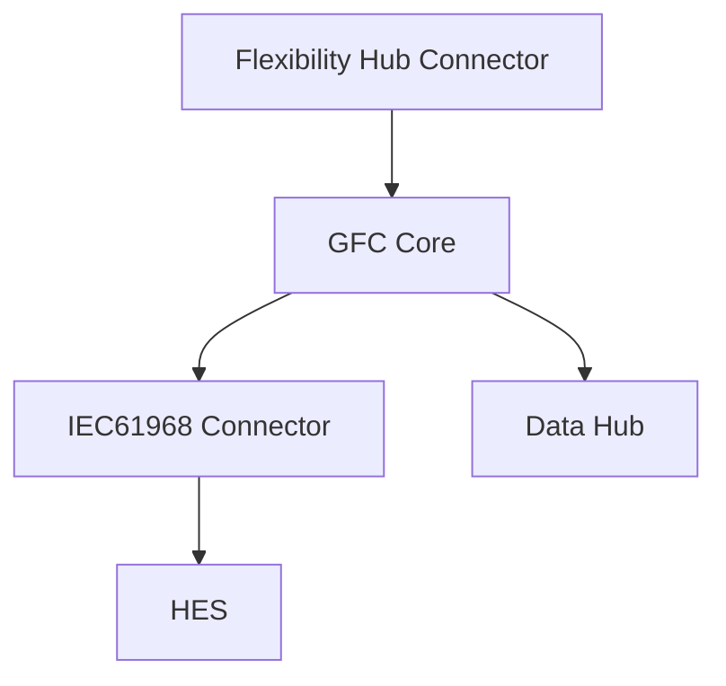
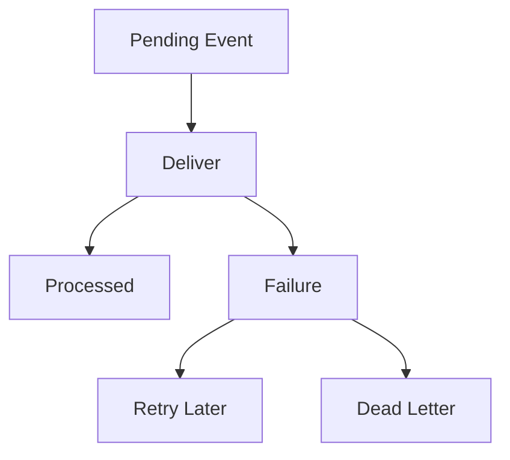

# Response flow
- [Outbox processing](#outbox-processing)
- [Scheduled processing](#scheduled-processing)
- [External integrations](#external-integrations)
- [Persistence](#persistence)
- [High availability](#high-availability)
- [Failure handling](#failure-handling)
- [Developer workflow](#developer-workflow)
## Outbox processing
- **Purpose**
  - Implements reliable asynchronous delivery to external systems.
  - Decouples business transactions from external notifications.
- **Entry point**
  - `ScheduledCamelRoutes`
  - `ProcessOutboxUseCase.process()`
- **Processing flow**
  - Iterates through all configured tenants.
  - Creates tenant-specific `AuthClaims`.
  - Retrieves up to `100` pending Outbox events.
  - Delivers each event through `DataHubNotificationPort`.
  - Marks successful events as processed.
- **Supported events**
  - `DH-1231-1`
    - Sends load control confirmation.
  - `DH-129-1`
    - Sends accounting point controllability information.
- **Completion**
  - Updates Outbox status after successful delivery.

## Scheduled processing
- **Scheduler**
  - Implemented using `ScheduledCamelRoutes`.
  - Uses Apache Camel timer routes.
- **Scheduled jobs**
  - `outbox-worker`
    - Executes `ProcessOutboxUseCase`.
  - `import-worker`
    - Executes `ProcessBatchJobUseCase`.
- **Configuration**
  - Initial delay is configurable.
  - Execution period is configurable.
  - Timer values are loaded from `application.conf`.

## External integrations
- **Flexibility Hub Connector**
  - Sends control commands to GFC Core.
- **IEC61968 Connector**
  - Receives device control requests through `DeviceInteractionGrpcClient`.
  - Returns asynchronous execution updates.
- **Data Hub**
  - Receives asynchronous notifications through the Outbox process.
- **HES**
  - Executes commands on physical devices through the IEC61968 Connector.

## Persistence
- **Command storage**
  - `CommandDao`
  - Persists control commands.
  - Applies execution state updates.
- **Flexibility storage**
  - `FlexibilityDao`
  - Retrieves target flexibility.
  - Updates operational state after successful execution.
- **Market events**
  - `MarketEventDao`
  - Supports market event persistence.
- **Outbox storage**
  - `OutboxRepositoryAdapter`
  - Stores pending notification events.
  - Tracks retry count.
  - Updates processing status.
## High availability
- **Scheduler**
  - Supports leader-only execution.
  - Uses Camel `master` endpoint when `ha-enabled` is enabled.
- **Purpose**
  - Prevents multiple service instances from processing the same scheduled task.
  - Allows horizontal scaling without duplicate Outbox processing.
## Failure handling
- **Command dispatch**
  - Exceptions during gRPC dispatch are logged.
  - Command persistence is not rolled back.
- **Outbox delivery**
  - Failed deliveries increase retry count.
  - Retry delay uses exponential backoff.
  - Retry interval is calculated as `2^retryCount × 5 seconds`.
  - Events exceeding maximum retries are moved to the Dead Letter state.
- **Unknown events**
  - Unsupported event types are logged and ignored.

## Developer workflow
- **Implement a new inbound API**
  - Add a gRPC endpoint in `ControlCommandServiceImpl`.
  - Delegate business logic to the appropriate application service.
- **Implement new business logic**
  - Extend `ControlCommandMutationService` or create a new application service.
- **Add database operations**
  - Extend the corresponding DAO in `adapters.outbound.persistence`.
- **Call an external service**
  - Add a client in `adapters.outbound.grpc`.
  - Define an outbound port when required.
- **Publish a new asynchronous notification**
  - Create an `OutboxRequest`.
  - Extend `ProcessOutboxUseCase`.
  - Deliver through `DataHubNotificationPort`.
- **Add a scheduled background task**
  - Register a Camel timer route in `ScheduledCamelRoutes`.
  - Implement the processing logic in a dedicated use case.
