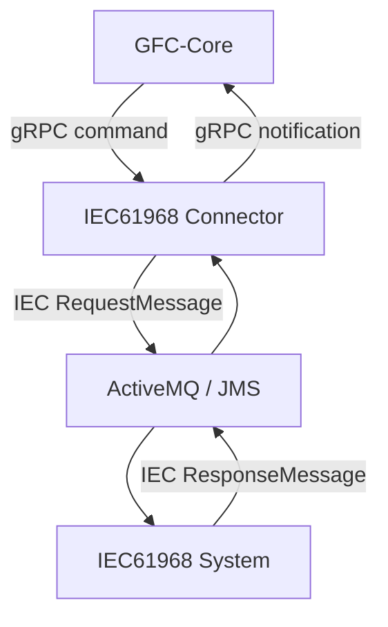
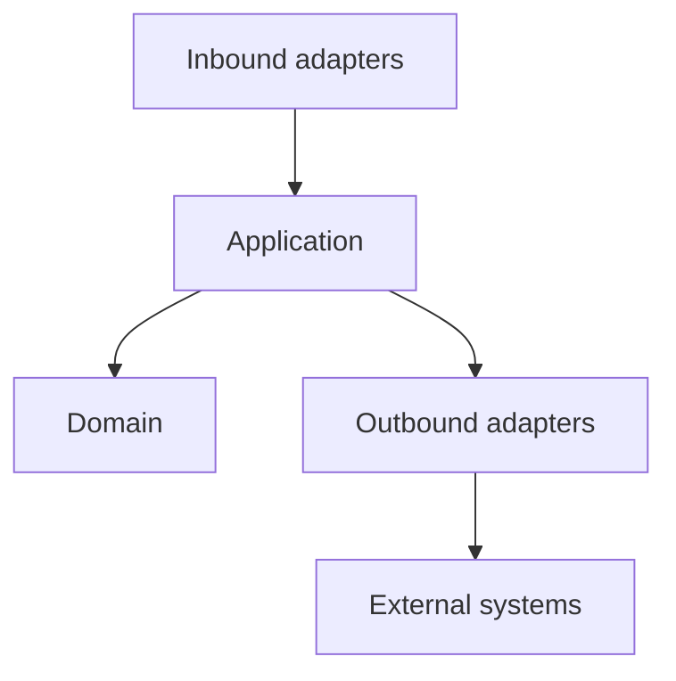
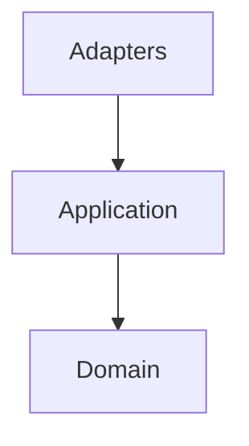
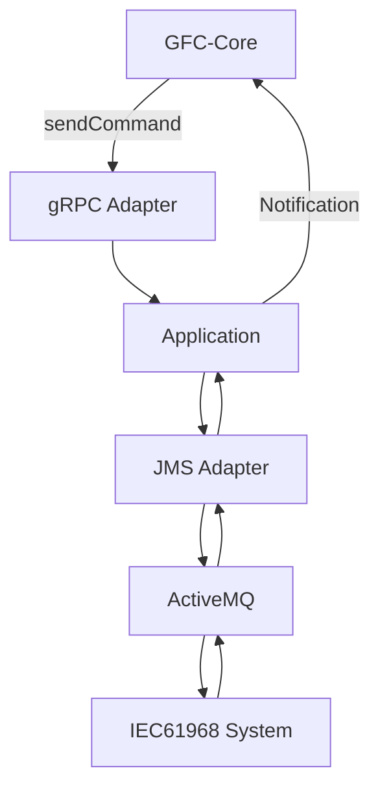
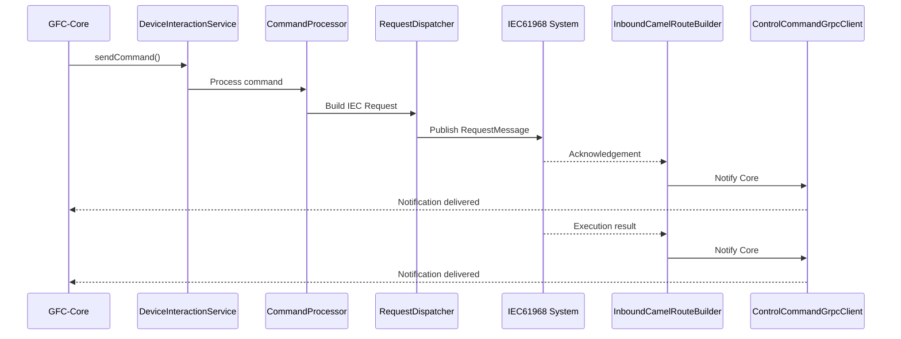

# IEC61968 connector
- [Service overview](#service-overview)
- [Architecture](#architecture)
- [Package structure](#package-structure)
- [Message flow](#message-flow)
- [Processing lifecycle](#processing-lifecycle)
- [Runtime log correlation](#runtime-log-correlation)
- [Layer responsibilities](#layer-responsibilities)
- [Architecture assessment](#architecture-assessment)
- [Recommendations](#recommendations)

## Service overview
- **Purpose**
  - Acts as an **integration connector** between **GFC-Core** and an external **IEC61968-compliant system**.
  - Bridges **gRPC** communication with **IEC61968 JMS messaging**.
- **Responsibilities**
  - Receive device control commands from **GFC-Core** through `gRPC`.
  - Convert internal domain models into **IEC61968 RequestMessage** payloads.
  - Publish requests to **ActiveMQ/JMS**.
  - Consume asynchronous responses from the IEC system.
  - Forward acknowledgements and execution results back to **GFC-Core** using `gRPC`.
- **Design principles**
  - Business logic resides in **GFC-Core**.
  - Connector focuses on **integration**, **protocol translation**, **mapping**, and **message orchestration**.
  - Implements **Hexagonal Architecture (Ports & Adapters)**.



## Architecture
- **Architectural style**
  - Implements **Hexagonal Architecture**.
  - Separates **Application**, **Domain**, and **Infrastructure** concerns.
- **Inbound adapters**
  - Receive `gRPC` requests.
  - Consume asynchronous JMS responses.
- **Application layer**
  - Coordinates command processing.
  - Resolves identifiers and control types.
  - Depends only on application services and ports.
- **Outbound adapters**
  - Publish IEC61968 messages to JMS.
  - Notify **GFC-Core** through `gRPC`.
- **Domain**
  - Contains business models independent of protocols and frameworks.



- **Adapters** isolate transport protocols.
- **Application** orchestrates command execution.
- **Domain** contains protocol-independent business models.

## Package structure

```text
java
└── com.landisgyr.gfc.iec61968_connector
    ├── adapters
    │   ├── inbound
    │   │   ├── grpc
    │   │   └── jms
    │   ├── outbound
    │   │   ├── grpc
    │   │   └── jms
    ├── app
    │   ├── service
    │   ├── Main
    ├── domain
    │   ├── model
    │   └── types
    └── infrastructure
```

| **Layer** | **Package / Component** | **Purpose / Responsibility** |
|------------|-------------------------|------------------------------|
| **Adapters** | | Contains protocol-specific implementations and isolates infrastructure concerns. |
| | **adapters.inbound.grpc** | Handles inbound `gRPC` communication. |
| | `DeviceInteractionService` | Receives device interaction requests from **GFC-Core**. |
| | `HealthGrpcService` | Exposes health endpoints. |
| | `TenantIdInterceptor` | Propagates tenant context. |
| | `ProtoMapper` | Maps Protobuf messages to domain models. |
| | **adapters.inbound.jms** | Consumes asynchronous IEC61968 responses. |
| | `InboundCamelRouteBuilder` | Defines Apache Camel JMS consumers. |
| | `ControlCommandResponseMapper` | Maps IEC responses into domain models. |
| | `CreateTouCalendarResponse` | Processes TOU calendar responses. |
| | `ShortIdGenerator` | Generates identifiers used during message processing. |
| | **adapters.outbound.grpc** | Sends notifications to **GFC-Core**. |
| | `ControlCommandGrpcClient` | Outbound gRPC client. |
| | `ProtoMapper` | Converts domain models into Protobuf messages. |
| | **adapters.outbound.jms** | Produces IEC61968 requests. |
| | `OutboundCamelRouteBuilder` | Defines outbound Camel routes. |
| | `RequestDispatcher` | Publishes JMS requests. |
| | `EndDeviceControlBuilder` | Builds IEC61968 `EndDeviceControl` messages. |
| | `TouCalendarMapper` | Maps TOU calendar requests. |
| | `RolloutCalendarMapper` | Maps rollout calendar requests. |
| | `TouCalendarModel` | Represents TOU calendar payloads. |
| **Application (`app`)** | | Coordinates command orchestration. |
| | `CommandProcessor` | Processes incoming control commands. |
| | `CommandResponseProcessor` | Processes asynchronous IEC responses. |
| | `BrokerIdLookupService` | Resolves broker identifiers. |
| | `NetworkIdLookupService` | Resolves network identifiers. |
| | `RelayControlTypeResolver` | Resolves relay control types. |
| | `TenantIdLookupService` | Resolves tenant identifiers. |
| **Domain** | | Contains protocol-independent business models and types. |



## Message flow

- **GFC-Core** invokes `DeviceInteractionService` using `gRPC`.
- The connector maps the request into an **IEC61968 RequestMessage**.
- `RequestDispatcher` publishes the message to **ActiveMQ**.
- The external IEC system processes the request.
- Apache Camel consumes asynchronous responses from the response queue.
- The connector maps the response into a domain model.
- `ControlCommandGrpcClient` forwards the response to **GFC-Core**.
- Responses may arrive in multiple stages while sharing the same `CorrelationID`.



## Processing lifecycle

- **Command reception**
  - `DeviceInteractionService` receives `sendCommand`.
- **Request creation**
  - Application services resolve identifiers.
  - `EndDeviceControlBuilder` creates the IEC61968 payload.
- **Message dispatch**
  - `RequestDispatcher` publishes the request to ActiveMQ.
- **Acknowledgement processing**
  - Camel receives an initial acknowledgement from the IEC system.
  - The acknowledgement is forwarded to **GFC-Core**.
- **Business response processing**
  - Camel receives the final execution result.
  - `CommandResponseProcessor` maps the response.
  - `ControlCommandGrpcClient` notifies **GFC-Core**.
- **Correlation**
  - All request and response messages are correlated using `CorrelationID`.



## Runtime log correlation

| Timestamp | Component | Layer | Event |
|-----------|-----------|-------|-------|
| `13:04:32.185` | `DeviceInteractionService` | **Inbound gRPC Adapter** | Receive `sendCommand` request |
| `13:04:32.202` | `RequestDispatcher` | **Outbound JMS Adapter** | Generate `CorrelationID` and dispatch IEC request |
| `13:04:32.249` | `RequestDispatcher` | **Outbound JMS Adapter** | Publish `RequestMessage` to ActiveMQ |
| `13:04:32.308` | `RequestDispatcher` | **Outbound JMS Adapter** | JMS message successfully sent |
| `13:04:32.784` | `InboundCamelRouteBuilder` | **Inbound JMS Adapter** | Receive acknowledgement (`Result=OK`, `0.3 Simple acknowledgment`) |
| `13:04:32.887` | `ControlCommandGrpcClient` | **Outbound gRPC Adapter** | Notify **GFC-Core** of acknowledgement |
| `13:04:34.655` | `InboundCamelRouteBuilder` | **Inbound JMS Adapter** | Receive final execution response (`0.0 Successful execution`) |
| `13:04:34.740` | `ControlCommandGrpcClient` | **Outbound gRPC Adapter** | Notify **GFC-Core** of command completion |

## Layer responsibilities

- **Inbound adapters**
  - Receive `gRPC` commands.
  - Consume asynchronous JMS responses.
  - Perform protocol-specific mapping.
- **Application**
  - Coordinates command execution.
  - Resolves identifiers and control types.
  - Orchestrates request and response processing.
- **Outbound adapters**
  - Publish IEC61968 requests.
  - Notify **GFC-Core** through `gRPC`.
- **Domain**
  - Encapsulates business models.
  - Remains independent of messaging protocols and frameworks.

## Architecture assessment

- **Strengths**
  - Clear separation of integration and business orchestration.
  - Consistent implementation of **Hexagonal Architecture**.
  - gRPC and JMS protocols isolated within adapters.
  - Apache Camel encapsulates messaging infrastructure.
  - Correlation-based asynchronous processing.
  - Domain remains framework independent.
  - Supports replacing messaging infrastructure with minimal impact.
  - Easily testable through adapter and mapper isolation.

## Recommendations

- Improve resilience for messaging.
  - `Retry`
  - `Dead Letter Queue (DLQ)`
  - `Exponential Backoff`
  - `Idempotency`
- Improve observability.
  - Distributed tracing.
  - Structured logging.
  - Correlation ID propagation across all services.
  - Metrics for request latency and response time.
- Improve operational monitoring.
  - Track acknowledgement and final response separately.
  - Detect missing or delayed business responses.
  - Alert on correlation timeouts.
- Maintain framework independence by keeping `Apache Camel`, `ActiveMQ`, `JMS`, and `gRPC` confined to adapter implementations.
