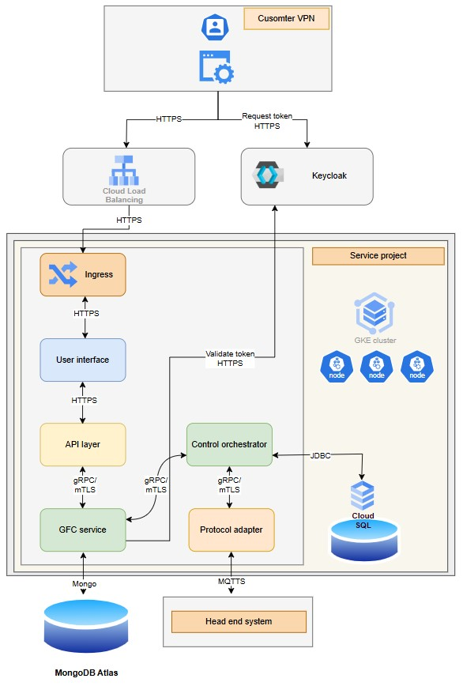
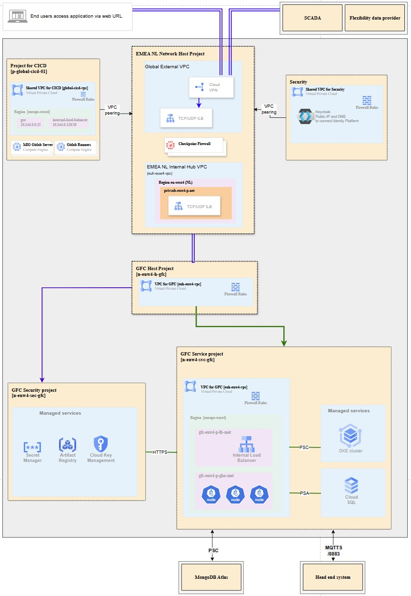
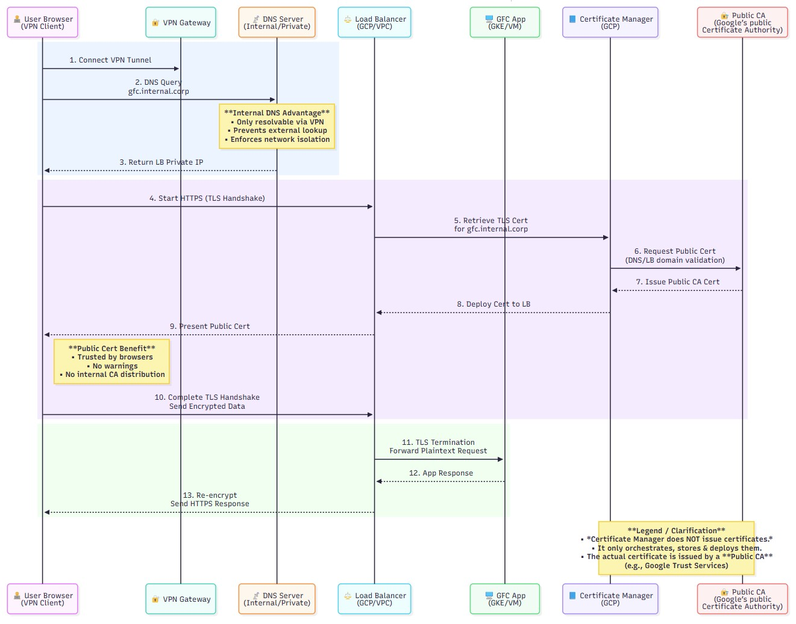
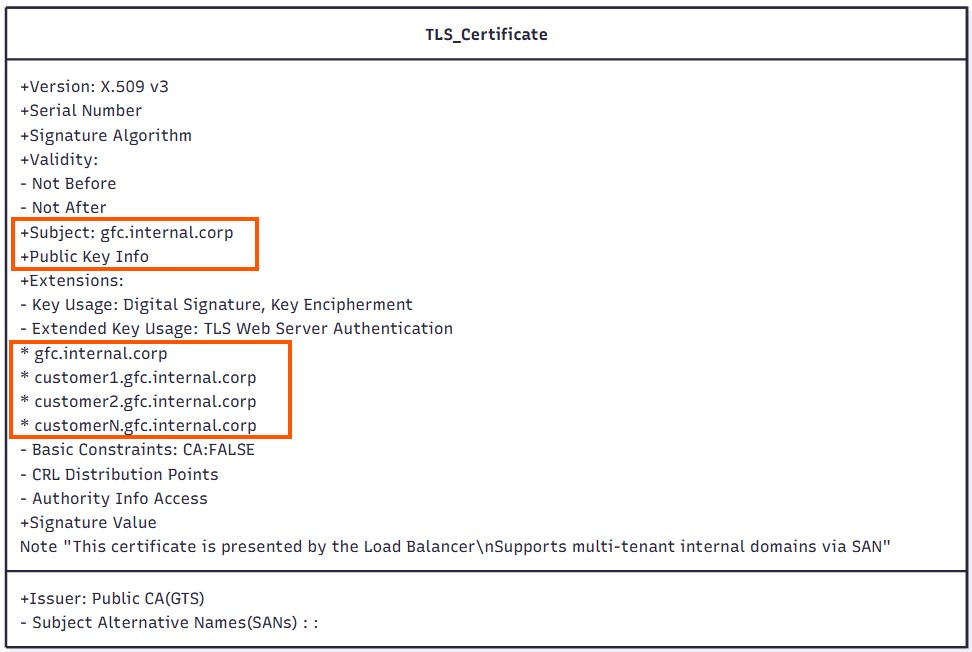
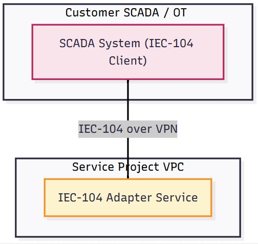
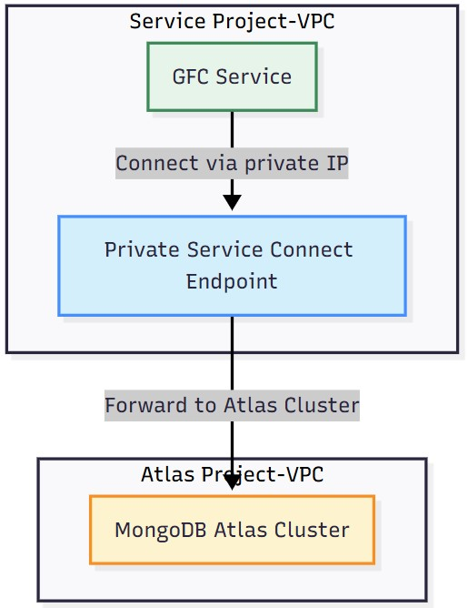
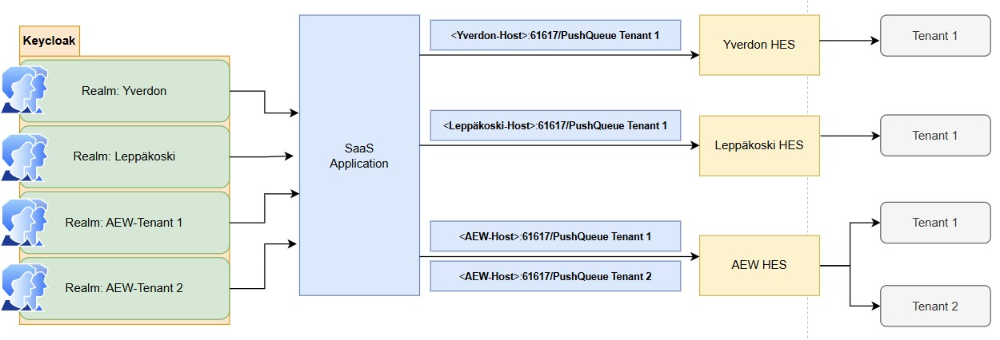
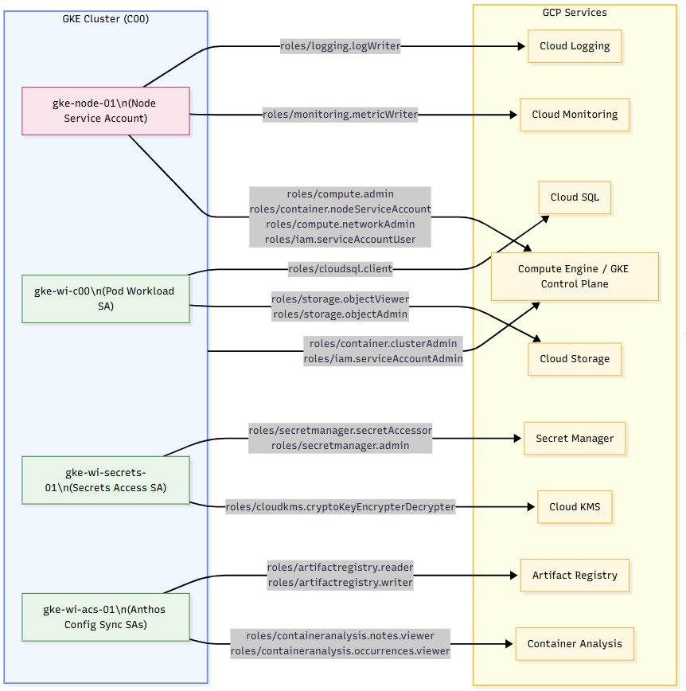
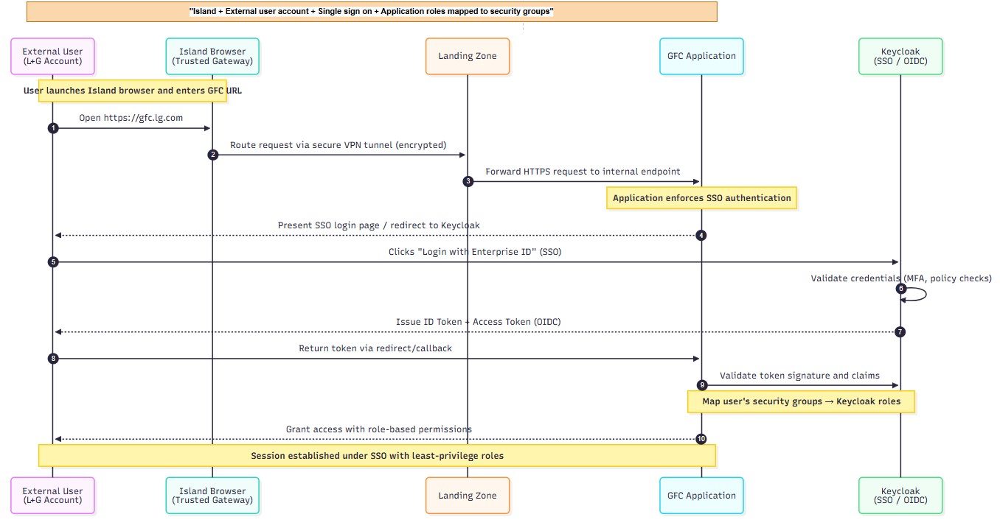

# Flexibility control
- [Application overview](#application-overview)
- [Development tools](#development-tools)
- [Project structure](#project-structure)
- [Networking](#networking)
- [SSL certificates](#ssl-certificates)
- [Authentication and Authorization](#authentication-and-authorization)
- [Private APIs](#private-apis)
- [Communication to HES](#communication-to-hes)
- [Services on GKE](#services-on-gke)
- [GKE nodes](#gke-nodes)
- [Databases](#databases)
  - [Cloud SQL](#cloud-sql)
  - [MongoDB Atlas cluster](#mongodb-atlas-cluster)
- [Multitenancy](#multitenancy)
- [Kubernetes service account](k8s_serviceaccount/README.md)
- [PSA and PSC](psa-psc/README.md)
- [Resource configuration](#resource-configuration)
  - [Atlas mongodb](#atlas-mongodb)
  - [Artifact registry repositories](#artifact-registry-repositories)
  - [Service account authenticated for sapro](#service-account-authenticated-for-sapro)
  - [Cloud sql](#cloud-sql)
  - [Development environment updates](#development-environment-updates)- 
## Application overview
- Below diagram illustrates architecture of Grid Flex Control application.
- The application will be containerized to run as private GKE cluster in Google Cloud Platform


- Customer securely connected through their **VPN**, opens URL of app and gets a **security token** from **Keycloak**
- This secure traffic hits our **Cloud Load Balancer** and enters our system, where the **Ingress** directs it right to the **User Interface**.
- The customer's request on the **UI** is translated by the **API Layer** for our core backend services.
- **GFC Service** service handles all the heavy lifting.
  - It reads and writes operational data to our distributed, scalable database, **MongoDB Atlas**.
- **Control orchestrator** maintains all structured, persistent records and **`state information`** in **Cloud SQL**.
- Control orchestrator forwards the request to the **Protocol adapter**.
  - **Protocol adapter** translates the request to IEC-61968-9 protocol and forwards it to **Head End System**
- These services run inside **GKE cluster**
## Development tools
- The Grid Flex Control application will be developed using these frameworks and tools:
  -	Frontend - AngularJS, HTML5, Nginx gateway
  -	Backend - Java, Restful APIs, Dapr
  -	Storage – PostgreSQL, MongoDB
  -	CI/CD – GitLab, Docker, Helm Charts
## Project structure
- Each deployment consists of two projects.

| Project logical index in iac       | Project root name | Note                                                        |
| ---------------------------------- | ----------------- | ----------------------------------------------------------- |
| Grid Flex Control Service project  | srv               | Grid Flex Control services in GKE and database in Cloud SQL |
| Grid Flex Control Security project | scr               | Secret Manager, Artifact Registry and KMS                   |

- **Required GCP APIs**
  - The following GCP APIs will need to be enabled in the service projects initially based on product design and IaC dependencies.

| API                                | srv | scr |
| ---------------------------------- | :-: | :-: |
| Compute Engine                     |  x  |     |
| Google Kubernetes Engine           |  x  |     |
| Cloud SQL                          |  x  |     |
| Google Cloud Storage               |  x  |     |
| Secret Manager                     |     |  x  |
| Artifact Registry                  |     |  x  |
| Cloud Key Management Service (KMS) |     |  x  |
| Cloud Logging                      |  x  |  x  |
| Cloud Monitoring                   |  x  |  x  |
| Container Analysis                 |  x  |  x  |
| Container Security                 |  x  |     |

## Networking
- The networking currently proposed is shown in the following diagram.


## SSL certificates
- As Grid Flex Control application exposes critical infrastructure, it will be accessible only within a private network.
  - The application will be exposed through **internal DNS name**.
  - All communication to the application is encrypted using SSL/TLS, application uses a **publicly trusted certificate**.


### Process
- The application is exposed through an **internal DNS name** (only resolvable inside the VPN or VPC)
  - External networks cannot resolve or access this DNS name
  - Only clients connected through the VPN tunnel or internal network can reach the application
- **Encrypted communication** to the application using SSL/TLS
  - Ensures data in transit is encrypted
  - Protects traffic from eavesdropping, tampering, or MITM attacks
- The application uses a **publicly trusted certificate**
  - Even though the DNS is internal, a public CA certificate prevents browser or client warnings
  - Clients automatically trust the certificate without needing to install private CA roots
- **Summary**
  - `Private/internal DNS` restricts access to VPN-connected clients only.
  - `SSL/TLS` ensures secure communication, also on an internal network.
  -	Using a `publicly trusted certificate` balances security and `ease-of-use` for internal clients.
### Content


## Authentication and Authorization
- Access to Grid Flex Control application for end-customers is provided via JWT token generated by Keycloak instance.


## Private APIs
* **Scada**
  * An IEC 60870-5-104 interface is used to establish connections to customers’ SCADA systems (`critical OT infrastructure`, `communication via private IP` and **`site-to-site VPN is mandatory`**).
  * Grid Flex Control’s SCADA connector can be configured as either an **`IEC104 client`** or **`IEC104 server`**, per connection.
  * Customers (e.g., DNO/TSO) can optionally be provided with one private endpoint each to establish an IEC 60870-5-104 connection to or from the customer’s SCADA environment (customer OT).
  * Careful setup is required (e.g., site-to-site VPN, access management of customers’ OT/SCADA networks), since **IEC 60870-5-104 `does not support` encryption or authentication by design**.


* **Flexibility data provider**
  * Grid Flex Control can receive flexibility master data pushed from authenticated and authorized clients (customer middleware or ESB) via REST API (REST/CSV) with TLS (or REST/JSON if required).
  * Customers (e.g., DSO/TSO) can optionally be provided with two private endpoints to automate transfers of flexibility master data to GFC.
    * The first endpoint accesses Keycloak to **request client tokens**
    * These tokens are used for **authenticated and authorized** access to the second API endpoint that `imports flexibility-master` data into GFC.
  * Alternatively, authenticated and authorized customers can manually upload master-data files using GFC's web UI.
## Communication to HES
- GFC communicates with the HES-systems via L+G’s IEC4HES-interface (IEC 61968-9).
- Messaging is realized using MQTT with TLS.
- The IEC4HES interfaces have a private IP (communication via site-to-site VPN).
## Services on GKE
- The Grid Flex Control application will run on GKE cluster.
- The cluster will run a user interface and microservices.
  - Services will be secured by mTLS.
  - JWT tokens (Keycloak) for endpoints.
  - ACL in service-to-service invocation.
  - OWASP based dependency checker against CVEs and upgrade and/or exclude transitive dependencies
## GKE nodes
- Node specs
  - `4 vCPUs` and `16GB of RAM`
- The sizing will be re-evaluated for production.
## Databases
### Cloud SQL
- Cloud SQL instance: 2 vCPUs and 8GB of RAM
- [**PSA setup**](https://cloud.google.com/sql/docs/mysql/connect-kubernetes-engine)
  - PSA is a mechanism to allocate a private IP range in your VPC for Google-managed services.
  - Steps
    - Reserve a CIDR range in your VPC.
    - Google allocates IPs from this range to the service (e.g., Cloud SQL).
    - GKE cluster accesses the service privately via the host VPC.
- **Auth proxy** placement
  - Sidecar container (best practice)
    - Add the Cloud SQL Auth Proxy as a sidecar in the same pod that needs SQL access.
    - Simplest, no extra networking hops, per-pod isolation.


### MongoDB Atlas cluster
- [**PSC setup**](https://www.mongodb.com/docs/atlas/security-private-endpoint/)
  - PSC is designed for private service endpoints like Atlas.
  - Private Service Connect (PSC) is used to connect Grid Flex Control service project’s VPC to the Atlas project.
  - Steps:
    - Create a PSC endpoint in Grid Flex Control service project VPC.
    - Configure MongoDB Atlas VPC peering to accept connections from that endpoint.
    - Use the private IP in your connection string from the service.


## Multitenancy
- The Grid Flex Control (GFC) solution uses a multi-tenant architecture with **logical data separation** in the application layer.
- Keycloak manages all user access and roles.
- **How access control works**
  - Each customer has their own `Keycloak Realm`, which issues JWT tokens containing the user’s roles and permissions.
  - gRPC services `check the JWT` and allow actions based on the user’s roles and permissions.
- **Platform architecture**
  - `One shared Kubernetes namespace for all customers`, with tenant isolation handled in the backend.
  - `One shared MongoDB Atlas database used by all tenants`.
    - Collections include `group` fields to logically isolate each tenant’s data.


## Resource configuration
- Resource creation and configuration will be completed via IaC - using a combination of the IDP tool, straight Terraform and GitLab pipelines.
- The GCP console will not be used for any resource creation or configuration.
- While CPET/OT provisions the environment, the Grid Flex Control team will provide base application configuration in Helm charts in Gitlab.
- These configurations will be used with overwritten values and secrets for deployment.
- It is expected that service accounts will be created as part of the provisioning infrastructure and resources.

| Resource                                       |
| ---------------------------------------------- |
| GCP projects, VPCs, VPNs, subnets, firewalls   |
| GKE cluster, namespaces                        |
| GKE application objects (services, pods, etc.) |
| Cloud SQL instances                            |
| Cloud Storage buckets                          |
| MongoDB setup                                  |
| IAM accounts, roles, groups                    |
| Cloud Monitoring infrastructure alerts         |
| Cloud Monitoring uptime checks                 |



### Atlas mongodb
* `gfc-dev users`

| user                           | cluster                                          | notes                  |
| ------------------------------ | ------------------------------------------------ | ---------------------- |
| smoc-cluster-02-gfc-db-user-01 | atlas-cpet-d-smoc-c01-srv-aah-01:smoc-cluster-02 | password sent by email |
| smoc-cluster-02-gfc-db-user-02 | atlas-cpet-d-smoc-c01-srv-aah-01:smoc-cluster-02 | password sent by email |

* `gfc-tst users`

| user                               | cluster                                              | notes                  |
| ---------------------------------- | ---------------------------------------------------- | ---------------------- |
| smoc-cluster-tst-01-gfc-db-user-01 | atlas-cpet-d-smoc-c01-srv-aah-01:smoc-cluster-tst-01 | password sent by email |
| smoc-cluster-tst-01-gfc-db-user-02 | atlas-cpet-d-smoc-c01-srv-aah-01:smoc-cluster-tst-01 | password sent by email |

### Artifact registry repositories

| environment | repository url                                                                                                                                             |
| ----------- | ---------------------------------------------------------------------------------------------------------------------------------------------------------- |
| dev         | `https://console.cloud.google.com/artifacts/docker/cpet-d-smoc-c01-sec-aab-01/europe-west4/d-euw4-gfc-c01-repository-a?project=cpet-d-smoc-c01-sec-aab-01` |
| tst         | `https://console.cloud.google.com/artifacts/docker/cpet-t-smoc-c01-sec-aam-01/europe-west4/t-euw4-gfc-c01-repository-a?project=cpet-t-smoc-c01-sec-aam-01` |

### Service account authenticated for sapro
* **Gitlab project:** `landisgyr/rnd/emea/grid-flex-control/`
* Service account configuration table

| field            | value                                                      |
| ---------------- | ---------------------------------------------------------- |
| branch pattern   | `*`                                                        |
| service accounts | `tf-747301344582@p-global-cicd-01.iam.gserviceaccount.com` |
| allowed scopes   | `https://www.googleapis.com/auth/cloud-platform`           |

### Cloud sql
* `Dev environment`

| database  | id                                     | instance               | notes                  |
| --------- | -------------------------------------- | ---------------------- | ---------------------- |
| gfc_db_01 | gfc_db_01_user//smoc-dev-c01b-c62b86f5 | smoc-dev-c01b-c62b86f5 | password sent by email |
| gfc_db_02 | gfc_db_02_user//smoc-dev-c01b-c62b86f5 | smoc-dev-c01b-c62b86f5 | password sent by email |

* `tst environment`

| database | id                                     | instance               | notes                  |
| -------- | -------------------------------------- | ---------------------- | ---------------------- |
| gfc      | gfc_db_01_user//smoc-tst-c01b-3ddbcb17 | smoc-tst-c01b-3ddbcb17 | password sent by email |

### Development environment updates
* Service account
  * **new:** `gke-wi-c03`
* Compute changes

| node pool                       | path                                                                       | change              |
| ------------------------------- | -------------------------------------------------------------------------- | ------------------- |
| node-pool-1-dev-smoc-cluster-01 | d-euw4-smoc-c01-gke-sub/smoc-net-dev-h-vpc/dev-smoc-cluster-01/node-pool-1 | max nodes **3 → 4** |

## 
- `Island + External user account + Single sign on + Application roles mapped to security groups`


```yaml
Atlas MongoDB:

database: gfc-dev
  "atlas-cpet-d-smoc-c01-srv-aah-01:smoc-cluster-02:smoc-cluster-02-gfc-db-user-01", "password": "sent-by-email",
  "atlas-cpet-d-smoc-c01-srv-aah-01:smoc-cluster-02:smoc-cluster-02-gfc-db-user-02", "password": "sent-by-email",
database: gfc-tst
  "atlas-cpet-d-smoc-c01-srv-aah-01:smoc-cluster-tst-01:smoc-cluster-tst-01-gfc-db-user-01", "password": "sent-by-email",
  "atlas-cpet-d-smoc-c01-srv-aah-01:smoc-cluster-tst-01:smoc-cluster-tst-01-gfc-db-user-02", "password": "sent-by-email",


Artifact Registry Repositories:
Dev repository: 
https://console.cloud.google.com/artifacts/docker/cpet-d-smoc-c01-sec-aab-01/europe-west4/d-euw4-gfc-c01-repository-a?project=cpet-d-smoc-c01-sec-aab-01
Tst repository:
https://console.cloud.google.com/artifacts/docker/cpet-t-smoc-c01-sec-aam-01/europe-west4/t-euw4-gfc-c01-repository-a?project=cpet-t-smoc-c01-sec-aam-01

Service Account authenticated for SAPRO:
New Gitab project: landisgyr/rnd/emea/grid-flex-control/

- name: "landisgyr/rnd/emea/grid-flex-control/" # group
    branches:
      - ref: "*"
        service_accounts: 
          - "tf-747301344582@p-global-cicd-01.iam.gserviceaccount.com"
        allowed_scopes:
          - "https://www.googleapis.com/auth/cloud-platform"

Cloud SQL
Dev
    "database": "gfc_db_01"
    "id": "gfc_db_01_user//smoc-dev-c01b-c62b86f5",
    "instance": "smoc-dev-c01b-c62b86f5",
    "name": "gfc_db_01_user",
    "password": "sent-by-email",

    "database": "gfc_db_02"
    "id": "gfc_db_02_user//smoc-dev-c01b-c62b86f5",
    "instance": "smoc-dev-c01b-c62b86f5",
    "name": "gfc_db_02_user",
    "password": "sent-by-email",

TST
    "database": "gfc"
    "id": "gfc_db_01_user//smoc-tst-c01b-3ddbcb17",
    "instance": "smoc-tst-c01b-3ddbcb17",
    "name": "gfc_db_01_user",
    "password": "sent-by-email",


New service account in development env: gke-wi-c03

More processing power for development env
  "d-euw4-smoc-c01-gke-sub/smoc-net-dev-h-vpc/dev-smoc-cluster-01/node-pool-1" = {
      name                     = "node-pool-1-dev-smoc-cluster-01"
      node_max_count           = 3 -> 4
  }
