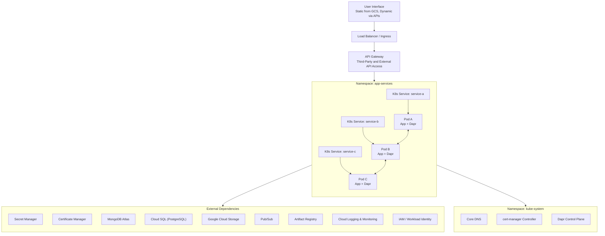

# Kubernetes service account
* The application runs on a Kubernetes cluster and connects to multiple cloud services: Secret Manager, Certificate Manager, Database, Pub/Sub, and S3.
* A dedicated **Kubernetes Service Account (KSA)** will be created for the application.
* This KSA will be **mapped via Workload Identity** to a single **GCP IAM Service Account** that represents the application in the cloud.
* The IAM Service Account will be granted the following roles:
  * **Secret Manager:** `roles/secretmanager.secretAccessor`
  * **Certificate Manager:** `roles/certificatemanager.viewer`
  * **Database (Cloud SQL):** `roles/cloudsql.client`
  * **Pub/Sub:** `roles/pubsub.publisher`, `roles/pubsub.subscriber`
  * **S3 / Cloud Storage:** `roles/storage.objectAdmin`
* This IAM Service Account will provide unified access control across all required cloud resources.
* The application uses **Dapr** for service integration and messaging. Dapr does **not** change or add to the identity or access model; it uses the same credentials provided through the mapped IAM Service Account.

# Service accounts
* **Node operations & cluster management:** `gke-node-01`
* **Workload access (pods to secrets, GCS, Cloud SQL):** `gke-wi-secrets-01`, `gke-wi-c0X`
* **Config sync / CI-CD / artifacts / container security:** `gke-wi-acs-01`, `gke-wi-acs-sa-01`
* **Default Compute Engine operations:** default compute service account

| API / Service            | Required service account                                 | Purpose                                                                                                                            |
| ------------------------ | -------------------------------------------------------- | ---------------------------------------------------------------------------------------------------------------------------------- |
| Compute Engine           | `828752755010-compute@developer.gserviceaccount.com`     | Default service account for VM operations, node creation, and GKE control plane interactions.                                      |
| Google Kubernetes Engine | `gke-node-01@...`                                        | Node operations, pod runtime, and cluster management.                                                                              |
| Cloud SQL                | Dedicated Cloud SQL service account or Workload Identity | Pods accessing Cloud SQL need a service account with `Cloud SQL Client` role; could map to a WI service account like `gke-wi-c0X`. |
| Google Cloud Storage     | `gke-wi-secrets-01@...`                                  | Pods reading/writing buckets; use Workload Identity for access.                                                                    |
| Secret Manager           | `gke-wi-secrets-01@...`                                  | Access to secrets from applications running in GKE.                                                                                |
| Artifact Registry        | `gke-wi-acs-01@...` or `gke-wi-acs-sa-01@...`            | Pull/push container images for deployments via Anthos Config Sync or CI/CD pipelines.                                              |
| Cloud KMS                | `gke-wi-acs-01@...` or dedicated WI SA                   | Encrypt/decrypt secrets or application data.                                                                                       |
| Cloud Logging            | `gke-node-01@...`                                        | Nodes and pods write logs to Cloud Logging.                                                                                        |
| Cloud Monitoring         | `gke-node-01@...`                                        | Nodes and pods emit metrics to Cloud Monitoring.                                                                                   |
| Container Analysis       | `gke-wi-acs-01@...`                                      | Scan container images in Artifact Registry.                                                                                        |
| Container Security       | `gke-wi-acs-01@...`                                      | Security scanning / vulnerability management of container images.                                                                  |

## Existing

| Email                                                                                                                                               | Status  | Name                                   | Description                                                                                  | OAuth 2 Client ID     |
| --------------------------------------------------------------------------------------------------------------------------------------------------- | ------- | -------------------------------------- | -------------------------------------------------------------------------------------------- | --------------------- |
| [gke-wi-secrets-01@cpet-d-smoc-c01-srv-aah-01.iam.gserviceaccount.com](mailto:gke-wi-secrets-01@cpet-d-smoc-c01-srv-aah-01.iam.gserviceaccount.com) | Enabled | gke-wi-secrets-01                      | Service account for accessing and managing secrets via Workload Identity                     | 107299971315134328771 |
| [gke-wi-c02@cpet-d-smoc-c01-srv-aah-01.iam.gserviceaccount.com](mailto:gke-wi-c02@cpet-d-smoc-c01-srv-aah-01.iam.gserviceaccount.com)               | Enabled | gke-wi-c02                             | Service account for GKE workloads in cluster C02                                             | 104306191782293523933 |
| [gke-wi-c01@cpet-d-smoc-c01-srv-aah-01.iam.gserviceaccount.com](mailto:gke-wi-c01@cpet-d-smoc-c01-srv-aah-01.iam.gserviceaccount.com)               | Enabled | gke-wi-c01                             | Service account for GKE workloads in cluster C01                                             | 118421224762473195244 |
| [gke-wi-c00@cpet-d-smoc-c01-srv-aah-01.iam.gserviceaccount.com](mailto:gke-wi-c00@cpet-d-smoc-c01-srv-aah-01.iam.gserviceaccount.com)               | Enabled | gke-wi-c00                             | Service account for GKE workloads in cluster C00                                             | 111279704760092950176 |
| [gke-wi-acs-sa-01@cpet-d-smoc-c01-srv-aah-01.iam.gserviceaccount.com](mailto:gke-wi-acs-sa-01@cpet-d-smoc-c01-srv-aah-01.iam.gserviceaccount.com)   | Enabled | gke-wi-acs-sa-01                       | Service account for Anthos Config Sync to manage cluster configuration via Workload Identity | 105799287988728200537 |
| [gke-wi-acs-01@cpet-d-smoc-c01-srv-aah-01.iam.gserviceaccount.com](mailto:gke-wi-acs-01@cpet-d-smoc-c01-srv-aah-01.iam.gserviceaccount.com)         | Enabled | gke-wi-acs-01                          | Service account for Anthos Config Sync in GKE                                                | 107617799084051669738 |
| [gke-node-01@cpet-d-smoc-c01-srv-aah-01.iam.gserviceaccount.com](mailto:gke-node-01@cpet-d-smoc-c01-srv-aah-01.iam.gserviceaccount.com)             | Enabled | gke-node-01                            | Node service account used by GKE nodes for cluster operations                                | 103101227181124887005 |
| [828752755010-compute@developer.gserviceaccount.com](mailto:828752755010-compute@developer.gserviceaccount.com)                                     | Enabled | Compute Engine default service account | Default Compute Engine service account for GKE and other Google Cloud services               | 116872117692202629477 |
