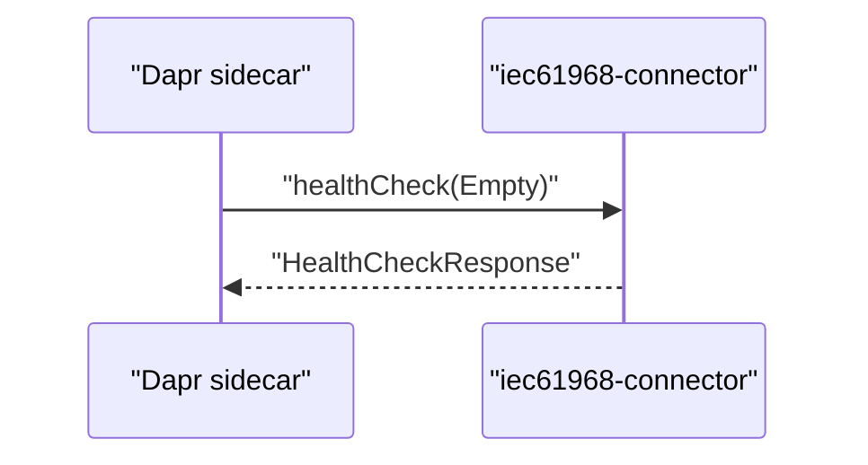

# API reference
- [Overview](#overview)
- [GRPC endpoints](#grpc-endpoints)
- [Message bus interface](#message-bus-interface)
- [Payload schemas](#payload-schemas)
- [Health and observability](#health-and-observability)
- [Limitations and unknowns](#limitations-and-unknowns)
## Overview
- External interfaces surfaced by this repository
  - gRPC application callback health endpoint used by the Dapr sidecar
  - Message bus topics (ActiveMQ via Dapr pub/sub) for input and output
  - XML payload structures aligned with IEC 61968 schemas

## GRPC endpoints
- Server
  - Protocol: gRPC over TCP
  - Default listen port: 9090 (configurable via iec61968-connector.dapr-grpc-callback-server.listen)
  - Example run configuration sets app-port to 5006 for Dapr
- Implemented service (from code)
  - Class: com.landisgyr.gfc.iec61968_connector.app.HealthService
  - Extends: AppCallbackHealthCheckGrpc.AppCallbackHealthCheckImplBase
  - Annotation: @GrpcService(grpcClass = AppCallbackHealthCheckGrpc.class)
- RPCs
  - healthCheck
    - Request: com.google.protobuf.Empty
    - Response: DaprAppCallbackProtos.HealthCheckResponse
    - Purpose: Responds to the Dapr sidecar application health probe
- Notes
  - Additional gRPC services or methods are not visible in the provided repository snippets
  - The concrete fields of HealthCheckResponse are not shown in this repository

## Message bus interface
- Transport
  - ActiveMQ accessed via a Dapr pub/sub component
- Component name
  - Default: iec4hes-activemq (configurable via iec61968-connector.message-bus.pubsub-name)
- Subscriptions
  - Topics are configured under iec61968-connector.message-bus.topics.subscribe
  - Networks filter is configured via iec61968-connector.message-bus.subscribe-to-network
- Publications
  - Outbound topics are configured under iec61968-connector.message-bus.topics.publish
  - Keys map to topic names; actual mapping is provided by configuration
- Concurrency and flow control
  - Fetch size: iec61968-connector.message-bus.subscription-fetch-size
  - Concurrency: iec61968-connector.message-bus.concurrency
- Notes
  - Exact topic names and message formats are configuration-defined and not hard-coded in the repository

## Payload schemas
- IEC 61968 message envelope and related types
  - File: src/main/resources/schemas/xsd/Message.xsd
  - Namespace: http://iec.ch/TC57/2011/schema/message
  - Provides message headers, request/reply structures, payload container, and operation sets
- End device control domain
  - File: src/main/resources/schemas/xsd/EndDeviceControls.xsd
  - Namespace: http://iec.ch/TC57/2011/EndDeviceControls#
  - Provides types such as EndDeviceControl, EndDeviceAction, ControlledAppliance
- Code generation
  - JAXB classes are generated at build time into target/generated-sources/xjc from the XSDs

## Health and observability
- Dapr configuration (examples in README)
  - --app-protocol grpc
  - --app-port 5006
  - --enable-app-health-check
  - --app-health-probe-interval 15
  - --app-health-probe-timeout 3000
- Zipkin
  - A Zipkin UI reference is provided for local tracing at http://localhost:9411/zipkin/
- Notes
  - The repository indicates Dapr health checks are enabled for HTTP and gRPC
  - Only the gRPC healthCheck implemented by HealthService is visible in code

## Limitations and unknowns
- gRPC
  - Only the healthCheck RPC is evidenced; other potential Dapr AppCallback methods are not shown
  - .proto definitions are generated from an external path (../gfc-apis/proto) and are not included here
- Message bus
  - Exact input and output topic names and message structures are configuration-dependent and not included
- Payloads
  - JAXB usage sites (marshalling/unmarshalling) are not shown; concrete message examples are not 
