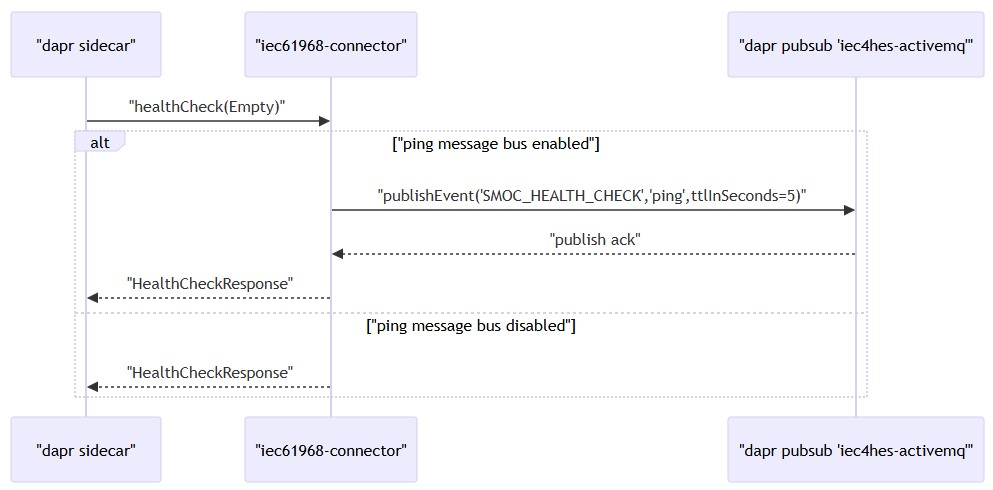
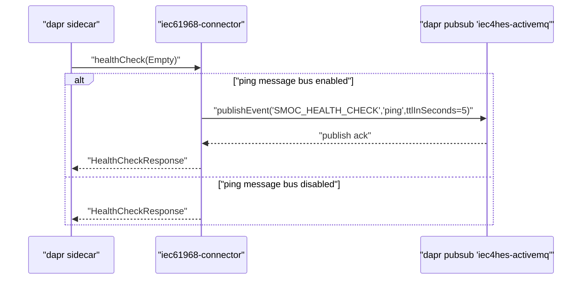

# Runtime behavior
* **Process model**
  * Service runs alongside a `Dapr` sidecar using `gRPC`
  * `Dapr` is started with `--app-protocol grpc` and an explicit app port (example: `5006`)
  * The sidecar periodically invokes the service’s `gRPC` health callback
* **Health probing flow**
  * The service implements the `healthCheck` `gRPC` method for `Dapr` health probes
  * Behavior is configuration-driven:
    * When message bus pinging is enabled, a test message is published via `Dapr` pub/sub and the result determines health
    * When disabled, the service immediately returns a successful health response
* **Message bus probe during health check**
  * When pinging is enabled, the service publishes via `DaprClient`:
    * `pubsub`: `iec4hes-activemq`
    * `topic`: `SMOC_HEALTH_CHECK`
    * `data`: `"ping"`
    * `metadata`: `ttlInSeconds=5`
  * On successful publish:
    * Logs `"Connectivity with activemq is OK"`
    * Emits `HealthCheckResponse` and completes the `gRPC` call
  * On failure:
    * Logs `"activemq unreachable"` with the associated error
    * Propagates the error to the `gRPC` response observer
* **Threading and execution**
  * Health check logic executes within a forked `gRPC Context`
  * Publish operation is reactive and scheduled on Reactor’s `boundedElastic` scheduler
  * The `gRPC` response observer is signaled from the reactive subscription
* **Ports and sidecar interaction**
  * `Dapr` forwards `gRPC` health probes to the service using the configured app port
  * Example run configuration:
    * `--app-protocol grpc`
    * `--app-port 5006`
    * `--enable-app-health-check` with probe interval and timeout

  
mermaid

* **Logging and observability**
  * Success path logs connectivity confirmation to `ActiveMQ`
  * Failure path logs publish errors
  * `Zipkin` tracing can be enabled separately, as referenced in repository materials
* **Unknowns and constraints**
  * Exact `HealthCheckResponse` payload fields are not shown
  * No additional `gRPC` endpoints beyond `healthCheck` are visible
  * Handling of `ttlInSeconds` depends on the configured `Dapr` pub/sub component implementation
